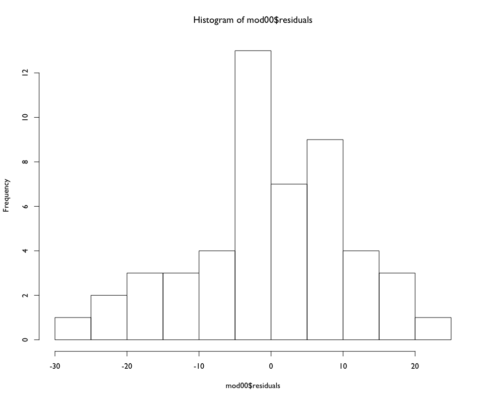
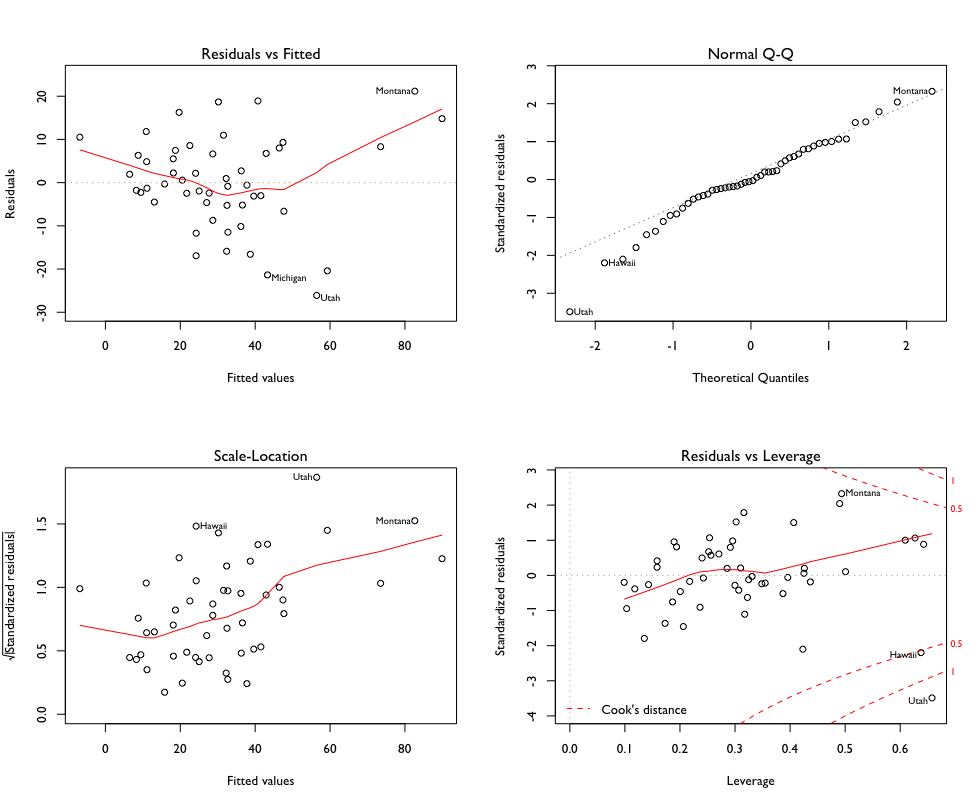
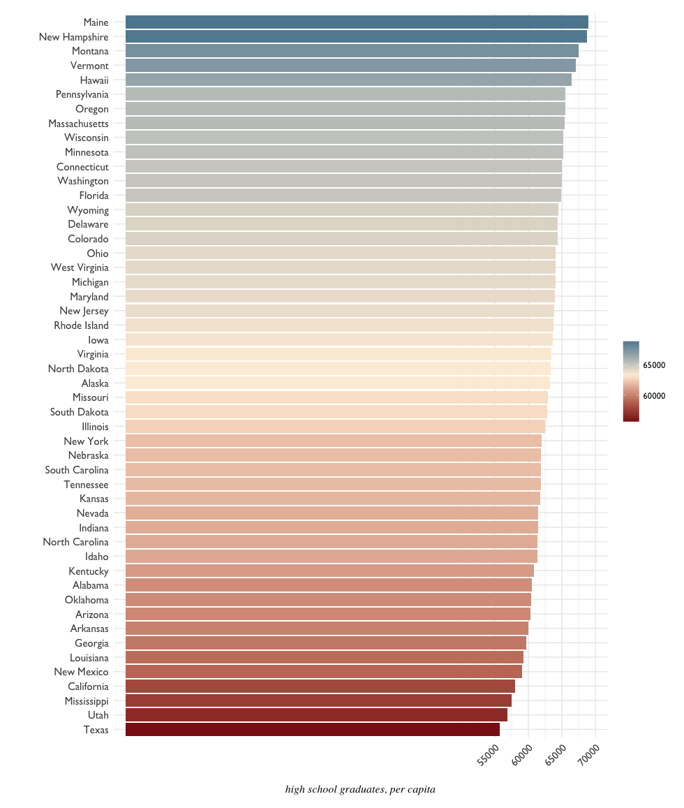
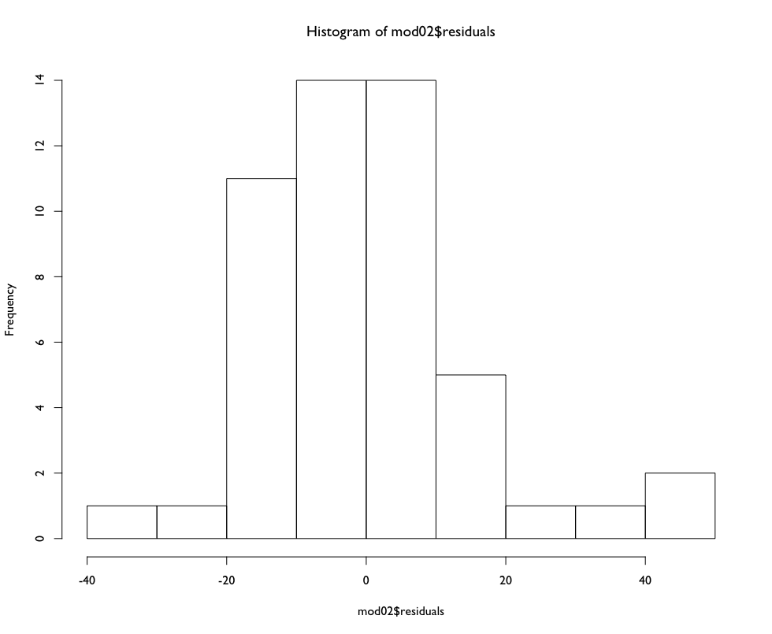
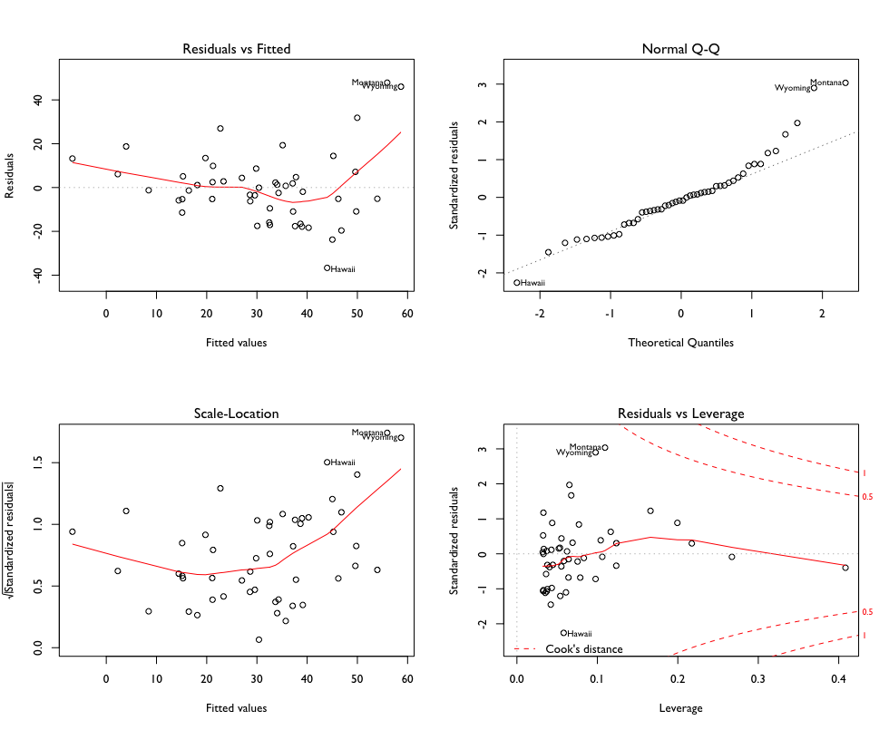
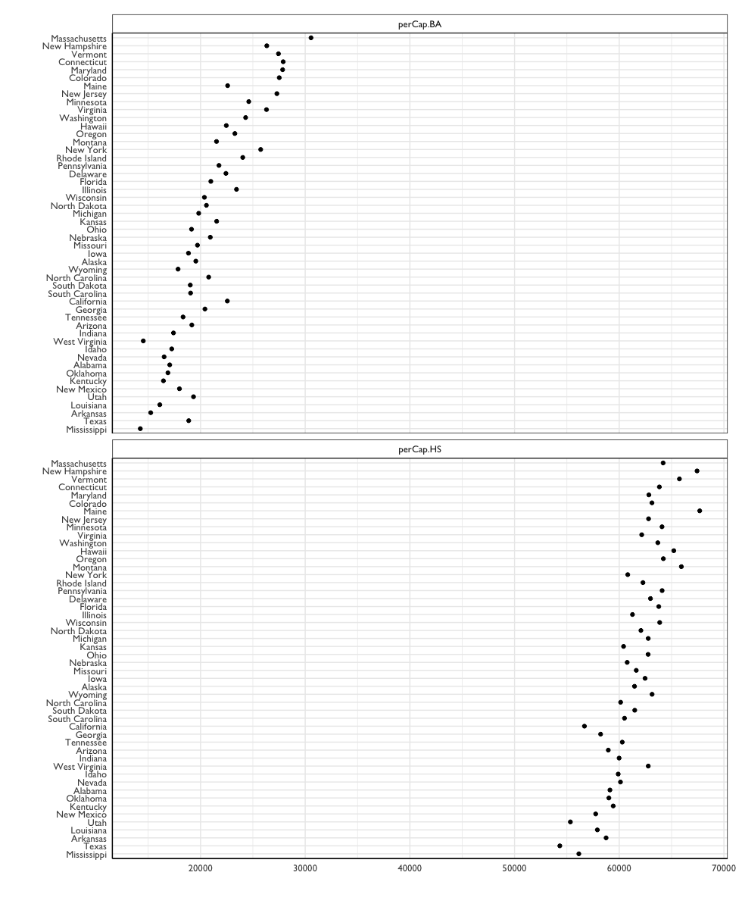
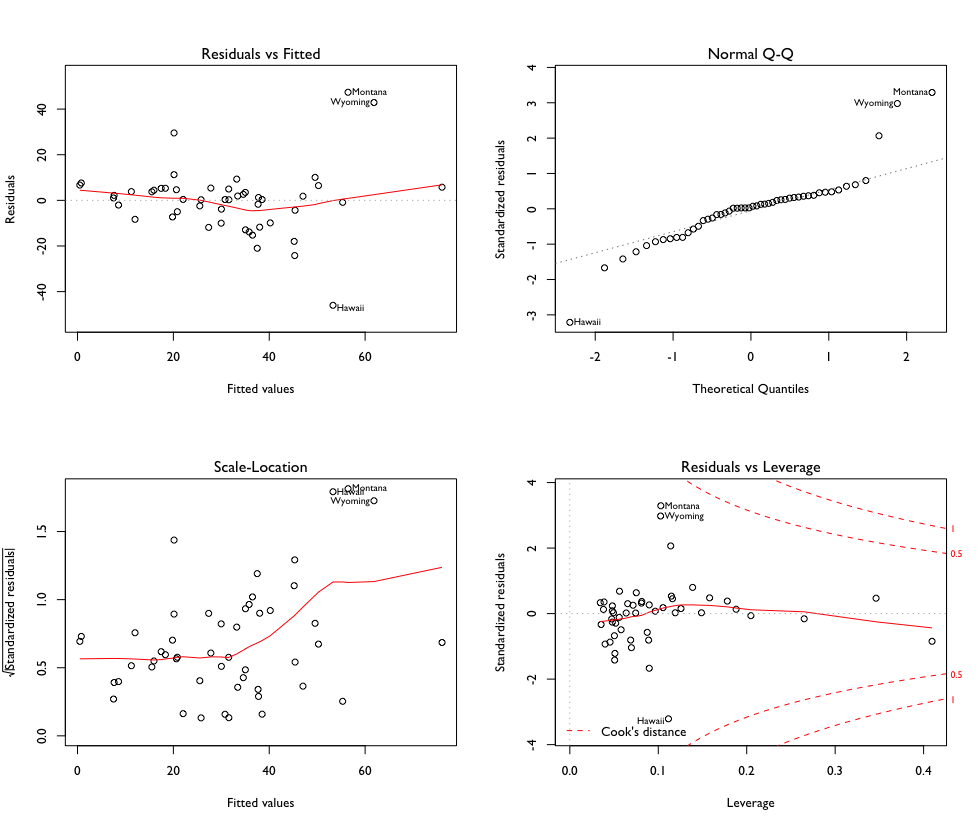
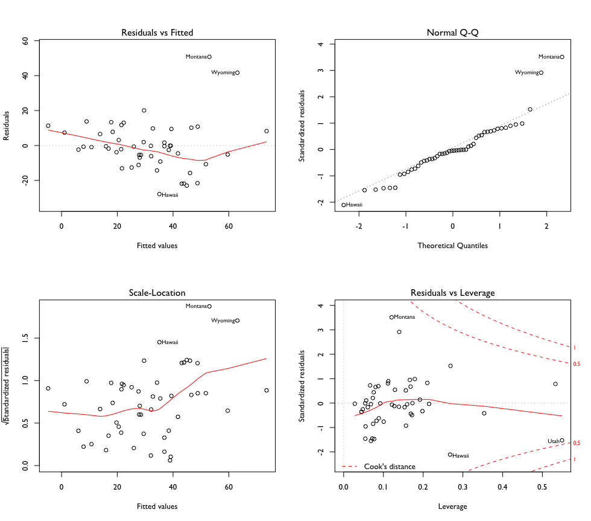

# Educational Attainment EDA

Educational attainment data from the US Census/American Community Survey. Variables derived are per capita- population numbers for educational attainment by age bracket; e.g. per capita population 18-24 years old with High School diploma, per capita population 35-44 with Bachelor's Degree or higher. 

A look at the structure:

```{R}
str(edu.pc2)
'data.frame':	50 obs. of  17 variables:
 $ NAME        : chr  "California" "Texas" "Florida" "New York" ...
 $ perCapitaFFL: num  6.49 22.72 15.51 8.41 15.86 ...
 $ pc.18to24   : num  10112 10162 8763 9830 9641 ...
 $ pc.18to24.HS: num  2991 3268 2603 2574 2783 ...
 $ pc.18to24.BA: num  978 805 769 1548 1209 ...
 $ pc.25to34   : num  14958 14502 12809 14562 13811 ...
 $ pc.25to34.HS: num  13023 12569 11489 13078 12626 ...
 $ pc.25to34.BA: num  5091 4269 3724 6420 5523 ...
 $ pc.35to44   : num  13311 13582 12168 12654 13027 ...
 $ pc.35to44.HS: num  10824 11199 10787 11085 11590 ...
 $ pc.35to44.BA: num  4619 4170 3734 5020 4869 ...
 $ pc.45to64   : num  25318 23872 26635 26863 26387 ...
 $ pc.45to64.HS: num  20567 19619 23596 23338 23627 ...
 $ pc.45to64.BA: num  7864 6691 7537 8711 8370 ...
 $ pc.65plus   : num  13309 11745 19488 15002 14240 ...
 $ pc.65plus.HS: num  10573 9116 16430 11877 11900 ...
 $ pc.65plus.BA: num  4008 2936 5219 4047 3463 ...
```

# Baseline linear model

Baseline linear model fit, using all variables, to get a general sense of the data:

```{R}
mod00 <- lm(perCapitaFFL ~ .-NAME, data = edu.pc2)
summary(mod00)

# Residuals:
#      Min       1Q   Median       3Q      Max 
# -26.1021  -5.0467  -0.4466   7.2838  21.1745 

Coefficients:
               Estimate Std. Error t value Pr(>|t|)  
(Intercept)  -10.738972 227.275231  -0.047   0.9626  
pc.18to24      0.011171   0.007961   1.403   0.1697  
pc.18to24.HS   0.003950   0.012239   0.323   0.7489  
pc.18to24.BA  -0.034013   0.026398  -1.288   0.2063  
pc.25to34      0.015550   0.016445   0.946   0.3510  
pc.25to34.HS  -0.017877   0.016681  -1.072   0.2914  
pc.25to34.BA   0.003934   0.011847   0.332   0.7419  
pc.35to44     -0.049350   0.020481  -2.410   0.0215 *
pc.35to44.HS   0.043920   0.019170   2.291   0.0283 *
pc.35to44.BA   0.014133   0.014922   0.947   0.3503  
pc.45to64      0.014179   0.010640   1.333   0.1915  
pc.45to64.HS  -0.009227   0.012679  -0.728   0.4718  
pc.45to64.BA  -0.015170   0.007469  -2.031   0.0501 .
pc.65plus     -0.013123   0.007245  -1.811   0.0790 .
pc.65plus.HS   0.010023   0.008935   1.122   0.2698  
pc.65plus.BA   0.010640   0.007964   1.336   0.1904  
---
Signif. codes:  0 ‘***’ 0.001 ‘**’ 0.01 ‘*’ 0.05 ‘.’ 0.1 ‘ ’ 1

Residual standard error: 12.79 on 34 degrees of freedom
Multiple R-squared:  0.7566,	Adjusted R-squared:  0.6492 
F-statistic: 7.046 on 15 and 34 DF,  p-value: 1.287e-06
```

How are the residuals distributed? 



Approaching normal, but with some bumps along the way.

How does a plot of the model metrics look? 



Influential outliers:

- Utah
- Hawaii
- Montana
- Michigan

Why are these outliers influential? What is it about these states that distinguishes them from the rest of the country in terms of education?

Before looking specifically at these states - a summary of educational attainment variables, ignoring the provided age brackets:

- total per capita surveyed population
- total per capita high school graduates
- total per capita college graduates

From there, a simplified model using these summarized variables.

```{R}
# summarize education without age brackets
edu.pc2 <- edu.pc2 %>%
  mutate(pop.per.capita = pc.18to24 + pc.25to34 + pc.35to44 + pc.45to64 + pc.65plus,
         hs.per.capita = pc.18to24.HS + pc.25to34.HS + pc.35to44.HS + pc.45to64.HS + pc.65plus.HS,
         ba.per.capita = pc.18to24.BA + pc.25to34.BA + pc.35to44.BA + pc.45to64.BA + pc.65plus.BA)
         
# simplified model with simplified variables
mod01 <- lm(perCapitaFFL ~ pop.per.capita + hs.per.capita + ba.per.capita, data = edu.pc2)
summary(mod01)

# Residuals:
#     Min      1Q  Median      3Q     Max 
# -35.516 -10.635   0.219   6.547  47.993 

Coefficients:
                 Estimate Std. Error t value Pr(>|t|)    
(Intercept)     2.045e+02  9.945e+01   2.056 0.045464 *  
pop.per.capita -7.166e-03  1.783e-03  -4.020 0.000214 ***
hs.per.capita   7.051e-03  1.279e-03   5.514 1.54e-06 ***
ba.per.capita  -2.987e-03  7.168e-04  -4.167 0.000135 ***
---
Signif. codes:  0 ‘***’ 0.001 ‘**’ 0.01 ‘*’ 0.05 ‘.’ 0.1 ‘ ’ 1

Residual standard error: 16.28 on 46 degrees of freedom
Multiple R-squared:  0.4667,	Adjusted R-squared:  0.432 
F-statistic: 13.42 on 3 and 46 DF,  p-value: 2.015e-06
```

Each variable is significant in this model, with High School education carrying the most influence. But the R-squared values leave something to be desired. 



Where do the observed outliers in the model sit compared to the rest of the country? 

Looking at a plot of high school graduates per capita across the states, it appears that **Montana** and **Hawaii** have higher per capita HS graduate levels, while **Utah** sits second from the bottom. 

There are more "extreme" states on either side of our influential outliers - why is this? Is there another factor to be considered? What about the **_ratio_** of the population with high school or college degrees? 

```{R}
edu.pc2 <- edu.pc2 %>%
  mutate(hs.pop.ratio = hs.per.capita/pop.per.capita,
         ba.pop.ratio = ba.per.capita/pop.per.capita,
         hs.ba.ratio = hs.per.capita/ba.per.capita)

edu.pc2$Pop2015.perCapita <- perCap2015(edu.pc2$Pop2015)
rownames(edu.pc2) <- edu.pc2$NAME

mod02 <- lm(perCapitaFFL ~ hs.pop.ratio + ba.pop.ratio + hs.ba.ratio, data = edu.pc2)
summary(mod02)

# Residuals:
#     Min      1Q  Median      3Q     Max 
# -36.677 -10.554  -1.300   5.866  47.871 

Coefficients:
             Estimate Std. Error t value Pr(>|t|)    
(Intercept)  -355.709    117.493  -3.027 0.004032 ** 
hs.pop.ratio  495.124    119.477   4.144 0.000145 ***
ba.pop.ratio -162.016    260.979  -0.621 0.537794    
hs.ba.ratio     9.204     23.630   0.390 0.698685    
---
Signif. codes:  0 ‘***’ 0.001 ‘**’ 0.01 ‘*’ 0.05 ‘.’ 0.1 ‘ ’ 1

Residual standard error: 16.72 on 46 degrees of freedom
Multiple R-squared:  0.4375,	Adjusted R-squared:  0.4008 
F-statistic: 11.93 on 3 and 46 DF,  p-value: 6.682e-06
```





Residuals again appear to be approaching a Gaussian distribution; outliers on the normal Q-Q plot now resemble those from the model using rural-urban proportions as explanatory variables. 

Using ratios seems to lessen the influence of outliers. 

# Per Capita, re-calculated

To feel assured about the data, new per capita figures were calculated from the total data. 

```{R}
# Accurate Age and Education Brackets -----------------------------------------

# create total pop, HS, BA, male, female variables
edu.pc3 <- education %>%
  select(NAME, 
         Total.18to24, Total.25to34, Total.35to44, Total.45to64, Total.65plus,
         Total.1824.HS.Male, Total.25to34.HS, Total.35to44.HS, Total.45to64.HS, Total.65plus.HS,
         Total.18to24.BA, Total.25to34.BA, Total.35to44.BA, Total.45to64.BA, Total.65plus.BA,
         Total.18.to24.Male, Total.25to34.Male, Total.35to44.Male, Total.45to64.Male, Total.65plus.Male,
         Total.18to24.Female, Total.25to34.Female, Total.35to44.Female, Total.45to64.Female, Total.65plus.Female) %>%
  mutate(total.pop = Total.18to24 + Total.25to34 + Total.35to44 + Total.45to64 + Total.65plus,
         total.HS = Total.1824.HS.Male + Total.25to34.HS + Total.35to44.HS + Total.45to64.HS + Total.65plus.HS,
         total.BA = Total.18to24.BA + Total.25to34.BA + Total.35to44.BA + Total.45to64.BA + Total.65plus.BA,
         total.male = Total.18.to24.Male + Total.25to34.Male + Total.35to44.Male + Total.45to64.Male + Total.65plus.Male,
         total.female = Total.18to24.Female + Total.25to34.Female + Total.35to44.Female + Total.45to64.Female + Total.65plus.Female)

# merge FFL data
edu.pc3 <- ffl.pop %>%
  left_join(edu.pc3) 

# compute population estimate error
edu.pc3 <- edu.pc3 %>%
  mutate(pop.err.2015 = Pop2015 - total.pop,
         pop.err.2016 = Pop2016 - total.pop)

# compute per capita for 5 totals
edu.pc3 <- edu.pc3 %>%
  mutate(perCap.pop = Pop2015 / 100000,
         perCap.HS = (total.HS/Pop2015) * 100000,
         perCap.BA = (total.BA/Pop2015) * 100000,
         perCap.male = (total.male/Pop2015) * 100000,
         perCap.female = (total.female/Pop2015) * 100000)

rownames(edu.pc3) <- edu.pc3$NAME
```



And a model: 

```{R}
mod04 <- lm(perCapitaFFL ~ perCap.HS + perCap.BA + perCap.male + perCap.female,
            data = edu.pc3)
summary(mod04)

# Residuals:
#     Min      1Q  Median      3Q     Max 
# -45.998  -6.701   0.723   5.188  47.374 

Coefficients:
                Estimate Std. Error t value Pr(>|t|)    
(Intercept)    7.189e+01  1.053e+02   0.683 0.498390    
perCap.HS      4.589e-03  1.419e-03   3.234 0.002292 ** 
perCap.BA     -2.706e-03  6.832e-04  -3.961 0.000263 ***
perCap.male    1.999e-03  3.429e-03   0.583 0.562703    
perCap.female -8.653e-03  1.748e-03  -4.949 1.09e-05 ***
---
Signif. codes:  0 ‘***’ 0.001 ‘**’ 0.01 ‘*’ 0.05 ‘.’ 0.1 ‘ ’ 1

Residual standard error: 15.2 on 45 degrees of freedom
Multiple R-squared:  0.5456,	Adjusted R-squared:  0.5052 
F-statistic: 13.51 on 4 and 45 DF,  p-value: 2.602e-07
```




# High School and College Graduate Ratios

Would the ratio of High Schooll and College Graduates to the Total Population be useful for modeling? 

```{R}
edu.pc3 <- edu.pc3 %>%
  mutate(ratio.HS = total.HS/total.pop,
         ratio.BA = total.BA/total.pop,
         ratio.18to24 = Total.18to24/total.pop,
         ratio.25to34 = Total.25to34/total.pop,
         ratio.35to44 = Total.35to44/total.pop,
         ratio.45to64 = Total.45to64/total.pop,
         ratio.65plus = Total.65plus/total.pop)

rownames(edu.pc3) <- edu.pc3$NAME
```

```{R}
mod05 <- lm(perCapitaFFL ~ ratio.HS + ratio.BA + ratio.18to24 + ratio.25to34 +
              ratio.35to44 + ratio.45to64 + ratio.65plus, data = edu.pc3)
              
summary(mod05)
# Residuals:
#     Min      1Q  Median      3Q     Max 
# -27.811  -6.724  -0.665   8.153  50.769 

Coefficients: (1 not defined because of singularities)
             Estimate Std. Error t value Pr(>|t|)    
(Intercept)   -551.50     157.08  -3.511  0.00106 ** 
ratio.HS       537.00     105.81   5.075 7.92e-06 ***
ratio.BA      -291.88      56.51  -5.165 5.89e-06 ***
ratio.18to24   828.65     266.06   3.115  0.00327 ** 
ratio.25to34   195.36     270.42   0.722  0.47394    
ratio.35to44   -67.60     323.27  -0.209  0.83535    
ratio.45to64   309.93     249.67   1.241  0.22121    
ratio.65plus       NA         NA      NA       NA    
---
Signif. codes:  0 ‘***’ 0.001 ‘**’ 0.01 ‘*’ 0.05 ‘.’ 0.1 ‘ ’ 1

Residual standard error: 15.41 on 43 degrees of freedom
Multiple R-squared:  0.5532,	Adjusted R-squared:  0.4909 
F-statistic: 8.874 on 6 and 43 DF,  p-value: 2.607e-06
```




