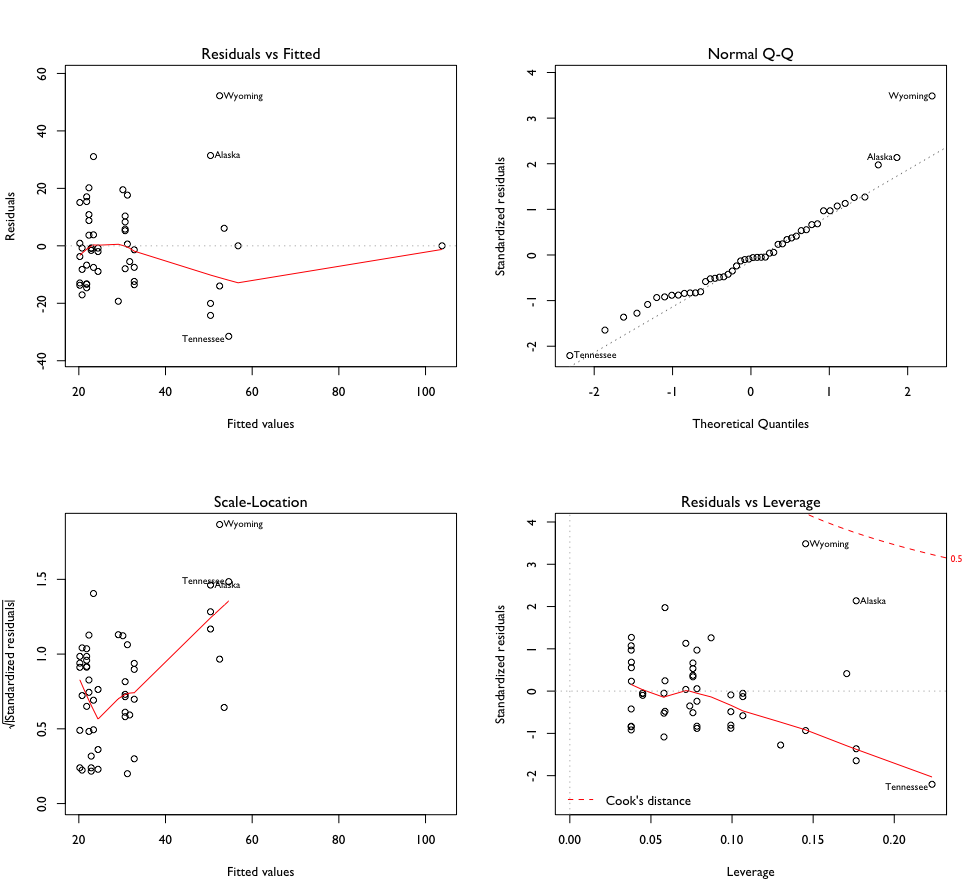
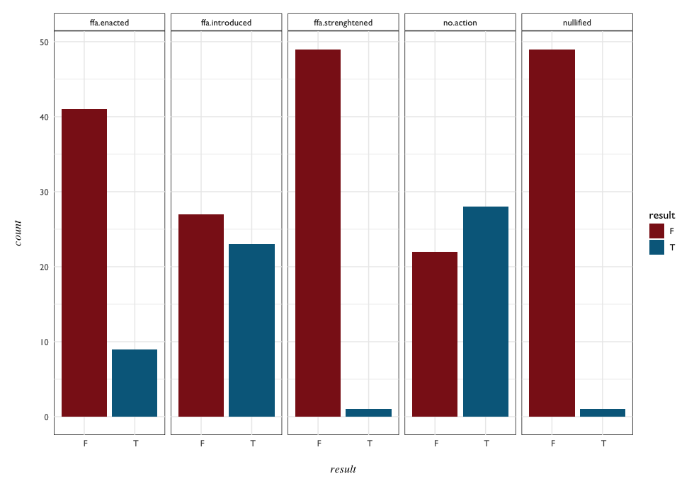
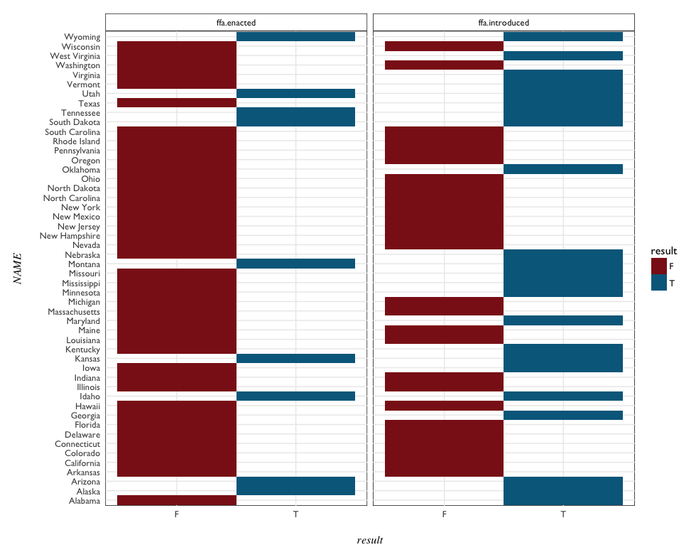
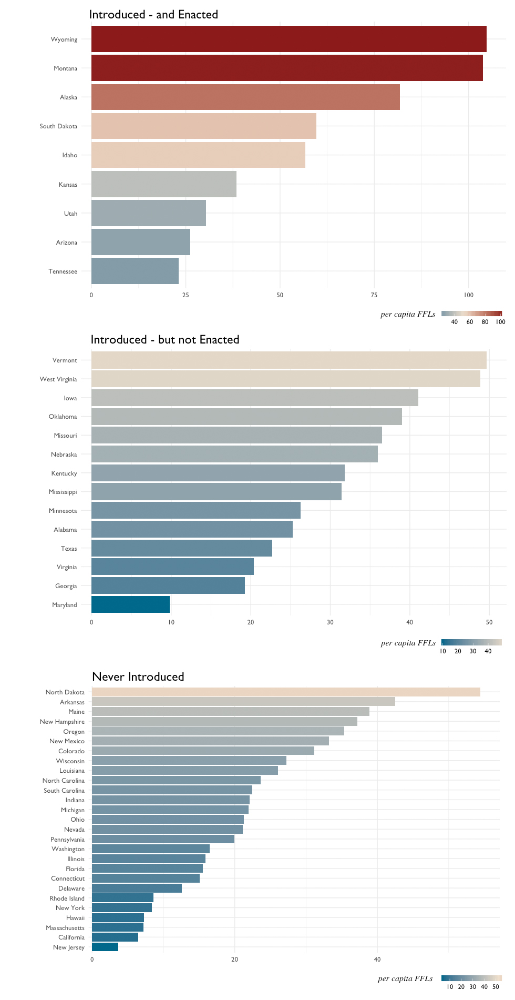
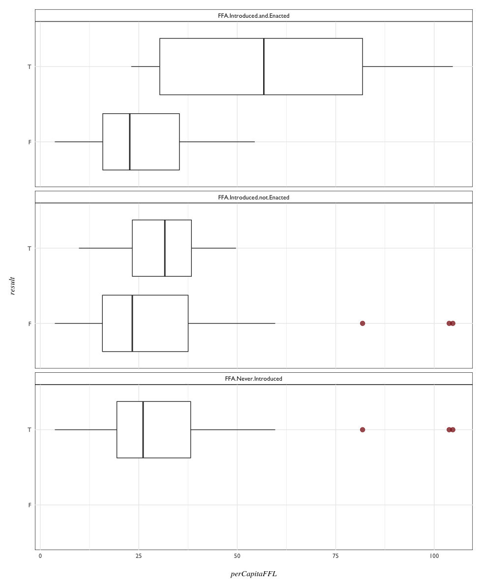
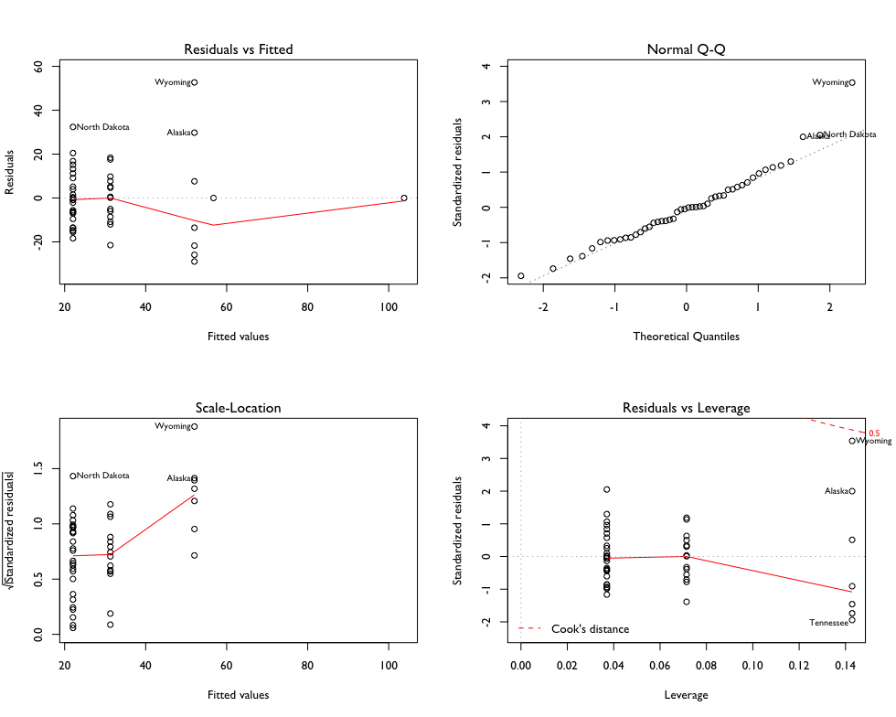
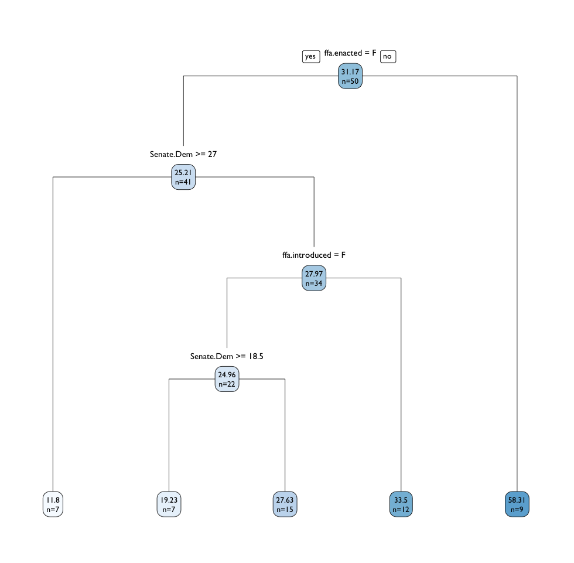

# Firearms Freedom Act

Certain states introduced legislation through a specific interpretation of a 'commerce clause' in the 10th Amendment. Called the Firearms Freedom Act (FFA), it argued that firearms manufactured and kept in-state were beyond Federal regulation - citing Congressional interference on within-state commerce<sup>[1](#Notes), [2](#Notes)</sup>.

Montana was the first to introduce this bill in 2009, the first to have the bill challenged, and the only state to have the bill struck down in court. 

Data on this act and variants of it from state to state were acquired from [gunwars.news21](http://gunwars.news21.com/interactives/nullification.html).


## Baseline Linear Model

A maximal model,  fit using all the variables, to get a general idea of any relationships with per capita FFLs. 

```{R}
Call:
lm(formula = perCapitaFFL ~ . - NAME, data = ffa)

Residuals:
    Min      1Q  Median      3Q     Max 
-31.502 -11.532  -0.856   7.763  52.237 

Coefficients: (1 not defined because of singularities)
                   Estimate Std. Error t value Pr(>|t|)   
(Intercept)        -28.4662    17.7529  -1.603  0.11599   
ffa.introduced T    61.7798    18.1893   3.396  0.00146 **
ffa.enacted T       21.8009     7.7398   2.817  0.00724 **
ffa.strenghtened T   6.3626    17.5848   0.362  0.71922   
no.action T         53.4244    17.5848   3.038  0.00400 **
nullified T              NA         NA      NA       NA   
ATF.Region          -0.5253     0.9466  -0.555  0.58174   
---
Signif. codes:  0 ‘***’ 0.001 ‘**’ 0.01 ‘*’ 0.05 ‘.’ 0.1 ‘ ’ 1

Residual standard error: 16.21 on 44 degrees of freedom
Multiple R-squared:  0.4943,	Adjusted R-squared:  0.4368 
F-statistic:   8.6 on 5 and 44 DF,  p-value: 9.596e-06
```

The introduction of the FFA bill appears to be the strongest predictor for per capita FFLs - followed by states taking no action on the bill, and states that enact the bill. 


There are the usual high outliers Wyoming and Alaska in the QQ plots,  and other signs that linear regression assumptions are violated in the Residuals vs. Fitted plot. It could be because the explanatory variables are binary/boolean, and on top of that not normally distributed. 

How was each variable distributed? 

## Visualizing Distributions and Conditions

```{R}
# look at data distributions
# create long dataframe and faceted histogram plot
ffa %>%
  mutate(NAME = rownames(ffa)) %>%
  dplyr::select(everything()) %>%
  gather(action, result, 1:5) %>%
  ggplot(aes(result, fill = result)) + 
  geom_histogram(stat = "count") +
  facet_wrap(~ action, ncol = 5) +
  scale_fill_manual(values = c("firebrick4",
                               "deepskyblue4")) +
  pd.facet
```



Far fewer states enacted the bill compared to total states, but for simply introducing the legislation there's a near 50-50 split. 

Idaho was the only state to stregthen the bill after adoption, and again Montana was the only state to have the bill struck down in court (nullified).

How did specific states treat this legislation - by introducing it, enacting it, or both? 

```{R}
# plot introduction and enactment by state
ffa %>%
  mutate(NAME = rownames(ffa)) %>%
  dplyr::select(NAME, ffa.introduced, ffa.enacted) %>%
  gather(action, result, 2:3) %>%
  group_by(result, NAME) %>%
  ggplot(aes(NAME, result, fill = result)) +
  geom_tile() +
  facet_wrap(~ action) +
  scale_fill_manual(values = c("firebrick4",
                               "deepskyblue4")) +
  pd.facet + coord_flip() 
 ```
 
 
 
Which introduced the bill but ultimately did not enact it? Which states introduced the bill _and_ enacted it? Which states never introduced the bill at all? And how do these 3 legislative conditions compare in regard to FFLs? 
 


```{R}
# Compare FFL distributions of these 3 legislative conditions -----------------

# create long dataframe with condition as T/F
# e.g Introduced and Enacted == T
ffa.3 <- ffa %>%
  dplyr::select(everything()) %>%
  mutate(NAME = rownames(ffa),
         FFA.Introduced.and.Enacted = 
           ifelse(ffa.introduced == "T" & ffa.enacted == "T", "T", "F"),
         FFA.Introduced.not.Enacted = 
           ifelse(ffa.introduced == "T" & ffa.enacted == "F", "T", "F"),
         FFA.Never.Introduced = 
           ifelse(ffa.introduced == "F" & ffa.enacted == "F", "T", "T")) %>%
  gather(process, result, 8:10)

# boxplot of FFLs by condition
ggplot(ffa.3, aes(result, perCapitaFFL)) +
  geom_boxplot(outlier.color = "firebrick4", 
               outlier.shape = 19, 
               outlier.size = 3,
               outlier.alpha = 0.75,
               varwidth = F, notch = F) +
  facet_wrap(~ process, ncol = 1) +
  coord_flip() +
  pd.facet
```



It appears clear that having the FFA enacted corresponds to a higher mean per capita FFL - with any other circumstances, the mean never goes above 35. While there is some overlap in ranges, and certainly true that outliers can be exerting influence, the mean and quantile range of 'Enacted' states seems to suggest a generally higher FFL count. 

This was seen in the previous barplots where per capita FFL was mapped to color, but positioned along a common scale in the faceted boxplots it appears much more clearly.


 ## Analysis of Variance
 
 After violating some linear regression assumptions earlier, how would an anova model fit describe the data? 
 
```{R}
 ffa.anova <- aov(perCapitaFFL ~ ., data = ffa)
> summary(ffa.anova)
                 Df Sum Sq Mean Sq F value   Pr(>F)    
ffa.introduced    1   4871    4871  18.822 8.01e-05 ***
ffa.enacted       1   4001    4001  15.462 0.000288 ***
ffa.strenghtened  1      3       3   0.011 0.918297    
no.action         1   2345    2345   9.063 0.004265 ** 
Residuals        45  11645     259                     
---
Signif. codes:  0 ‘***’ 0.001 ‘**’ 0.01 ‘*’ 0.05 ‘.’ 0.1 ‘ ’ 1
```



It appears we might have the same problem we did the maximal linear regression model. Just out of curiousity, what if _introduction_ and _enactment_ were modeled as an interaction? 

```{R}
ffa.model.02 <- lm(perCapitaFFL ~ ffa.introduced * ffa.enacted, data = ffa)
summary(ffa.model.02)

Residuals:
    Min      1Q  Median      3Q     Max 
-35.226 -10.554  -0.454   8.738  46.411 

Coefficients: (1 not defined because of singularities)
                             Estimate Std. Error t value Pr(>|t|)    
(Intercept)                    22.059      3.321   6.643 2.85e-08 ***
ffa.introducedT                 9.228      5.683   1.624 0.111092    
ffa.enactedT                   27.026      7.372   3.666 0.000626 ***
ffa.introducedT:ffa.enactedT       NA         NA      NA       NA    
---
Signif. codes:  0 ‘***’ 0.001 ‘**’ 0.01 ‘*’ 0.05 ‘.’ 0.1 ‘ ’ 1

Residual standard error: 17.26 on 47 degrees of freedom
Multiple R-squared:  0.388,	Adjusted R-squared:  0.362 
F-statistic:  14.9 on 2 and 47 DF,  p-value: 9.736e-06
```

And how did this linear model with interactions compare to the previous maximal model?

```{R}
bind_rows(tidy(ffa.model), tidy(ffa.model.02)) %>%
  arrange(p.value)
                term    estimate  std.error  statistic      p.value
1        (Intercept)  22.0591816  3.3207308  6.6428696 2.848199e-08
2       ffa.enactedT  27.0263453  7.3721506  3.6660056 6.257024e-04
3   ffa.introduced T  61.7797983 18.1892863  3.3964938 1.457426e-03
4        no.action T  53.4244409 17.5848393  3.0380966 3.995417e-03
5      ffa.enacted T  21.8008862  7.7398131  2.8167200 7.237127e-03
6    ffa.introducedT   9.2281190  5.6827897  1.6238713 1.110921e-01
7        (Intercept) -28.4662455 17.7529489 -1.6034657 1.159871e-01
8         ATF.Region  -0.5253247  0.9466105 -0.5549534 5.817370e-01
9 ffa.strenghtened T   6.3625748 17.5848393  0.3618216 7.192172e-01
```

If going by p.value - a slight improvement.

# State Government data

Now to combine state legislature with Firearms Freedom Act data: 

```{R}
# Introduce State Government data ---------------------------------------------
legislative <- read.csv("data/per-capita-clean/per-capita-legislative.csv",
                        stringsAsFactors = F)

rownames(legislative) <- legislative$X
colnames(legislative)[1] <- "NAME"
 
# merge with FFA data
# create NAME variable to merge along with perCapitaFFL
ffa$NAME <- rownames(ffa)

state.gov <- legislative %>%
  left_join(ffa) %>%
  dplyr::select(-Total.Seats, -Total.Senate, -Total.House, -Senate.other)

rownames(state.gov) <- state.gov$NAME
```

## State Government - Regression Trees

```{R}
# State Government: Regression Trees ------------------------------------------
state.gov$NAME <- NULL
state.tree.a <- rpart(perCapitaFFL ~ ., data = state.gov)
summary(state.tree.a)

par(mfrow = c(1, 1), family = "GillSans")
rpart.plot(state.tree.a, type = 1, extra = 1,
           digits = 4, cex = 0.85, 
           split.family = "GillSans", split.cex = 1.1,
           nn.family = "GillSans", nn.cex = 0.85, 
           fallen.leaves = T)
```



The initial split shows shows 9 states that tend toward higher FFLs per capita - the deciding criteria being whether or not the FFA was enacted. 

If the FFA was not made into law, then the number of State Sentate Democrats becomes a deciding factor - more than 27 Democrats in a State Senate would lead to a group of 7 states with the lowest overall mean FFL per capita (11.8).

For states with less than 27 Senate Dems - the question of whether an FFA bill was introduced comes into play - if introduced, a higher FFL per cap mean of 33.5. 

And if not introduced at all - another split in the number of Senate Dems decides. At 19 or more Senate Democrats in a given state - the mean FFL per cap sits at 19.32. Seven states fall into this category, while 15 states with 18 or less Democratic senators group to a mean FFL per cap of 27.63.


# Notes

<sup>1</sup> Montana Firearms Freedom Act, [Wikipedia article](https://en.wikipedia.org/wiki/Montana_Firearms_Freedom_Act)

<sup>2</sup> Firarms Freedom Act [webpage](http://firearmsfreedomact.com/)