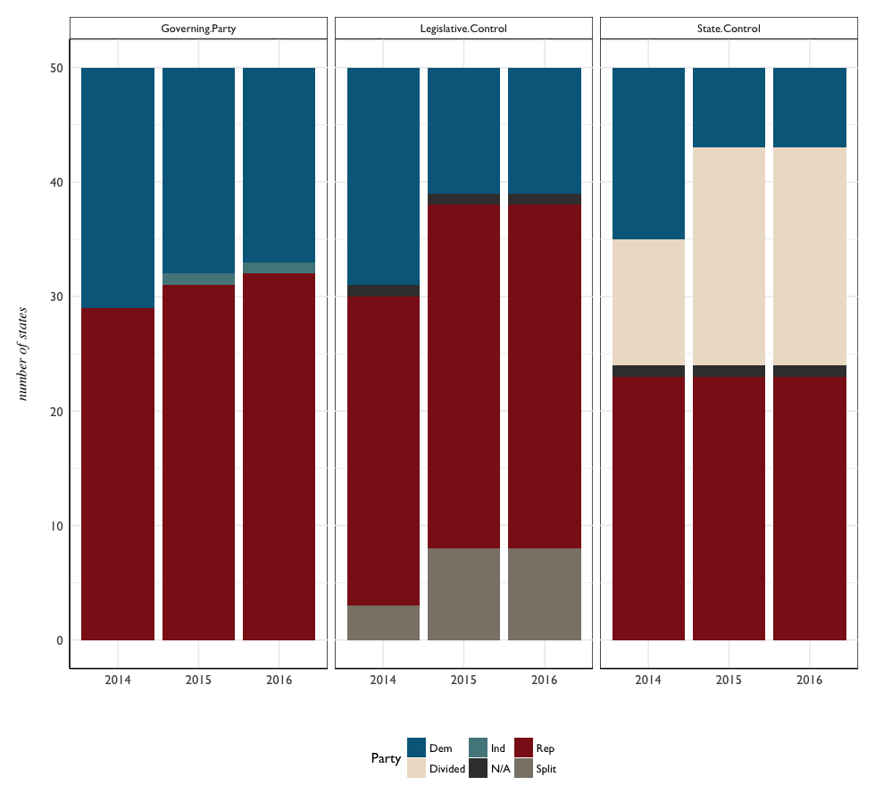

# State Goverment

State government data for the years 2014-2016. The **legislative branch** of each state's government generally comprises a State Sentate and State House of Representatives<sup>[1](#notes)</sup>, and generally these are referred to as the Upper and Lower Houses, respectively<sup>[2](#notes)</sup>. The **executive branch** of a state's government is headed by an elected Governor. 

Historical data on parties elected to state government were acquired from the National Conference of State Legislatures ([NCLS](http://www.ncsl.org/)), in the form of annual tables which were converted to CSVs using Tabula. 

Structure of the data:

```{R}
str(legislature)
'data.frame':	150 obs. of  14 variables:
 $ STATE        : Factor w/ 50 levels "Alabama","Alaska",..: 1 2 3 4 5 6 7 8 9 10 ...
 $ Total.Seats  : int  140 60 90 135 120 100 187 62 160 236 ...
 $ Total.Senate : int  35 20 30 35 40 35 36 21 40 56 ...
 $ Senate.Dem   : int  11 7 12 13 28 18 21 13 14 18 ...
 $ Senate.Rep   : int  23 13 17 22 11 17 14 8 26 38 ...
 $ Senate.other : Factor w/ 8 levels "0","1","1v","2",..: 2 1 3 1 3 1 3 1 1 1 ...
 $ Total.House  : Factor w/ 31 levels "100","101","105",..: 3 18 23 1 27 24 13 20 6 16 ...
 $ House.Dem    : chr  "37" "14" "24" "48" ...
 $ House.Rep    : chr  "66" "26" "36" "51" ...
 $ House.other  : Factor w/ 16 levels "","0","1","1, 1v",..: 4 2 2 3 2 2 2 2 7 3 ...
 $ Legis.Control: Factor w/ 4 levels "Dem","N/A","Rep",..: 3 3 3 3 1 1 1 1 3 3 ...
 $ Gov.Party    : Factor w/ 3 levels "Dem","Rep","Ind": 2 2 2 1 1 1 1 1 2 2 ...
 $ State.Control: Factor w/ 4 levels "Dem","Divided",..: 4 4 4 2 1 1 1 1 4 4 ...
 $ Year         : chr  "2014" "2014" "2014" "2014" ...
```

# State Governments by Party - 2014-2016

Given the legislative and executive branches of state government, 3 categories were presented in the data:

- Legislative Control - party which holds both Senate and House, or split
- Governing Party - party of the elected governor
- State Control - party which holds both Legislative Control and Governorship, or split

or 

- **Legislative Control** + **Governing Party** = **State Control**


Observations on the party totals over the years:

- generally - a receding of **Democratic** seats, and
- slight increase in **Divided** and **Split** seats.
- emergence of an  **Independent** seat.
- **Republican** seats remain relatively steady, with a slight increase from 2014 that carries over to 2016 (the _general_ length of term)

There might be a popular notion that Republicans are 'gaining' seats on Democrats, but the voting results show Democrats are losing seats to Independents, and within-state divisions are increasing - particularly arriving at 2016.


**State Control** becomes an interesting category to look at on the map - from 2014 onwards the United States visually appears to be of 3 parties - this is superficial to some degree, as the third 'party' is simply states divided between Democrat and Republican. A stacked area chart gives another sense of these three 'parties' and the space they occupy:



# Political Control in 2014

2014 becomes a particular year of interest because the governing parties in place would feasibly be enacting legislation that would take effect 2015-onwards.


# Model Building

Fitting a linear model to explore, using the variables:

- Total Seats
- Total Senate
- Senate Dem
- Senate Rep
- Total House
- House Dem
- House Rep

The observation for Nebraska was removed - because of the unicameral governing body. 

```{R}
mod01 <- lm(perCapitaFFL ~ Total.Seats + Total.Senate + Senate.Dem + Senate.Rep +
              Total.House + House.Dem + House.Rep, data = leg.model)
summary(mod01)

# Residuals:
#     Min      1Q  Median      3Q     Max 
# -26.052 -13.909  -1.918   8.687  66.253 

Coefficients:
             Estimate Std. Error t value Pr(>|t|)    
(Intercept)   58.3681    15.7917   3.696 0.000641 ***
Total.Seats    3.1212     2.2036   1.416 0.164212    
Total.Senate -14.2201    10.2292  -1.390 0.171986    
Senate.Dem    10.2772     8.5603   1.201 0.236808    
Senate.Rep    10.9924     8.4736   1.297 0.201797    
Total.House   -0.3030     0.3247  -0.933 0.356124    
House.Dem     -3.2518     2.2618  -1.438 0.158103    
House.Rep     -3.0936     2.1786  -1.420 0.163182    
---
Signif. codes:  0 ‘***’ 0.001 ‘**’ 0.01 ‘*’ 0.05 ‘.’ 0.1 ‘ ’ 1

Residual standard error: 20.34 on 41 degrees of freedom
Multiple R-squared:  0.2573,	Adjusted R-squared:  0.1304 
F-statistic: 2.029 on 7 and 41 DF,  p-value: 0.07444
```


Residuals are likely not normally distributed, looking at the QQ plot. **New Hampshire** especially appears to be exerting undue influence as an outlier, while **New York** and **Montana** are also doing so to a lesser degree.

What would happen if Totals were removed from this model? 

```{R}
mod02 <- lm(perCapitaFFL ~ Senate.Dem + Senate.Rep + House.Dem + House.Rep, data = leg.model)
summary(mod02)

# Residuals:
#     Min      1Q  Median      3Q     Max 
# -21.454 -13.029  -5.527   7.979  72.684 

Coefficients:
             Estimate Std. Error t value Pr(>|t|)    
(Intercept) 45.000810  11.856724   3.795 0.000447 ***
Senate.Dem  -0.837523   0.492720  -1.700 0.096229 .  
Senate.Rep   0.210937   0.542484   0.389 0.699273    
House.Dem   -0.068505   0.167312  -0.409 0.684201    
House.Rep    0.003286   0.201090   0.016 0.987038    
---
Signif. codes:  0 ‘***’ 0.001 ‘**’ 0.01 ‘*’ 0.05 ‘.’ 0.1 ‘ ’ 1

Residual standard error: 20.34 on 44 degrees of freedom
Multiple R-squared:  0.2034,	Adjusted R-squared:  0.131 
F-statistic: 2.808 on 4 and 44 DF,  p-value: 0.0368
```

A very slight and insignificant improvement. Would proportions of Legislative seats by party be of use in a model? Or using categorical variables as predictors? 

```{R}

mod05<- lm(perCapitaFFL ~ Legislative.Control + Governing.Party + State.Control, 
           data = legislature2)
summary(mod05)

Residuals:
    Min      1Q  Median      3Q     Max 
-26.078 -11.454  -6.972   4.625  70.472 

Coefficients: (1 not defined because of singularities)
                         Estimate Std. Error t value Pr(>|t|)    
(Intercept)                19.622      3.520   5.575 1.21e-07 ***
Legislative.ControlN/A      3.076     14.481   0.212 0.832075    
Legislative.ControlRep     45.135     11.400   3.959 0.000118 ***
Legislative.ControlSplit   23.226      8.651   2.685 0.008123 ** 
Governing.PartyRep         13.255      8.807   1.505 0.134526    
Governing.PartyInd         35.772     14.215   2.516 0.012965 *  
State.ControlDivided      -18.712     10.949  -1.709 0.089643 .  
State.ControlN/A               NA         NA      NA       NA    
State.ControlRep          -43.759     19.499  -2.244 0.026372 *  
---
Signif. codes:  0 ‘***’ 0.001 ‘**’ 0.01 ‘*’ 0.05 ‘.’ 0.1 ‘ ’ 1

Residual standard error: 18.95 on 142 degrees of freedom
Multiple R-squared:  0.2564,	Adjusted R-squared:  0.2197 
F-statistic: 6.994 on 7 and 142 DF,  p-value: 3.676e-07
```
`Legislative.ControlRep` appears to be significant as a predictor, although overall the model could use work. 

```{R}
anova(mod05)
Analysis of Variance Table

Response: perCapitaFFL
                     Df Sum Sq Mean Sq F value    Pr(>F)    
Legislative.Control   3  10696  3565.5  9.9252 5.543e-06 ***
Governing.Party       2   4748  2374.0  6.6086  0.001802 ** 
State.Control         2   2142  1071.1  2.9817  0.053890 .  
Residuals           142  51011   359.2                      
---
Signif. codes:  0 ‘***’ 0.001 ‘**’ 0.01 ‘*’ 0.05 ‘.’ 0.1 ‘ ’ 1
```

What effect does `Legislative.Party` have on `perCapitaFFL` on it's own? 

```{R}
mod07 <- lm(perCapitaFFL ~ Legislative.Control, data = legislature.ffl)
summary(mod07)
# Residuals:
#     Min      1Q  Median      3Q     Max 
# -22.008 -13.888  -6.108   5.015  67.210 

Coefficients:
                         Estimate Std. Error t value Pr(>|t|)    
(Intercept)                18.025      3.110   5.796 4.04e-08 ***
Legislative.ControlN/A     17.928     11.911   1.505   0.1344    
Legislative.ControlRep     19.491      3.772   5.167 7.70e-07 ***
Legislative.ControlSplit   11.692      5.527   2.115   0.0361 *  
---
Signif. codes:  0 ‘***’ 0.001 ‘**’ 0.01 ‘*’ 0.05 ‘.’ 0.1 ‘ ’ 1

Residual standard error: 19.91 on 146 degrees of freedom
Multiple R-squared:  0.1559,	Adjusted R-squared:  0.1386 
F-statistic:  8.99 on 3 and 146 DF,  p-value: 1.673e-05
```


# Notes
<sup>1</sup> Nebraska is the exception, having a unicameral legislative body.

<sup>2</sup> "State governments of the United States", [Wikipedia](https://en.wikipedia.org/wiki/State_governments_of_the_United_States).


