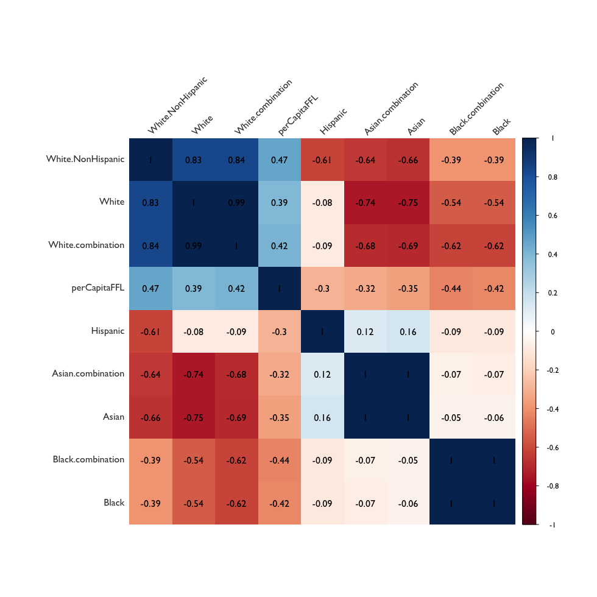
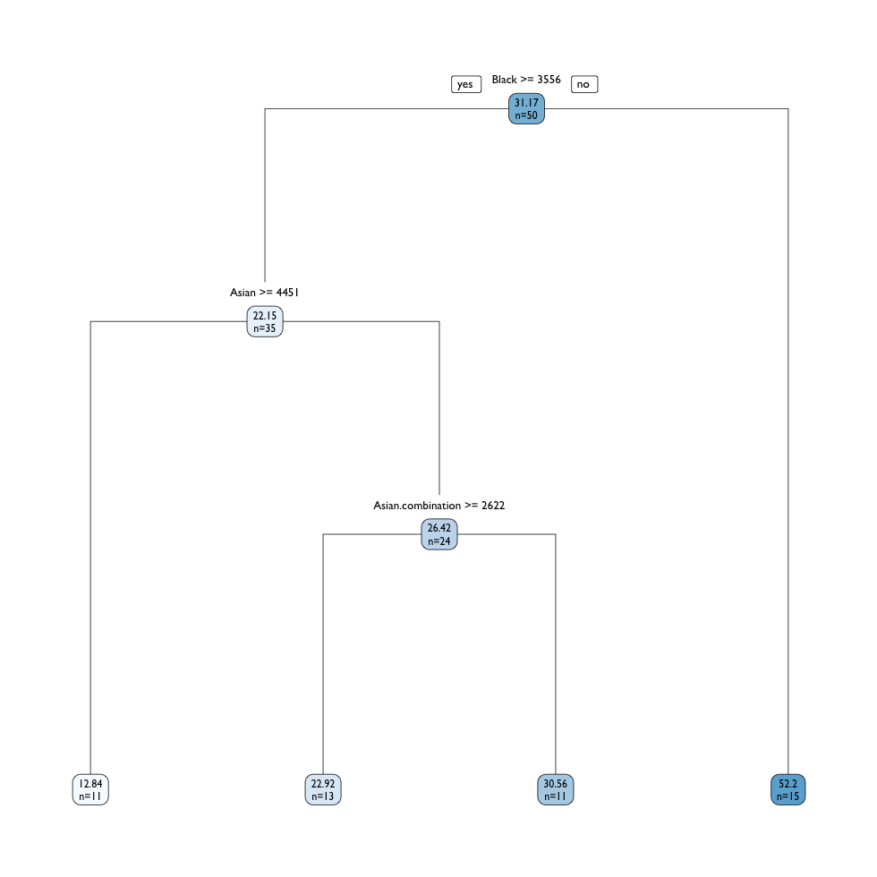

## Baseline Maximal Linear Model

```{R}
Call:
lm(formula = perCapitaFFL ~ . - NAME, data = race.model)

Residuals:
    Min      1Q  Median      3Q     Max 
-17.655  -7.594  -0.854   4.111  43.941 

Coefficients:
                       Estimate    Std. Error t value  Pr(>|t|)    
(Intercept)       283.069881961  60.647800331   4.667 0.0000325 ***
Asian              -0.007089132   0.005180559  -1.368  0.178636    
Asian.combination   0.002499212   0.004317674   0.579  0.565869    
Black               0.022066642   0.006502099   3.394  0.001540 ** 
Black.combination  -0.024864556   0.006352409  -3.914  0.000335 ***
Hispanic           -0.000009709   0.002666603  -0.004  0.997112    
White              -0.001364151   0.003459005  -0.394  0.695347    
White.combination  -0.001624751   0.003155030  -0.515  0.609338    
White.NonHispanic   0.000754956   0.002797074   0.270  0.788584    
---
Signif. codes:  0 ‘***’ 0.001 ‘**’ 0.01 ‘*’ 0.05 ‘.’ 0.1 ‘ ’ 1

Residual standard error: 12.58 on 41 degrees of freedom
Multiple R-squared:  0.7163,	Adjusted R-squared:  0.661 
F-statistic: 12.94 on 8 and 41 DF,  p-value: 0.000000004459
```

```{R}
 tidy(race.mod01) %>% arrange(p.value)
               term        estimate    std.error    statistic       p.value
1       (Intercept) 283.06988196109 60.647800331  4.667438562 0.00003246608
2 Black.combination  -0.02486455559  0.006352409 -3.914193001 0.00033502294
3             Black   0.02206664207  0.006502099  3.393772039 0.00153992407
4             Asian  -0.00708913230  0.005180559 -1.368410630 0.17863588728
5 Asian.combination   0.00249921153  0.004317674  0.578832785 0.56586858216
6 White.combination  -0.00162475087  0.003155030 -0.514971560 0.60933826870
7             White  -0.00136415056  0.003459005 -0.394376560 0.69534701787
8 White.NonHispanic   0.00075495556  0.002797074  0.269909084 0.78858412379
9          Hispanic  -0.00000970937  0.002666603 -0.003641101 0.99711248715
```

## Linear Model with Race Totals

Would adding up totals for each race, i.e. combining `Asian` and `Asian.combination` into one variable, make a difference in the model? 

```{R}
# create new variables
race.model02 <- race.model %>%
  mutate(total.black = Black + Black.combination,
         total.asian = Asian + Asian.combination,
         total.white = White + White.combination + White.NonHispanic,
         total.hispanic = Hispanic) %>%
  dplyr::select(NAME, perCapitaFFL, total.black, total.asian, total.white, total.hispanic)

# fit regression model
race.mod02 <- lm(perCapitaFFL ~ .-NAME, data = race.model02)

summary(race.mod02)
Residuals:
    Min      1Q  Median      3Q     Max 
-22.263  -8.296  -0.927   4.430  57.535 

Coefficients:
                  Estimate  Std. Error t value     Pr(>|t|)    
(Intercept)    299.0242021  52.3720487   5.710 0.0000008408 ***
total.black     -0.0016339   0.0002543  -6.424 0.0000000731 ***
total.asian     -0.0020552   0.0003652  -5.628 0.0000011084 ***
total.white     -0.0008411   0.0001793  -4.691 0.0000255377 ***
total.hispanic  -0.0016110   0.0002965  -5.434 0.0000021417 ***
---
Signif. codes:  0 ‘***’ 0.001 ‘**’ 0.01 ‘*’ 0.05 ‘.’ 0.1 ‘ ’ 1

Residual standard error: 14.27 on 45 degrees of freedom
Multiple R-squared:  0.5993,	Adjusted R-squared:  0.5637 
F-statistic: 16.83 on 4 and 45 DF,  p-value: 0.00000001672
```

```{R}
tidy(race.mod02)
            term       estimate     std.error statistic          p.value
1    (Intercept) 299.0242021430 52.3720487361  5.709614 0.00000084083549
2    total.black  -0.0016338597  0.0002543320 -6.424123 0.00000007310961
3    total.asian  -0.0020552391  0.0003651570 -5.628372 0.00000110841045
4    total.white  -0.0008411102  0.0001793007 -4.691058 0.00002553769522
5 total.hispanic  -0.0016110499  0.0002964717 -5.434076 0.00000214174985
```

## Linear Model with Select Variables

Are the race variables correlated? Particularly, `White`, `White.combination`, and `White.NonHispanic`?

```{R}
library(corrplot)
race.model$NAME <- NULL
race.cor <- cor(race.model)
corrplot(race.cor, method = "shade", shade.col = NA, 
         tl.col = "gray23", tl.srt = 45, tl.cex = 1, 
         addCoef.col = "black", number.cex = 1, order = "AOE",
         mar = c(2, 2, 2, 2))
```



Fit a linear model without the additional variables e.g. `White.combination` and `White.NonHispanic`, because of their collinearity and the high population totals across the _White_ variables. 

```{R}
race.mod03 <- lm(perCapitaFFL ~ Black + Black.combination + Asian + Asian.combination +
                   Hispanic + White, data = race.model)

summary(race.mod03)
Residuals:
    Min      1Q  Median      3Q     Max 
-18.314  -8.185  -0.991   4.224  44.445 

Coefficients:
                     Estimate  Std. Error t value    Pr(>|t|)    
(Intercept)       264.3183837  44.5746906   5.930 0.000000463 ***
Black               0.0224158   0.0059302   3.780    0.000479 ***
Black.combination  -0.0250201   0.0058724  -4.261    0.000109 ***
Asian              -0.0058725   0.0045328  -1.296    0.202040    
Asian.combination   0.0015026   0.0038057   0.395    0.694924    
Hispanic           -0.0007029   0.0002365  -2.972    0.004827 ** 
White              -0.0020618   0.0004612  -4.470 0.000056180 ***
---
Signif. codes:  0 ‘***’ 0.001 ‘**’ 0.01 ‘*’ 0.05 ‘.’ 0.1 ‘ ’ 1

Residual standard error: 12.33 on 43 degrees of freedom
Multiple R-squared:  0.7143,	Adjusted R-squared:  0.6745 
F-statistic: 17.92 on 6 and 43 DF,  p-value: 0.0000000002796
```

```{R}
tidy(race.mod03) %>% arrange(p.value)
               term       estimate     std.error  statistic         p.value
1       (Intercept) 264.3183836598 44.5746906492  5.9297862 0.0000004625316
2             White  -0.0020618386  0.0004612490 -4.4701208 0.0000561804102
3 Black.combination  -0.0250200788  0.0058723710 -4.2606434 0.0001090113623
4             Black   0.0224158200  0.0059302428  3.7799160 0.0004786734559
5          Hispanic  -0.0007029132  0.0002364936 -2.9722295 0.0048271409938
6             Asian  -0.0058724995  0.0045327931 -1.2955587 0.2020395563679
7 Asian.combination   0.0015025720  0.0038056741  0.3948241 0.6949243759807
```


## Linear Model Four Variables

```{R}
race.mod04 <- lm(perCapitaFFL ~ Black + Asian + Hispanic + White, data = race.model)

summary(race.mod04)
Residuals:
    Min      1Q  Median      3Q     Max 
-25.851  -9.060  -0.722   4.400  57.000 

Coefficients:
               Estimate  Std. Error t value    Pr(>|t|)    
(Intercept) 272.5951348  49.2971522   5.530 0.000001550 ***
Black        -0.0029993   0.0004824  -6.217 0.000000149 ***
Asian        -0.0045005   0.0008299  -5.423 0.000002223 ***
Hispanic     -0.0007127   0.0002285  -3.119     0.00316 ** 
White        -0.0022715   0.0005099  -4.455 0.000055125 ***
---
Signif. codes:  0 ‘***’ 0.001 ‘**’ 0.01 ‘*’ 0.05 ‘.’ 0.1 ‘ ’ 1

Residual standard error: 14.52 on 45 degrees of freedom
Multiple R-squared:  0.5854,	Adjusted R-squared:  0.5485 
F-statistic: 15.88 on 4 and 45 DF,  p-value: 0.00000003539
```


```{R}
tidy(race.mod04) %>% arrange(p.value)
         term       estimate     std.error statistic         p.value
1       Black  -0.0029992524  0.0004824226 -6.217064 0.0000001485818
2 (Intercept) 272.5951348010 49.2971521621  5.529633 0.0000015497027
3       Asian  -0.0045004537  0.0008298737 -5.423059 0.0000022230387
4       White  -0.0022715342  0.0005099271 -4.454625 0.0000551246428
5    Hispanic  -0.0007126983  0.0002285247 -3.118693 0.0031647872165
```

## Compare Variable P-Values

```{R}

m01 <- tidy(race.mod01) %>% mutate(model = "01")
m02 <- tidy(race.mod02) %>% mutate(model = "02")
m03 <- tidy(race.mod03) %>% mutate(model = "03")
m04 <- tidy(race.mod04) %>% mutate(model = "04")

linear.comparison <- bind_rows(m01, m02, m03, m04) %>%
+   filter(term != "(Intercept)") %>%
+   arrange(p.value)
> linear.comparison
                term       estimate    std.error    statistic          p.value model
1        total.black -0.00163385974 0.0002543320 -6.424122643 0.00000007310961    02
2              Black -0.00299925235 0.0004824226 -6.217064008 0.00000014858180    04
3        total.asian -0.00205523911 0.0003651570 -5.628371822 0.00000110841045    02
4     total.hispanic -0.00161104988 0.0002964717 -5.434076016 0.00000214174985    02
5              Asian -0.00450045371 0.0008298737 -5.423058733 0.00000222303873    04
6        total.white -0.00084111021 0.0001793007 -4.691058384 0.00002553769522    02
7              White -0.00227153425 0.0005099271 -4.454625193 0.00005512464276    04
8              White -0.00206183864 0.0004612490 -4.470120776 0.00005618041016    03
9  Black.combination -0.02502007879 0.0058723710 -4.260643427 0.00010901136230    03
10 Black.combination -0.02486455559 0.0063524092 -3.914193001 0.00033502293872    01
11             Black  0.02241581997 0.0059302428  3.779916038 0.00047867345594    03
12             Black  0.02206664207 0.0065020991  3.393772039 0.00153992406506    01
13          Hispanic -0.00071269830 0.0002285247 -3.118693090 0.00316478721655    04
14          Hispanic -0.00070291315 0.0002364936 -2.972229472 0.00482714099380    03
15             Asian -0.00708913230 0.0051805592 -1.368410630 0.17863588727594    01
16             Asian -0.00587249951 0.0045327931 -1.295558681 0.20203955636792    03
17 Asian.combination  0.00249921153 0.0043176745  0.578832785 0.56586858215674    01
18 White.combination -0.00162475087 0.0031550303 -0.514971560 0.60933826869606    01
19 Asian.combination  0.00150257197 0.0038056741  0.394824135 0.69492437598073    03
20             White -0.00136415056 0.0034590052 -0.394376560 0.69534701787241    01
21 White.NonHispanic  0.00075495556 0.0027970736  0.269909084 0.78858412379241    01
22          Hispanic -0.00000970937 0.0026666028 -0.003641101 0.99711248715308    01
```

# Compare Model R-Squared Values

```{R}
# compare r-squared
g01 <- glance(race.mod01) %>% mutate(model = "01")
g02 <- glance(race.mod02) %>% mutate(model = "02")
g03 <- glance(race.mod03) %>% mutate(model = "03")
g04 <- glance(race.mod04) %>% mutate(model = "04")

rsq.comparison <- bind_rows(g01, g02, g03, g04) %>%
  arrange(desc(adj.r.squared)) %>%
  dplyr::select(r.squared, adj.r.squared, statistic, p.value, 
                AIC, deviance, model)

rsq.comparison
  r.squared adj.r.squared statistic            p.value      AIC deviance model
1 0.7143289     0.6744679  17.92046 0.0000000002796181 401.5172 6532.144    03
2 0.7163473     0.6610004  12.94287 0.0000000044587219 405.1627 6485.993    01
3 0.5993410     0.5637269  16.82874 0.0000000167247342 414.4307 9161.454    02
4 0.5853667     0.5485104  15.88241 0.0000000353864738 416.1449 9480.990    04
```


### Fitted vs. Observed Values - Maximal Linear Model


# Robust Regression Model
## 

```{R}
library(MASS)

race.rr <- rlm(perCapitaFFL ~ .-NAME, data = race.model)
summary(race.rr)

rr.weights <- data.frame(.rownames = race$NAME, 
                         .resid = race.rr$resid,
                         weight = race.rr$w) %>% arrange(weight)

rr.weights
#         .rownames       .resid    weight
# 1         Wyoming  54.46646312 0.2119064
# 2         Montana  44.29795370 0.2605492
# 3           Idaho  18.32960966 0.6296819
# 4       Tennessee -13.50771801 0.8544631
# 5         Indiana -11.58653636 0.9961384
```

### Fitted vs. Observed Values - Robust Regression Model


# Regression Trees

```{R}
library(tree)
library(rpart)
library(rpart.plot)

race.tree.a <- rpart(perCapitaFFL ~ .-NAME, data = race.model)

par(mfrow = c(1, 1))
rpart.plot(race.tree.a, type = 1, extra = 1,
           digits = 4, cex = 0.75, 
           split.family = "GillSans", split.cex = 1.1,
           nn.family = "GillSans", nn.cex = 0.85, 
           fallen.leaves = T)
```




