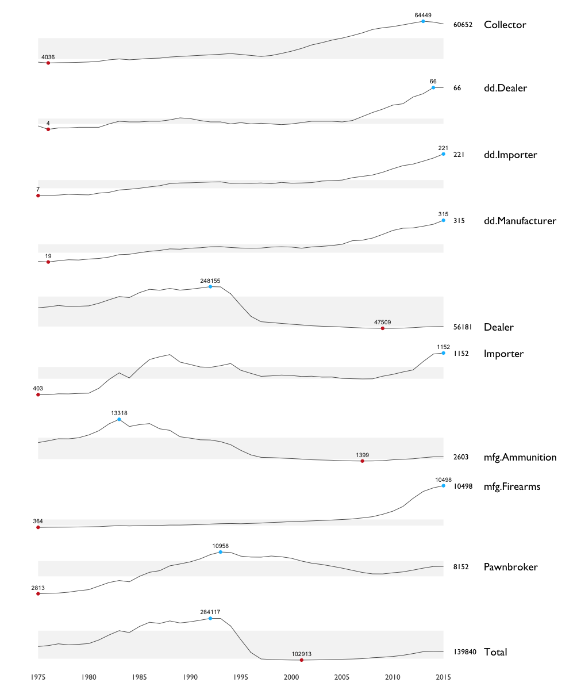
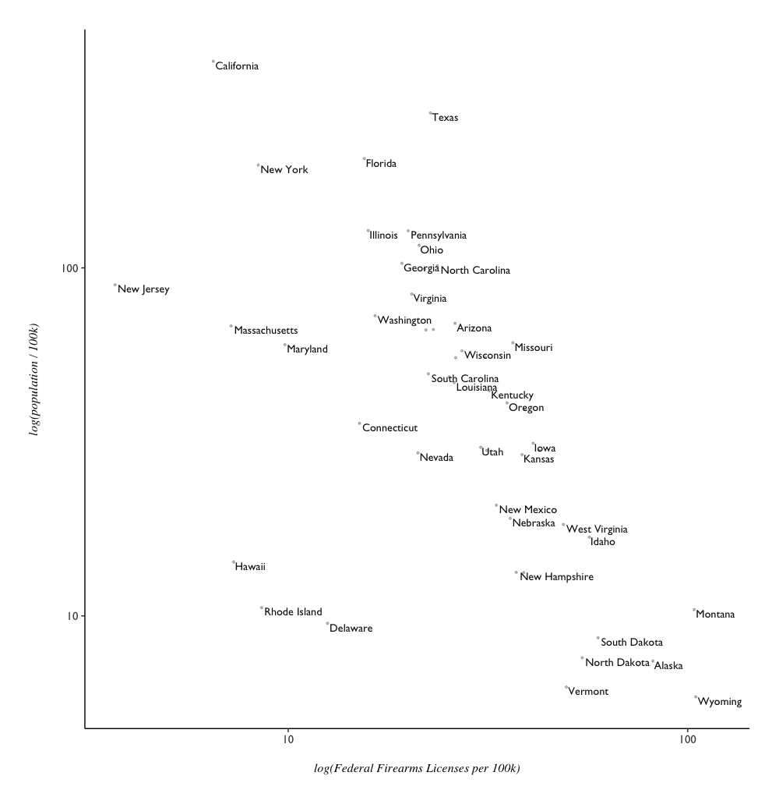
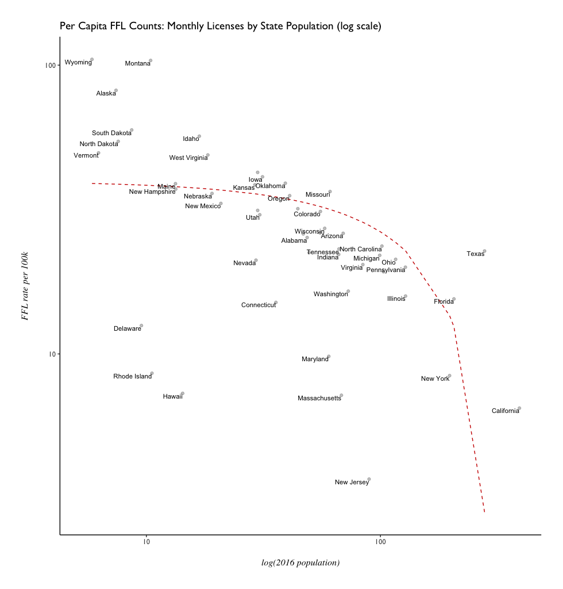
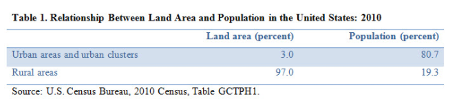
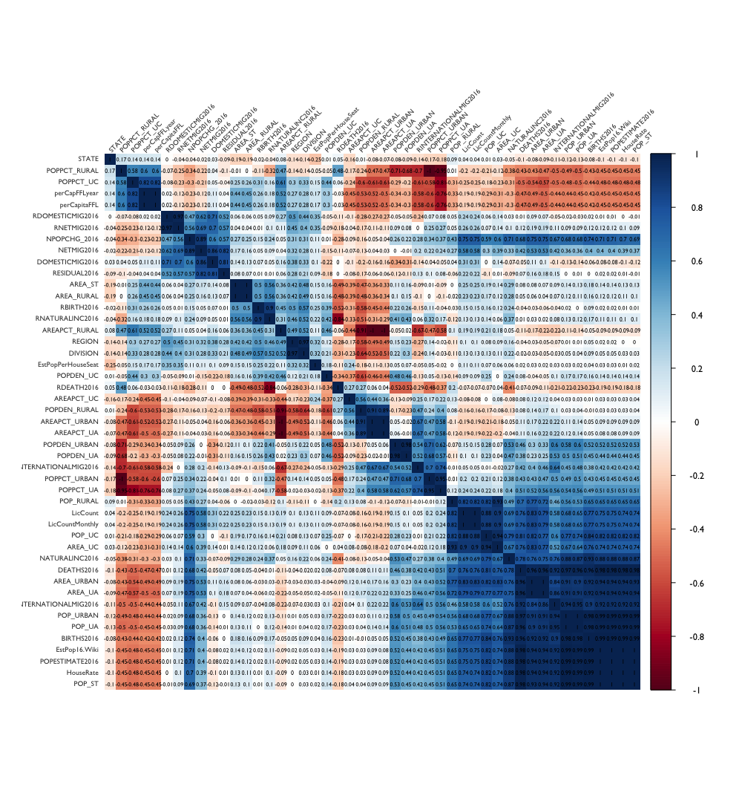

- [What is a Federal Firearms License?](#what-is-a-federal-firearms-license)
- [License Counts by State](#license-counts-by-state)
- [Rural-Urban Proportions](#rural-to-urban-proportions)
- [Federal Firearms Licenses over time](#ffl-history-1975-2015)

# What is a Federal Firearms License?

In the United States, a Federal Firearms License (FFL) is a requirement for those who engage in the business of firearms - generally **dealers**, **manufacturers**, and **importers**. 

It's not actually a license to carry a firearm; it's strictly for the conducting business involving firearms. It's not necessary to have one if selling at gun shows, or when purchasing guns for personal reasons. 

The ATF considers 9 __types__ of FFLs: 

- Dealer
- Pawnbroker
- Collector
- Manufacturer of Ammunition
- Manufacturer of Firearms
- Dealer in Destructive Devices
- Manufacturer of Destructive Devices
- Importer of Destructive Devices

'Destructive Devices' constitute their own class, and are [defined by the National Firearms Act](https://www.atf.gov/firearms/firearms-guides-importation-verification-firearms-national-firearms-act-definitions-1), [26 U.S.C. § 5845(F) (page 82)](https://www.atf.gov/firearms/docs/guide/atf-guidebook-importation-verification-firearms-ammunition-and-implements-war/download). Three examples, as shown in an illustration from the ATF Guidebook:


The ATF bullet points defining Destructive Device are: 

- A missile having an explosive or incendiary charge of more than 1/4 oz. (**1/4 oz explosive/incendiary**)
- Any type of weapon by whatever name known which will, or which may readily be converted to expel a projectile, by the action of an explosive or other propellant, the barrel or barrels of which have a bore greater than one-half inch in diameter. (**1/2" bore**)
- A combination of parts designed and intended for use in converting a device into a destructive device and from which a destructive device can be readily assembled.

Back to FFLs - the ATF [publishes data on this FFL holders](https://www.atf.gov/firearms/listing-federal-firearms-licensees-ffls-2016) monthly, from 2013 to present. Additionally, an [annual commerce report](https://www.atf.gov/resource-center/data-statistics) is released, which contains numbers on weapons registrations, imports and taxes, and historical FFL data. With historical FFL data, we can broadly see how license counts have changed over time - from 1975-2015. 

By the 9 Types of FFLs as defined by the ATF, how have the counts changed from 1975 to 2015? (**'dd'** stands for Destructive Device and **'mfg'** for manufacturer)



- Looking specifically at Destructive Devices - the number has increased steadily and heavily since 1975.
- Manufacturers of Ammunition have gone down dramatically
- around 2010, Manufacturers of Firearms began to increase steadily.
- peak of all FFL types appears to have happened in the early 1990s.
- Tufte-style sparkline plot originally translated to R by [Lukasz Piwek](http://motioninsocial.com/tufte/)


# License Counts by State

Here's a walkthrough of initial exploratory plots and analysis for Federal Firearms Licenses in 2016. 

```{r}
library(dplyr)
library(tidyr)
library(ggplot2)
library(data.table)

f16 <- fread("data/ffl-2016-V3.csv", stringsAsFactors = T)
f16 <- as.data.frame(f16)
```

## License Count by State

So the first broad question that comes to mind: Which states had the most firearms licenses? A license count variable for each state was computed while munging.

```{r}
# Broadly: which states had the most firearms licenses? -----------------------

summary(f16$LicCount)
#    Min. 1st Qu.  Median    Mean 3rd Qu.    Max. 
#      20   14630   20580   25220   29630   75960
```


Texas appears to have twice as many license holders than Florida - but it is also the largest state in the continental US. A state's total land area might be misleading here; although at the lower end of scale are where much smaller states such as Rhode Island and Delaware appear. 

Also what might be misleading is that the above plot is for _raw counts_, that doesn't take into account each state's population. After binding US Census population data for each state, license count can be normalized **per 100,000 residents**. This shows a different picture of FFL holders across the states (population mapped to color fill):


- Texas, while leading the raw count in FFLs, has less than 25 FFLs per capita. 
- Wyoming, with the lowest population in the US, has over 100 FFLs per 100,000 residents. 

Alaska (3rd least populous) along with North and South Dakota (4th and 5th least populous) appear to be part of a trend of more FFLs despite lower population.

Broadly speaking, it appears that the most populous states have less firearms license holders per capita than the least populous states.


Looking at these maps...it's tempting to want to say that the number of Fedeally Licensed Firearms dealers is inversely proportional to a state's population. We can create two rank variables to specifically look at this possibility. Or - put FFLs and population on a scatterplot, and possibly fit an exploratory linear regression if there appears to be a pattern.


Looking at the scatterplot of FFLs per 100k residents vs population...it is still tempting to see an inverse relationship between the two. Why would a higher population have less FFLs? It can also be noted that there's possibly 3 very general clusters that form on the scatterplot - the most populous states, least populous states, and states in general (which very much looks like would follow f(x) = 1/x to me.) 

How does this look on a log scale? 



And with fitted values from `lm(FFL.rate ~ Population)`?




**TODO**: compare urban density across US to FFL density.

# Rural to Urban Proportions

Since there appears to be an inverse relationship between a state's population and the number of Federal Firearms Licenses, it seemed a good idea to drill down further into how populations are comprised. The [US Census](https://www.census.gov/geo/reference/ua/urban-rural-2010.html) provides definitions and data on Rural and Urban across the United States.

According to the U.S. Census:

- Urbanized Areas are defined as having a population of over 50,000.
- Urban Clusters have a population 5,000 < n < 50,000.
- Rural Areas have a population less than 5,000.

Again there appears again to be an inverse relationship - this time, between Land Area and Population when looking at Urban vs Rural Areas. While Urban Areas comprise only 3 percent of United States Land Area, they also account for 80.7 percent of the population. Rural Areas, by contrast, make up 97% of US Land Area while only 19.3 percent of the population.<sup>[2](#works-cited)</sup> 



Given the observation of an inverse relationship between FFLs vs Population by state, what can be learned from differences in rural- and urban-defined areas in the United States in regard to FFLs? 

After combining Rural-Urban Proportions data with Per Capita FFL data from earlier, we can look for correlations between per capita License Counts and other variables. ([higher-resolution plot](R_plots/rural-urban-corr-matrix-01-hires.png), [annotated printout](R_plots/rural-urban-corr-matrix-annotated.jpg))




## Which variables strongly correlate with license counts? 

From the initial correlation matrix, about a dozen variables were selected for showing strong postive/negative correlation to raw and adjusted license counts. "Strong" in this case refers to variables with a correlation coefficient above 0.5 (preferably even higher) in relation to: 

- total FFLs
- monthly FFLs
- per capita total FFLs
- per capita monthly FFLs

Strongly correlated variables tended to relate to the stratified population categories:

- Urbanized Areas, Urban Clusters, and Rural Areas

and across variables of:

- Population, Population Percentage, and Land Area

For example, the **Land Area** of an **Urban Cluster** has a rather strong correlation coefficient of __0.90__ in relation to monthly license counts. The **Population Percentage** living in **Urban Clusters** shows a coefficient of __0.82__, in relation to monthly per capita FFL counts. 

Filtering for these variables, would a more specific correlation matrix be helpful before trying out a model?

``` {R}
library(corrplot)

# Filter for variables across the 3 population classes:
# Population Percentage, Population, Area
rural.urban.filter <- ffl.16 %>%
  select(STATE, LicCount, LicCountMonthly, perCapFFLyear, perCapitaFFL, 
         POPPCT_RURAL, POPPCT_UC, POPPCT_UA, POPPCT_URBAN, 
         POP_RURAL, POP_UC, POP_UA, AREA_RURAL, AREA_UC, AREA_URBAN,
         NPOPCHG_2016, NETMIG2016)

rural.urban.f.corr <- cor(rural.urban.filter)

corrplot(rural.urban.f.corr, method = "shade", shade.col = NA,
         tl.col = "gray23", tl.srt = 45, tl.cex = 0.85, 
         addCoef.col = "black", number.cex = 0.85,
         order = "hclust", mar = c(1, 1, 1, 1))
```


For raw totals of monthly license counts, Land Area and Population of Urban Clusters show the highest positive correlation (r^2 = 0.90 & 0.88). Land Area of Urbanized Areas and Rural Population also are strong (r^2 = 0.83 & 0.82). 

For monthly per capita FFL counts, Population Percentage of Urban Clusters shows the highest positive correlation (r^2 = 0.82). Population Percentage of Urbanized Areas shows a strong negative correlation (-0.75).


## License Count By Month

Was there much variance in the number of licenses in each state, from month to month? How does this look specifically, from 2015 to 2016? 


# Works Cited

<sup>1</sup> ["Why Own a Gun? Protection Is Now Top Reason"](http://www.pewresearch.org/daily-number/why-own-a-gun-protection-is-now-top-reason/). Pew Research. May 9th, 2013.

<sup>2</sup> ["Life Off the Highway: A Snapshot of Rural America"](http://blogs.census.gov/2016/12/08/life-off-the-highway-a-snapshot-of-rural-america/). U.S. Census Bureau. Dec 8th, 2016. 


