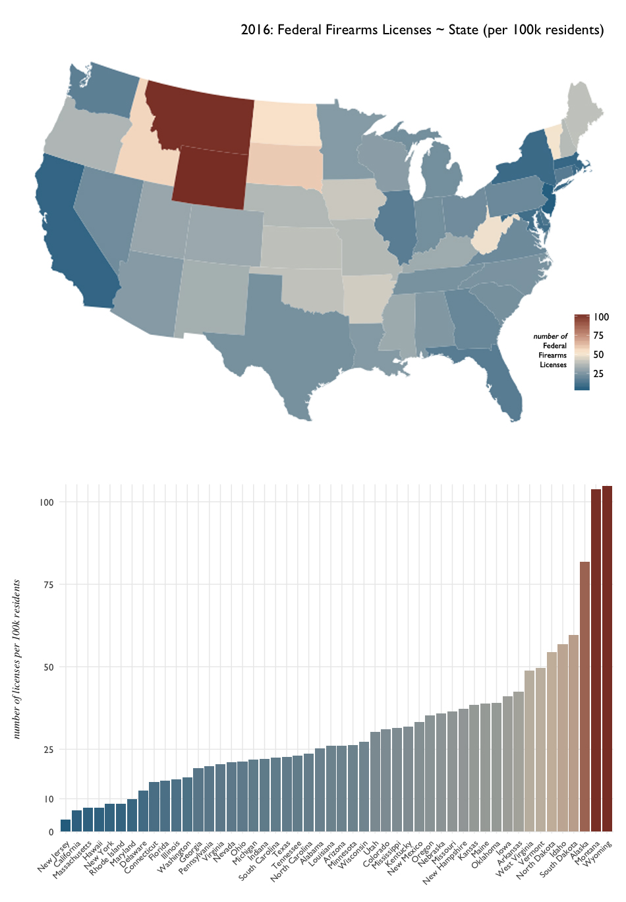
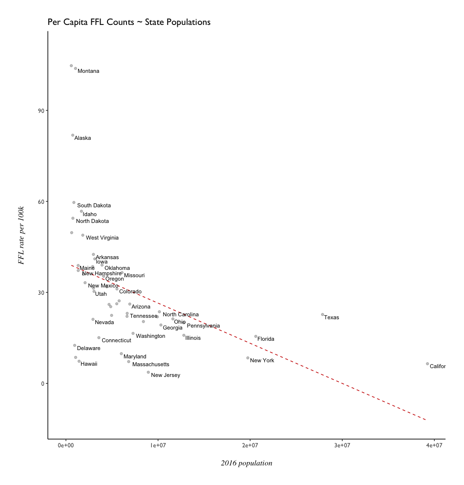
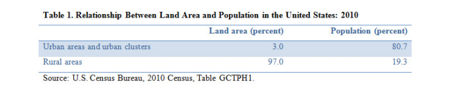
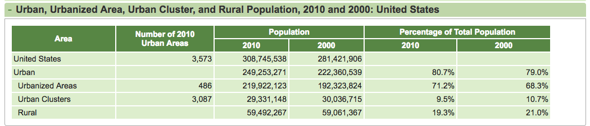
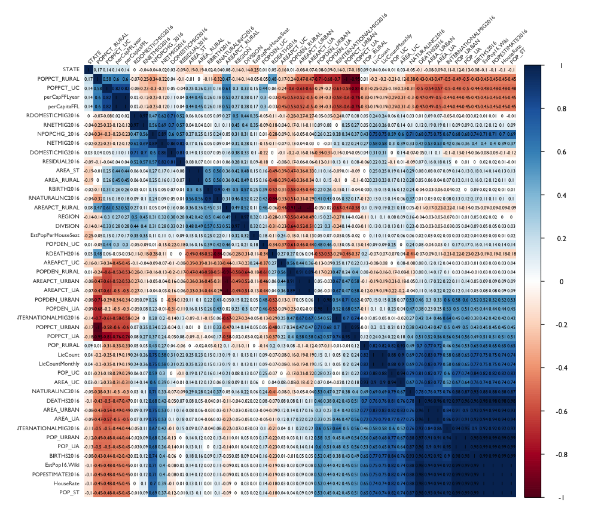
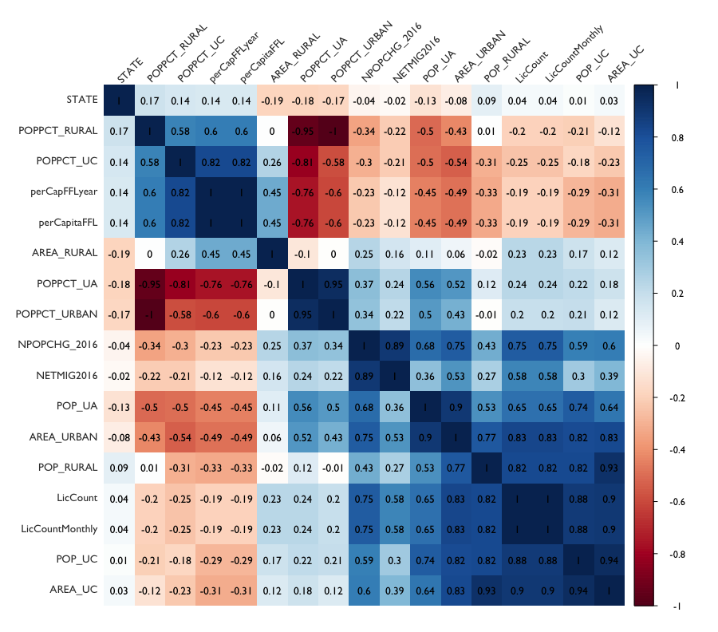
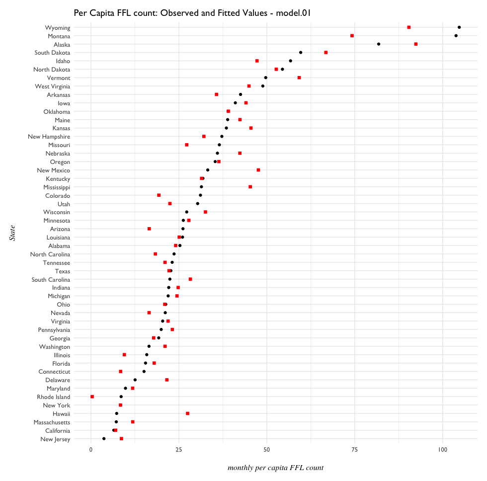

- [What is a Federal Firearms License?](#what-is-a-federal-firearms-license)
- [License Counts by State](#license-counts-by-state)
- [Rural-Urban Proportions](#rural-to-urban-proportions)
- [Federal Firearms Licenses over time](#ffl-history-1975-2015)

# What is a Federal Firearms License?

In the United States, a Federal Firearms License (FFL) is a requirement for those who engage in the business of firearms - generally **dealers**, **manufacturers**, and **importers**. 

It's not actually a license to carry a firearm; it's strictly for the conducting business involving firearms. It's not necessary to have one if selling at gun shows, or when purchasing guns for personal reasons. 

The ATF considers 9 __types__ of FFLs: 

- Dealer
- Pawnbroker
- Collector
- Manufacturer of Ammunition
- Manufacturer of Firearms
- Dealer in Destructive Devices
- Manufacturer of Destructive Devices
- Importer of Destructive Devices

'Destructive Devices' constitute their own class, and are [defined by the National Firearms Act](https://www.atf.gov/firearms/firearms-guides-importation-verification-firearms-national-firearms-act-definitions-1), [26 U.S.C. § 5845(F) (page 82)](https://www.atf.gov/firearms/docs/guide/atf-guidebook-importation-verification-firearms-ammunition-and-implements-war/download). Three examples, as shown in an illustration from the ATF Guidebook:


The ATF bullet points defining Destructive Device are: 

- A missile having an explosive or incendiary charge of more than 1/4 oz. (**1/4 oz explosive/incendiary**)
- Any type of weapon by whatever name known which will, or which may readily be converted to expel a projectile, by the action of an explosive or other propellant, the barrel or barrels of which have a bore greater than one-half inch in diameter. (**1/2" bore**)
- A combination of parts designed and intended for use in converting a device into a destructive device and from which a destructive device can be readily assembled.

Back to FFLs - the ATF [publishes data on this FFL holders](https://www.atf.gov/firearms/listing-federal-firearms-licensees-ffls-2016) monthly, from 2013 to present. Additionally, an [annual commerce report](https://www.atf.gov/resource-center/data-statistics) is released, which contains numbers on weapons registrations, imports and taxes, and historical FFL data. With historical FFL data, we can broadly see how license counts have changed over time - from 1975-2015. 

By the 9 Types of FFLs as defined by the ATF, how have the counts changed from 1975 to 2015? (**'dd'** stands for Destructive Device and **'mfg'** for manufacturer)


- Looking specifically at Destructive Devices - the number has increased steadily and heavily since 1975.
- Manufacturers of Ammunition have gone down dramatically
- around 2010, Manufacturers of Firearms began to increase steadily.
- peak of all FFL types appears to have happened in the early 1990s.
- Tufte-style sparkline plot originally translated to R by [Lukasz Piwek](http://motioninsocial.com/tufte/)


# License Counts by State

Here's a walkthrough of initial exploratory plots and analysis for Federal Firearms Licenses in 2016. 

```{r}
library(dplyr)
library(tidyr)
library(ggplot2)
library(data.table)

f16 <- fread("data/ffl-2016-V3.csv", stringsAsFactors = T)
f16 <- as.data.frame(f16)
```

## License Count by State

So the first broad question that comes to mind: Which states had the most firearms licenses? A license count variable for each state was computed while munging.

```{r}
# Broadly: which states had the most firearms licenses? -----------------------

summary(f16$LicCount)
#    Min. 1st Qu.  Median    Mean 3rd Qu.    Max. 
#      20   14630   20580   25220   29630   75960
```


Texas appears to have twice as many license holders than Florida - but it is also the largest state in the continental US. A state's total land area might be misleading here; although at the lower end of scale are where much smaller states such as Rhode Island and Delaware appear. 

Also what might be misleading is that the above plot is for _raw counts_, that doesn't take into account each state's population. After binding US Census population data for each state, license count can be normalized **per 100,000 residents**. This shows a different picture of FFL holders across the states (population mapped to color fill):


- Texas, while leading the raw count in FFLs, has less than 25 FFLs per capita. 
- Wyoming, with the lowest population in the US, has over 100 FFLs per 100,000 residents. 

Alaska (3rd least populous) along with North and South Dakota (4th and 5th least populous) appear to be part of a trend of more FFLs despite lower population.

Broadly speaking, it appears that the most populous states have less firearms license holders per capita than the least populous states.




Looking at these maps...it's tempting to want to say that the number of Fedeally Licensed Firearms dealers is inversely proportional to a state's population. We can create two rank variables to specifically look at this possibility. Or - put FFLs and population on a scatterplot, and possibly fit an exploratory linear regression if there appears to be a pattern.


Looking at the scatterplot of FFLs per 100k residents vs population...it is still tempting to see an inverse relationship between the two. Why would a higher population have less FFLs? It can also be noted that there's possibly 3 very general clusters that form on the scatterplot - the most populous states, least populous states, and states in general (which very much looks like would follow f(x) = 1/x to me.) 

How does this look on a log scale? 


And with fitted values from `lm(FFL.rate ~ Population)`?




**TODO**: compare urban density across US to FFL density.

# Rural to Urban Proportions

Since there appears to be an inverse relationship between a state's population and the number of Federal Firearms Licenses, it seemed a good idea to drill down further into how populations are comprised. The [US Census](https://www.census.gov/geo/reference/ua/urban-rural-2010.html) provides definitions and data on Rural and Urban across the United States.

According to the U.S. Census:

- Urbanized Areas are defined as having a population of over 50,000.
- Urban Clusters have a population 5,000 < n < 50,000.
- Rural Areas have a population less than 5,000.
- Urban Areas reflect the sum totals of Urbanized Areas and Urban Clusters.

Again there appears again to be an inverse relationship - this time, between **Land Area** and **Population** when looking at **Urban** vs **Rural Areas**. While **Urban Areas** comprise only 3 percent of United States **Land Area**, they also account for 80.7 percent of the **Population**. **Rural Areas**, by contrast, make up 97% of US **Land Area** while only 19.3 percent of the total **Population**.<sup>[2](#works-cited)</sup> 



The raw numbers on these Census definitions tells a similar story, while also showing a slight increase in population for **Urbanized Areas** from 2000 to 2010 (2.9% of population, or approx 20.6 million people).



Given the observation of an inverse relationship between FFLs vs Population by state, what can be learned from differences in **Rural-** and **Urban-** defined areas in the United States in regard to FFLs? 

After joining Rural-Urban Proportions data with Per Capita FFL data from earlier, we can look for correlations between per capita License Counts and other variables. ([higher-resolution plot](R_plots/rural-urban-corr-matrix-01-hires.png), [annotated printout](R_plots/rural-urban-corr-matrix-annotated.jpg))




## Which variables correlate strongly with license counts? 

From the initial correlation matrix, about a dozen variables were selected for showing strong postive or negative correlation to raw and adjusted license counts. "Strong" in this case refers to variables with a correlation coefficient above **0.5** (preferably even higher) in relation to: 

- total FFLs
- monthly FFLs
- per capita total FFLs
- **per capita monthly FFLs**

**Per Capita Monthly FFLs** might be the most the most accurate metric for FFLs for two reasons:

- the per capita adjustment normalizes for the different populations across states
- the monthly count captures more unique FFLs than annual totals because of monthly rollover/repetition of license holders. 

Strongly correlated variables tended to relate to the stratified population categories:

- Urbanized Areas, Urban Clusters, and Rural Areas

and across variables of:

- Population, Population Percentage, and Land Area

For example, the **Land Area** of an **Urban Cluster** has a rather strong correlation coefficient of __0.90__ in relation to monthly license counts. The **Population Percentage** living in **Urban Clusters** shows a coefficient of __0.82__, in relation to monthly per capita FFL counts. 

Filtering for these variables, would a more specific correlation matrix be helpful before trying out a model?

``` {R}
library(corrplot)

# Filter for variables across the 3 population classes:
# Population Percentage, Population, Area
rural.urban.filter <- ffl.16 %>%
  select(STATE, LicCount, LicCountMonthly, perCapFFLyear, perCapitaFFL, 
         POPPCT_RURAL, POPPCT_UC, POPPCT_UA, POPPCT_URBAN, 
         POP_RURAL, POP_UC, POP_UA, AREA_RURAL, AREA_UC, AREA_URBAN,
         NPOPCHG_2016, NETMIG2016)

rural.urban.f.corr <- cor(rural.urban.filter)

corrplot(rural.urban.f.corr, method = "shade", shade.col = NA,
         tl.col = "gray23", tl.srt = 45, tl.cex = 0.85, 
         addCoef.col = "black", number.cex = 0.85,
         order = "hclust", mar = c(1, 1, 1, 1))
```



For _raw totals of monthly license counts_ (**LicCount**, **LicCountMonthly**), **Land Area** and **Population** of **Urban Clusters** show the highest positive correlation (r^2 = **0.90** & **0.88**). **Land Area** of **Urbanized Areas** and **Rural Population** also are strong (r^2 = **0.83** & **0.82**). 

For _monthly per capita FFL counts_ (**perCapitaFFL**), **Population Percentage** of **Urban Clusters** shows the highest positive correlation (r^2 = **0.82**). **Population Percentage** of **Urbanized Areas** shows a strong negative correlation (**-0.75**).


### Per Capita FFL relationships

Overall - **Urban Clusters** tend to show a high correlation to Per Capita Monthly FFL counts, across all three variable classes (**Population**, **Population Percentage**, and **and Area**). 

While the assumption might be that **Rural** areas have higher FFL counts, there's actually a weak negative correlation between Population Percentage, Land Area and Monthly Per Capita FFLs. But contradicting this potential pattern is **Rural Population**, correlating with Monthly Per Capita FFLs at a coefficient of **0.82**. 

### Relationships between Rural-Urban variables

Other strong correlations appear, but the strongest of these generally highlight the difference between _Rural_ and _Urban_, e.g. coefficient of **-1** for relationship between Rural Population Percentage and Urban Population. 

However, there are some potentially interesting relationships between the Census-defined variables: such as between the **Rural Population** and **Land Area** of **Urban Clusters** (**0.93**). Further investigation might show that **"Urban" Clusters** more resemble **Rural Areas**, despite the naming and US Census definition. 

**Land Area** and **Population** are highly correlated with regard to **Urbanized Areas** and **Urbanized Clusters** (**> 0.90**), but there's almost no relationship between **Land Area** and **Rural Population** (**-0.02**).

## Exploratory Model Building

model.01 Explanatory Variables:

- Population Percentage: Rural, Urban Cluster, Urbanized Area
- Population: Rural, Urban Cluster, Urbanized Area
- Land Area: Rural, Urban Cluster, Urbanized Area

Essentially, will be looking at explanatory power of population and land area across the 3 classes defined by the US Census. 


```{r}

model.01 <- lm(perCapitaFFL ~ STATE + POPPCT_UC + POPPCT_UA + POPPCT_RURAL + POP_UC 
               + POP_UA + POP_RURAL + AREA_UC + AREA_UA + AREA_RURAL, data = ffl.16)

summary(model.01)

# look at coefficients, sorted by p-value
model.01.tidy <- tidy(model.01) %>%
  arrange(p.value)

#            term      estimate    std.error   statistic      p.value
# 1    AREA_RURAL  3.562443e-11 6.683218e-12  5.33043081 4.394393e-06
# 2       AREA_UA  2.232194e-09 1.194578e-09  1.86860456 6.920262e-02
# 3       AREA_UC -1.852561e-08 1.049634e-08 -1.76495790 8.540102e-02
# 4         STATE  1.384627e-01 9.204794e-02  1.50424518 1.405743e-01
# 5     POP_RURAL  4.603342e-06 5.647564e-06  0.81510220 4.199638e-01
# 6     POPPCT_UA -2.121229e+02 3.002846e+02 -0.70640627 4.841346e-01
# 7   (Intercept)  2.120248e+04 3.002844e+04  0.70607999 4.843353e-01
# 8  POPPCT_RURAL -2.117348e+02 3.002665e+02 -0.70515630 4.849035e-01
# 9     POPPCT_UC -2.102720e+02 3.003451e+02 -0.70010125 4.880196e-01
# 10       POP_UA -5.664944e-07 8.418024e-07 -0.67295411 5.049448e-01
# 11       POP_UC  1.419485e-06 1.424846e-05  0.09962379 9.211534e-01
```

Six variables have smaller p-values than the Intercept:

- Land Area for Rural, Urbanized Areas, and Urban Clusters, respectively
- the STATE index variable (which I don't believe should have predicitive power)
- Rural Population
- Urbanized Area Population Percentage

How do the fitted and observed values look? 

```{r}
# create key-value df for state names and numbers
state.key <- ffl.16 %>%
  select(NAME, STATE)

# store fitted values in dataframe, merge to include state names
model.01.fit <- augment(model.01) %>%
  arrange(desc(perCapitaFFL)) %>%
  left_join(state.key)

# plot observed and fitted perCapitaFFL counts
ggplot(model.01.fit, aes(x = reorder(NAME, perCapitaFFL), y = perCapitaFFL)) +
  geom_point() +
  geom_point(aes(x = reorder(NAME, perCapitaFFL), y = .fitted), 
             color = "red", shape = 15, size = 2, data = model.01.fit) +
  pd.theme + coord_flip() +
  labs(x = "State", y = "monthly per capita FFL count", 
       title = "Per Capita FFL count: Observed and Fitted Values - model.01")
``` 

      


## License Count By Month

Was there much variance in the number of licenses in each state, from month to month? How does this look specifically, from 2015 to 2016? 


# Works Cited

<sup>1</sup> ["Why Own a Gun? Protection Is Now Top Reason"](http://www.pewresearch.org/daily-number/why-own-a-gun-protection-is-now-top-reason/). Pew Research. May 9th, 2013.

<sup>2</sup> ["Life Off the Highway: A Snapshot of Rural America"](http://blogs.census.gov/2016/12/08/life-off-the-highway-a-snapshot-of-rural-america/). U.S. Census Bureau. Dec 8th, 2016. 


