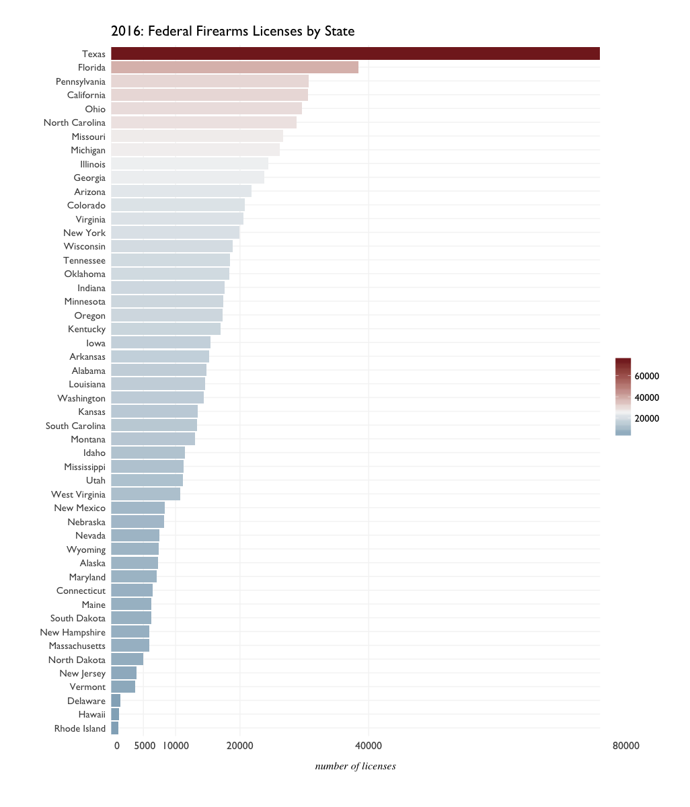

# Why Own a Gun?

_an examination of ATF Federal Firearms License data_

Protection, Recreation, and Entitlement: these are 3 reasons commonly cited for owning a firearm in the United States. A Pew Research poll<sup>[1](#works-cited)</sup> actually asked the question "Why Own a Gun?", and their survey shows an interesting figure in people's primary reasons for doing so. 

- In 1999, 49% of those surveyed cited 'Hunting' as a primary reason, and 26% claimed 'Protection'. 
- In 2013, 48% claimed 'Protection', while 32% cited 'Hunting' as a primary reason. 

The question of _Why?_ is beyond the direct scope of Federal Firearms License data alone; FFL covers not individual owners but rather dealers, manufacturers, and suppliers of firearms. However, by looking at patterns and outliers in federally licensed firearm trade...

# ATF - Federal Firearms Licenses 2016

Here's a walkthrough of initial exploratory plots and analysis for Federal Firearms Licenses in 2016. 

```{r}
library(dplyr)
library(tidyr)
library(ggplot2)
library(data.table)
library(RColorBrewer)
library(scales)

f16 <- fread("data/ffl-2016-V2.csv", stringsAsFactors = T)
f16 <- as.data.frame(f16)
```

## License Count by State

So the first broad question that comes to mind: Which states had the most firearms licenses? A license count variable for each state was computed while munging.

```{r}
# Broadly: which states had the most firearms licenses? -----------------------

summary(f16$LicCount)
#    Min. 1st Qu.  Median    Mean 3rd Qu.    Max. 
#      20   14630   20580   25220   29630   75960
```


Texas appears to have twice as many license holders than Florida - but it is also the largest state in the continental US. Square mileage per state might be misleading here; although at the lower end of scale are where much smaller states such as Rhode Island and Delaware appear. 

Also what might be misleading is that the above plot is for _raw counts_, that doesn't take into account each state's population. After binding US Census population data for each state, License count can be normalized per 100,000 residents. This shows a different picture of FFL holders across the states:


- Texas, while leading the raw count in FFLs, has less than 25 FFLs per capita. 
- Wyoming, with the lowest population in the US, has over 100 FFLs per 100,000 residents. 

Alaska (3rd least populous) along with North and South Dakota (4th and 5th least populous) appear to be part of a trend of more FFLs despite lower population.

Broadly speaking, it appears that the most populous states have less firearms license holders per capita than the least populous states.


Looking at these maps...it's tempting to want to say that the number of Fedeally Licensed Firearms dealers is inversely proportional to a state's population. We can create two rank variables to specifically look at this possibility. Or - put FFLs and population on a scatterplot, and fit an exploratory linear regression there appears to be a pattern.


Looking at the scatterplot of FFLs per 100k residents vs population...it is still tempting to see an inverse relationship between the two. Why would a higher population have less FFLs? 


## License Count by Region

Are there any trends by region? Could state population be tell us more about license holders? 

(For whatever reason, it's difficult to find the ATF's Region codes online, but the states belonging to each region can be found by simply filtering the data.)


So most regions have less than 40,000 licenses per state, but appear _generally_ similar. Region 8 has just 4 states and a low number of licenses, other than Pennsylvania. Region 6 appears to have the lowest number of licenses by region overall; most states here have less than 10,000, with the outlier of New York at about 20,000. Perhaps a summary of each region by state would be easier to read than this plot. 

## License Count By Month

Was there much variance in the number of licenses in each state, from month to month?


It doesn't appear there was much variance...but just to be a bit more sure:

More certainly it appears that license counts remained stable from month to month. A likely guess for this would be that most licenses did not expire - but also that there were no significant increases or decreases in license ownership from month to month. How does this look specifically, from 2015 to 2016? 


# Works Cited

<sup>1</sup> ["Why Own a Gun? Protection Is Now Top Reason"](http://www.pewresearch.org/daily-number/why-own-a-gun-protection-is-now-top-reason/). Pew Research. May 9th, 2013.


