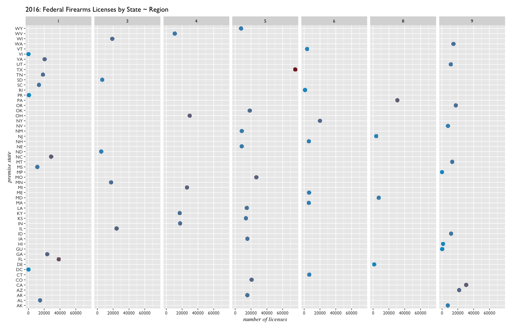
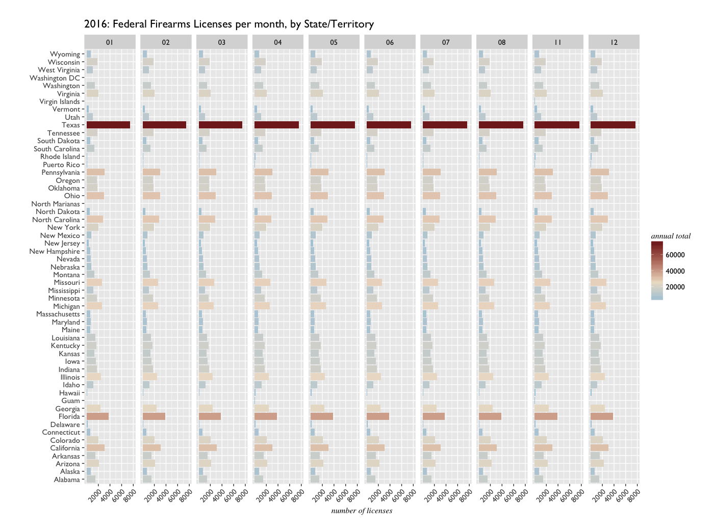

_Why Own a Gun? an examination of ATF Federal Firearms License data_

Entitlement, Protection, and Recreation

# ATF - Federal Firearms Licenses 2016

Here's a walkthrough of initial exploratory plots and analysis for Federal Firearms Licenses in 2016. 

```{r}
library(dplyr)
library(tidyr)
library(ggplot2)
library(data.table)
library(RColorBrewer)
library(scales)

f16 <- fread("data/ffl-2016-V2.csv", stringsAsFactors = T)
f16 <- as.data.frame(f16)
```

### License Count by State
So the first broad question that comes to mind: Which states had the most firearms licenses? A license count variable for each state was computed while munging.

```{r}
# Broadly: which states had the most firearms licenses? -----------------------

summary(f16$LicCount)
#    Min. 1st Qu.  Median    Mean 3rd Qu.    Max. 
#      20   14630   20580   25220   29630   75960

# A look at license count by state
ggplot(f16, aes(reorder(PremiseStateFull, LicCount), fill = LicCount)) + 
  geom_bar() +
  scale_fill_gradient2(low = "deepskyblue2", mid = "antiquewhite2", high = muted("firebrick3"),
                       midpoint = 25220) +
  scale_y_discrete(limits = c(0, 5000, 10000, 20000, 40000, 80000)) +
  theme_minimal(base_size = 13.75, base_family = "GillSans") +
  theme(plot.margin = unit(c(1, 1, 1, 1), "cm"),
        axis.title.x = element_text(family = "Times", face = "italic", size = 12,
                                    margin = unit(c(0.5, 0.5, 0.5, 0.5), "cm")),
        axis.text.x = element_text(size = 12.75, angle = 30, hjust = 1, vjust = 1),
        panel.grid.major = element_line(color = "gray96")) +
  labs(title = "2016: Federal Firearms Licenses by State",
       y = "number of licenses", x = "", fill = "") +
  coord_flip()
```


Texas appears to have twice as many license holders than Florida - but it is also the largest state in the continental US. Square mileage per state might be misleading here; although at the lower end of scale are where much smaller states such as Rhode Island and Delaware appear. 

### License Count by Region

Are there any trends by region? Could state population be tell us more about license holders? 

(For whatever reason, it's difficult to find the ATF's Region codes online, but the states belonging to each region can be found by simply filtering the data.)

```{r}

# facet license counts by state and region 
ggplot(f16, aes(LicCount, PremiseState, color = LicCount)) +
  geom_point(size = 3) +
  facet_grid(. ~ Region) +
  scale_color_gradient(low = "deepskyblue3", high = muted("firebrick4"),
                        guide = FALSE) +
  theme_gray(base_size = 12, base_family = "GillSans") +
  theme(plot.margin = unit(c(0.5, 0.5, 0.5, 0.5), "cm"),
        axis.title = element_text(family = "Times", face = "italic")) +
  labs(title = "2016: Federal Firearms Licenses by State ~ Region",
       x = "number of licenses", y = "premise state")
```


So most regions have less than 40,000 licenses per state, but appear _generally_ similar. Region 8 has just 4 states and a low number of licenses, other than Pennsylvania. Region 6 appears to have the lowest number of licenses by region overall; most states here have less than 10,000, with the outlier of New York at about 20,000. Perhaps a summary of each region by state would be easier to read than this plot. 


### License Count By Month

Was there much variance in the number of licenses in each state, from month to month?

```{r}
# Was there much variance from month to month? --------------------------------

# define a palette for each month
month_pal <- c("deepskyblue4", "deepskyblue3", "lightblue2", "bisque2", "bisque3",
               "firebrick2", "firebrick3", "firebrick4", "lightblue4", "lightblue3")

# license holder count by state, stack by month
ggplot(f16, aes(PremiseStateFull, fill = month)) + 
  geom_bar() +
  scale_fill_manual(values = month_pal) +
  theme_minimal(base_size = 14, base_family = "GillSans") +
  theme(plot.margin = unit(c(1, 1, 1, 1), "cm"),
        axis.title = element_text(family = "Times", face = "italic", size = 12,
                                  margin = unit(c(0.5, 0.5, 0.5, 0.5), "cm"))) +
  labs(title = "2016: Federal Firearms Licenses per month, by State/Territory", 
       x = "", y = "number of licenses") +
  coord_flip()
```


It doesn't appear so...but just to be a bit more sure:



More certainly it appears that license counts remained stable from month to month. A likely guess for this would be that most licenses did not expire - but also that there were no significant increases or decreases in license ownership from month to month. 

In that case, how many licenses were there each month? 

```{r}
# How many licenses were there each month? 

months16 <- f16 %>%
  group_by(month) %>%
  count()

months16 

    month     n
   <fctr> <int>
# 1      01 78776
# 2      02 79015
# 3      03 79021
# 4      04 79193
# 5      05 79346
# 6      06 79525
# 7      07 79662
# 8      08 79906
# 9      11 80071
# 10     12 80047
```

It appears that the number of licenses grew over the course of the year.

### State Populations ---------------------------------------------------------

Back to an earlier question brought up after barplotting by state: Could state population be tell us more about license holders? First to merge in population data by state:

```{r}
# What percentage of the population has a Federal Firearms License? -----------

# data sourced from Wikipedia: 
# https://en.wikipedia.org/wiki/List_of_U.S._states_and_territories_by_population#States_and_territories

# load and cleanse population data
statepop <- read.csv("data/population-state-estimate.csv", stringsAsFactors = F)
str(statepop)

statepop <- statepop %>% select(X.State.or.territory., Population.estimate..July.1..2016, 
                                Estimated.pop..per.House.seat..2016,
                                Percent.of.total.U.S..pop...2016.note.1.)

colnames(statepop) <- c("state", "EstPop2016", "EstPopPerHouseSeat", "PercentUS")

# add state abbreviation to statepop dataframe
statepop$PremiseState <- state.abb[match(statepop$state, state.name)]


# merge license count df with population df 
f16 <- merge(f16, statepop, by = "PremiseState")

# drop superfluous state variable
f16$state <- NULL

# convert population numbers to int and double
f16$EstPop2016 <- gsub(",", "", f16$EstPop2016)
f16$EstPop2016 <- as.integer(f16$EstPop2016)

f16$EstPopPerHouseSeat <- gsub(",", "", f16$EstPopPerHouseSeat)
f16$EstPopPerHouseSeat <- as.integer(f16$EstPopPerHouseSeat)

f16$PercentUS <- gsub("%", "", f16$PercentUS)
f16$PercentUS <- as.double(f16$PercentUS)

# create new column with proportion of FFL holding pop to total pop per state
f16 <- f16 %>%
  mutate(percentFFL = LicCount/EstPop2016)
```


Now we have some decent population data - while at it, why not translate these firearms Type codes to get a summary of those: 


```{r}
# Firearm License Types -------------------------------------------------------

# type.tsv is simply copied from the ATF website
# https://www.atf.gov/firearms/listing-federal-firearms-licensees-ffls-2016

types <- read.csv("data/type.tsv", sep = "\t", stringsAsFactors = T)

types$Type <- factor(types$Type)
types$Description <- as.character(types$Description)
levels(types$Type)

f16$FullType <- ifelse(f16$Type == "01", types$Description[[1]], 
                       ifelse(f16$Type == "02", types$Description[[2]],
                              ifelse(f16$Type == "06", types$Description[[4]],
                                     ifelse(f16$Type == "07", types$Description[[5]],
                                            ifelse(f16$Type == "08", types$Description[[6]],
                                                   ifelse(f16$Type == "09", types$Description[[7]],
                                                          ifelse(f16$Type == "10", types$Description[[8]],
                                                                 ifelse(f16$Type == "11", types$Description[[9]], ""))))))))


f16$FullType <- factor(f16$FullType)
```


