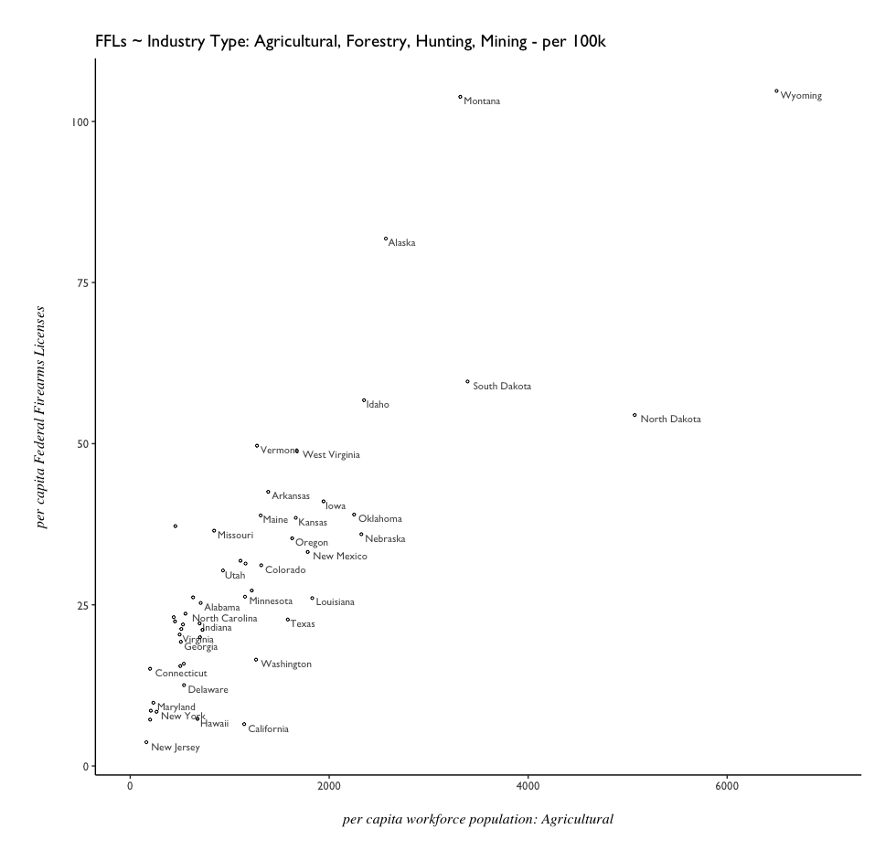
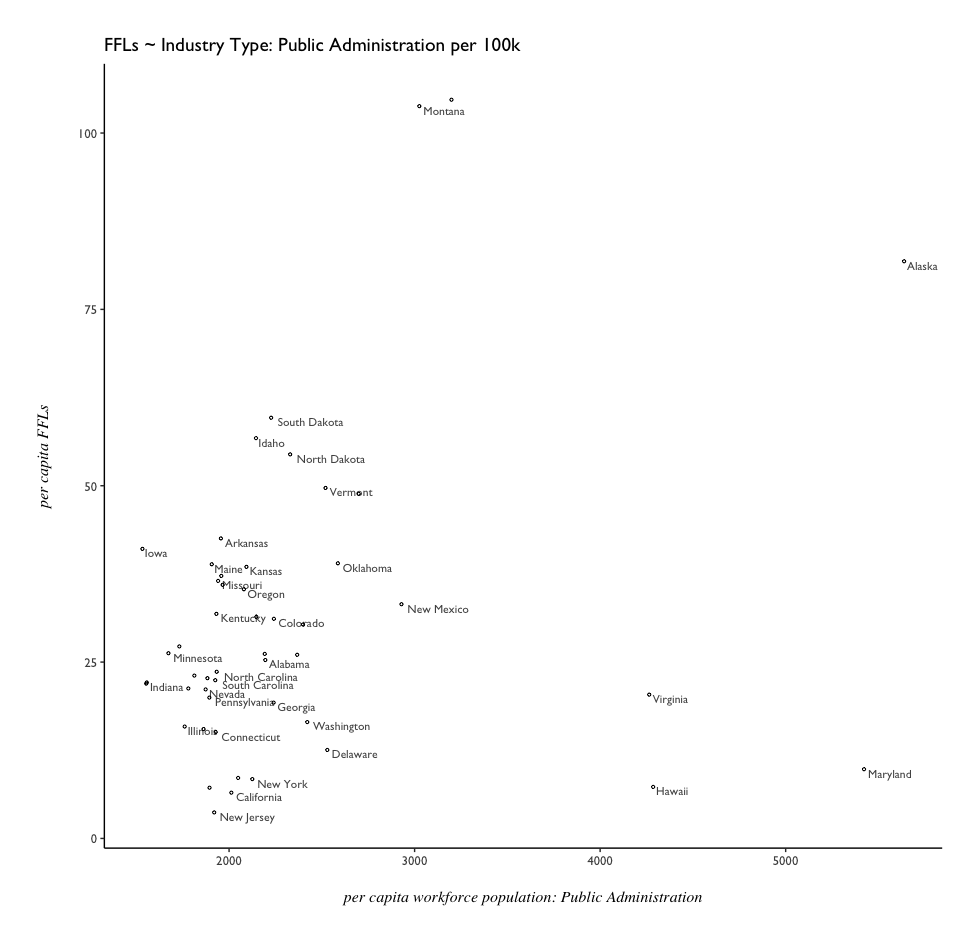

# Federal Firearms Licenses - Feature Exploration

Economic vs. Legislative Forces: which holds more influence over the number for Federal Firearms Licenses in a given state?

To investigate the question, different fields of data from the US Census & American Community Survey are explored, in preparation for fitting models to observe patterns and outliers. 

# Financial Characteristics

# Industry

