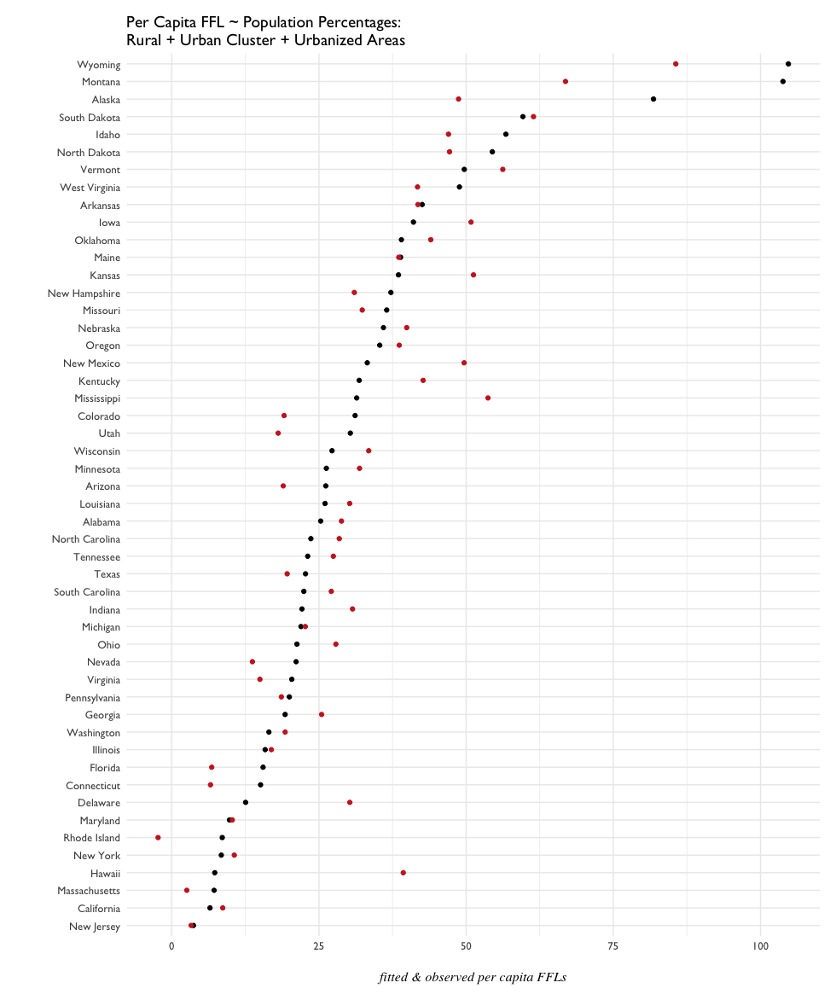

# Model Bulding

## Rural-Urban Proportions data

Is there a relationship between per capita FFLs and the percentage of the population living in Rural, Urban Cluster, and Urban Areas? 

```{r}
# Population Percentages
model.01 <- lm(perCapitaFFL ~ POPPCT_RURAL + POPPCT_UC + POPPCT_UA, data = ffl.16m)
summary(model.01)

Call:
lm(formula = perCapitaFFL ~ POPPCT_RURAL + POPPCT_UC + POPPCT_UA, 
    data = ffl.16m)

Residuals:
    Min      1Q  Median      3Q     Max 
-32.017  -5.475  -1.428   6.889  36.937 

Coefficients:
             Estimate Std. Error t value Pr(>|t|)
(Intercept)   25052.3    36630.6   0.684    0.497
POPPCT_RURAL   -250.3      366.3  -0.683    0.498
POPPCT_UC      -248.6      366.3  -0.679    0.501
POPPCT_UA      -250.6      366.3  -0.684    0.497

Residual standard error: 12.1 on 46 degrees of freedom
Multiple R-squared:  0.7055,	Adjusted R-squared:  0.6863 
F-statistic: 36.74 on 3 and 46 DF,  p-value: 0.000000000002858
```

```{r}
glance(model.01)
  r.squared adj.r.squared    sigma statistic              p.value df    logLik      AIC      BIC deviance df.residual
1  0.705535     0.6863307 12.09853   36.7385 0.000000000002858006  4 -193.5166 397.0332 406.5933 6733.227          46
```

How do the fitted values look plotted with the observed values?

```{r}
# observed and fitted by state
ggplot(m01.fit, aes(perCapitaFFL, reorder(NAME, perCapitaFFL))) + geom_point() +
  geom_point(aes(.fitted, reorder(NAME, perCapitaFFL)), color = "firebrick3", data = m01.fit) +
  pd.theme + labs(y = "", x = "fitted & observed per capita FFLs",
                  title = "Per Capita FFL ~ Population Percentages:\nRural + Urban Cluster + Urbanized Areas")
```




