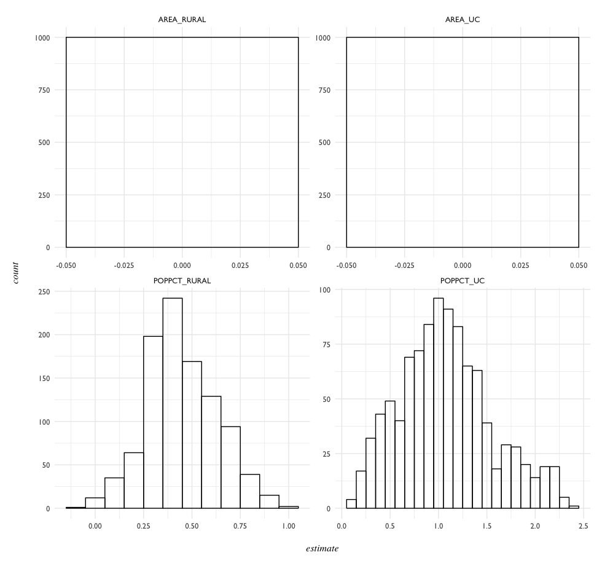

Model Building
==============

# Rural-Urban Proportions

The value that we're looking to explain here is the per capita Federal Firearms License count, by state. Previously, what appeared to be an inverse relationship between a state's population and FFL count was observed. 

A few questions specific to this finer-grain population data:

- Are there characteristics of the population that might also contribute to FFL counts? 
- Does the percentage of the population living in Rural Areas play a role? In Urban Clusters? 
- Could the Land Area of Rural America have an effect on the number of Federal Firearms Licenses in a given state? 

_note:_ Why look at only at Rural Populations and Land Areas, and not also Urbanized Areas? The US census defines these two as opposites - any land that doesn't fit the population and land area criteria for 'Urban' is by default considered 'Rural'.

- [Model 01](#model-01---population-and-land-area-features) - Population and Land Area Features
- [Model 02](#model-02-how-influential-are-the-outliers) - How Influential are the Outliers?
- [Model 03](#model-03-further-reductions) - Further Reductions
- [Model Comparison](#model-comparison)
- [Model 04](#model-04---inversely-proportional) - Inverse Proportions
- [Model 05](#model-05---robust-regression) - Robust Regression 01, Huber Weighting
- [Model 06](#model-05---robust-bisquare-regression) - Robust Regression 01, Bisquare Weighting
- TO-DO: Bisquare weighted Robust Regression, Bootstrap Confidence Intervals, describe all this.

# Model 01 - Population and Land Area Features

This first model looks to see if per Capita FFL counts could be explained by: 

- percentage of population _n_ living in Rural Areas, _n_ < 2,500
- percentage of population _n_ living in Urban Clusters (2,500 < _n_ < 50,000)
- percentage of Rural Land Area
- percentage of Urban Cluster Land Area
- total Rural Land Area
- total Urban Cluster Land Area

```{R}
rural.urban.01 <- lm(perCapitaFFL ~ POPPCT_RURAL + POPPCT_UC + AREAPCT_RURAL + AREAPCT_UC + 
                     AREA_RURAL + AREA_UC, data = ffl.16)
```

What do the coefficients for this model look like? 

```{R}
tidy(rural.urban.01)
           term      estimate    std.error statistic      p.value
1   (Intercept)  3.912484e+01 1.559204e+01  2.509284 1.585326e-02
2  POPPCT_RURAL  4.035331e-01 1.178348e-01  3.424567 1.343717e-03
3     POPPCT_UC  1.844273e+00 2.363076e-01  7.804543 7.711391e-10
4 AREAPCT_RURAL -4.634996e-01 1.815600e-01 -2.552872 1.422859e-02
5    AREAPCT_UC -5.395559e+00 1.584342e+00 -3.405552 1.419769e-03
6    AREA_RURAL  2.515727e-11 6.923526e-12  3.633592 7.270708e-04
```

Going by `p.value`, the most significant explanatory variables in this case would be:

- Urban Cluster Population Percentage (`POPPCT_UC`)
- Rural Land Area (`AREA_RURAL`). 

How do the R-squared and fitted values look? 

```{R}
glance(rural.urban.01)[, c(1:5, 8, 10)]
# r.squared   adj.r.squared    sigma statistic      p.value      AIC deviance
# 1 0.8333481     0.8144104 9.306224  44.00469 4.927771e-16 372.5705 3810.656

summary(rural.urban.01)
# Residuals:
#      Min       1Q   Median       3Q      Max 
# -18.4432  -4.7065   0.5332   5.0442  30.2534 

Coefficients:
                Estimate Std. Error t value Pr(>|t|)    
(Intercept)    2.960e+01  1.600e+01   1.851  0.07110 .  
POPPCT_RURAL   3.944e-01  1.147e-01   3.438  0.00131 ** 
POPPCT_UC      1.652e+00  2.517e-01   6.565 5.51e-08 ***
AREAPCT_RURAL -3.011e-01  1.967e-01  -1.531  0.13320    
AREAPCT_UC    -4.606e+00  1.598e+00  -2.883  0.00612 ** 
AREA_RURAL     2.713e-11  6.817e-12   3.981  0.00026 ***
AREA_UC       -3.726e-09  1.989e-09  -1.873  0.06791 .  
---
Signif. codes:  0 ‘***’ 0.001 ‘**’ 0.01 ‘*’ 0.05 ‘.’ 0.1 ‘ ’ 1

Residual standard error: 9.052 on 43 degrees of freedom
Multiple R-squared:  0.8459,	Adjusted R-squared:  0.8244 
F-statistic: 39.34 on 6 and 43 DF,  p-value: 6.618e-16
```


I'd like to say the distribution of residuals approaches Normal - except for the outliers in the 30s. 


Alaska seems to be exerting a strong influence, as do Wyoming and Delaware. Montana, though, constantly appears as an oultier as well. How much did each of these affect the parameter estimates? 

# Model 02: How Influential are the Outliers?

To measure the influence of the outliers, I removed them and updated the first model.

```{R}
rural.urban.02 <- update(rural.urban.01, subset = (NAME != "Alaska" & NAME != "Wyoming" & NAME != "Montana"))

summary(rural.urban.02)
# Residuals:
#     Min      1Q  Median      3Q     Max 
# -12.280  -2.828  -0.162   4.012  14.686 

Coefficients:
                Estimate Std. Error t value Pr(>|t|)    
(Intercept)    5.565e+00  1.074e+01   0.518  0.60702    
POPPCT_RURAL   5.061e-01  8.949e-02   5.655 1.44e-06 ***
POPPCT_UC      6.580e-01  2.144e-01   3.069  0.00385 ** 
AREAPCT_RURAL  3.597e-02  1.382e-01   0.260  0.79601    
AREAPCT_UC    -2.375e+00  1.201e+00  -1.978  0.05483 .  
AREA_RURAL     3.524e-11  1.361e-11   2.589  0.01336 *  
AREA_UC       -5.444e-09  1.598e-09  -3.406  0.00151 ** 
---
Signif. codes:  0 ‘***’ 0.001 ‘**’ 0.01 ‘*’ 0.05 ‘.’ 0.1 ‘ ’ 1

Residual standard error: 5.72 on 40 degrees of freedom
Multiple R-squared:  0.8511,	Adjusted R-squared:  0.8288 
F-statistic:  38.1 on 6 and 40 DF,  p-value: 4.889e-15
```

Glancing at the summary, there's a better chance that the residuals will be closer to normally distributed.


TODO: CREATE TABLE COMPARING MODEL.01 AND MODEL.02

Removing large outliers might be revealing the presence of other, (relatively) smaller outliers. 

- What about looking at the strongest explanatory variables from the first model? `POPPCT_UC` & `AREA_RURAL`
- Would it be beneficial to try a reduced model with only these variables, with a minimally adequate model as a goal?

# Model 03: Further Reductions

Before fitting this reduced model, a quick look at these variables against per capita FFL counts.


Visually (and very roughly), `POPPCT_UC` appears more likely than `AREA_RURAL` to be able to describe per capita FFLs in a linear model.

```{R}
rural.urban.03 <- lm(perCapitaFFL ~ POPPCT_UC + AREA_RURAL, data = ffl.16)
summary(rural.urban.03)
# Residuals:
#     Min      1Q  Median      3Q     Max 
# -33.858  -5.848   0.395   6.428  35.333 

Coefficients:
              Estimate Std. Error t value Pr(>|t|)    
(Intercept) -1.480e+00  3.254e+00  -0.455  0.65133    
POPPCT_UC    2.064e+00  2.098e-01   9.840 5.37e-13 ***
AREA_RURAL   2.463e-11  7.507e-12   3.281  0.00195 ** 
---
Signif. codes:  0 ‘***’ 0.001 ‘**’ 0.01 ‘*’ 0.05 ‘.’ 0.1 ‘ ’ 1

Residual standard error: 11.26 on 47 degrees of freedom
Multiple R-squared:  0.7392,	Adjusted R-squared:  0.7281 
F-statistic: 66.62 on 2 and 47 DF,  p-value: 1.912e-14
```


With the model reduced to these two variables, the Q-Q plot shows the residuals closest to normally distributed out of any of the previous models. Outliers such as Montana and Wyoming still exert influence, but less so from the first model. 


# Model Comparison

None of the 3 models above are perfect.

```{R}
model.comparison <- glance(rural.urban.01) %>%
  bind_rows(glance(rural.urban.02), 
            glance(rural.urban.03)) %>%
  mutate(model = 1:3) %>%
  print
  
  r.squared adj.r.squared     sigma statistic      p.value df    logLik      AIC      BIC deviance df.residual model
1 0.8459155     0.8244153  9.051906  39.34460 6.617928e-16  7 -177.3251 370.6502 385.9464 3523.291          43     1
2 0.8510906     0.8287542  5.720005  38.10329 4.889207e-15  7 -144.8669 305.7338 320.5350 1308.738          40     2
3 0.7392453     0.7281493 11.263203  66.62300 1.911863e-14  3 -190.4771 388.9542 396.6023 5962.408          47     3
```

- `AIC` drops dramatically in the 2nd model, where influential outliers were removed.
- Although `AIC` and both R-Squared metrics are 'best' in the 2nd model, the 1st and 3rd models both appear to conform better to the assumption of normally distributed residuals for linear models. 

While on paper the 1st model appears to be preferable to the 3rd, a minimally adequate model is the overall goal here. It might be worth checking independence of variables in the 1st model, as I suspect they might show collinearity. 

```{R}
model.01.cor <- ru.01.fit %>%
  select(3:8) %>%
  cor(.)

par(mfrow = c(1, 1), family = "GillSans")
corrplot(model.01.cor, method = "shade", shade.col = NA,
         tl.col = "gray23", tl.srt = 45, tl.cex = 1, 
         addCoef.col = "black", number.cex = 1,
         order = "hclust", mar = c(1, 1, 1, 1))
```


Correlation matrix actually shows some reasonable values. Even so, variables can be pared back from the first model given the small amount of explanatory power in most of them. 

# Model 04 - Inversely Proportional

What would happen if adding the roughly _inverse relationship_ between Population and Federal Firearms Licenses that was observed in exploration? 


Plotting with a function shows that _y = 1/x_ would not be an exact fit, but rather a _very_ general approximation. How does this approximation interact with the previous model? 


```{R}
ffl.16$perCapitaPop <- ffl.16$POPESTIMATE2016/100000

inverse.02 <- lm(perCapitaFFL ~ I(1/perCapitaPop) + POPPCT_UC + AREA_RURAL, data = ffl.16)

summary(inverse.02)
# Residuals:
#     Min      1Q  Median      3Q     Max 
# -34.936  -3.294  -0.661   6.044  35.321 

Coefficients:
                    Estimate Std. Error t value Pr(>|t|)    
(Intercept)       -6.337e-01  3.050e+00  -0.208  0.83632    
I(1/perCapitaPop)  1.287e+02  4.544e+01   2.832  0.00684 ** 
POPPCT_UC          1.637e+00  2.471e-01   6.623 3.35e-08 ***
AREA_RURAL         2.301e-11  7.025e-12   3.275  0.00201 ** 
---
Signif. codes:  0 ‘***’ 0.001 ‘**’ 0.01 ‘*’ 0.05 ‘.’ 0.1 ‘ ’ 1

Residual standard error: 10.51 on 46 degrees of freedom
Multiple R-squared:  0.778,	Adjusted R-squared:  0.7635 
F-statistic: 53.72 on 3 and 46 DF,  p-value: 4.532e-15
```


Problems: 

- influential outliers (again)
- linear model when for nonlinear function

Using a Robust Regression method, assigning less weight to outlier values, might be the solution here for the first problem. The second problem, to be addressed later. 

# Model 05 - Robust Regression

Before trying out a robust regression, a linear model using the variables:

- POPPCT_UC
- POPPCT_RURAL
- AREA_UC
- AREA_RURAL

```{R}
rr00 <-  lm(perCapitaFFL ~ POPPCT_UC + POPPCT_RURAL + AREA_RURAL + AREA_UC, data = ffl.16)

summary(rr00)

# Residuals:
#     Min      1Q  Median      3Q     Max 
# -24.667  -3.964   0.251   4.098  32.939 

Coefficients:
               Estimate Std. Error t value Pr(>|t|)    
(Intercept)   6.077e-01  3.934e+00   0.154  0.87793    
POPPCT_UC     1.472e+00  2.326e-01   6.327 1.02e-07 ***
POPPCT_RURAL  3.904e-01  1.189e-01   3.283  0.00199 ** 
AREA_RURAL    3.245e-11  6.707e-12   4.838 1.58e-05 ***
AREA_UC      -5.580e-09  1.898e-09  -2.939  0.00517 ** 
---
Signif. codes:  0 ‘***’ 0.001 ‘**’ 0.01 ‘*’ 0.05 ‘.’ 0.1 ‘ ’ 1

Residual standard error: 9.686 on 45 degrees of freedom
Multiple R-squared:  0.8153,	Adjusted R-squared:  0.7989 
F-statistic: 49.68 on 4 and 45 DF,  p-value: 6.018e-16
```


Looking at the QQ plot, it appears the residuals are normally distributed, beyond a few rather large (or small) outliers. 

- Montana
- Wyoming
- Hawaii

These are the states that appear to be the largest outliers - but

- Alaska 

seems to exert the strongest influence over the model. How would the robust regression, using Huber weights, handle these outliers? 

```{R}
summary(rr01 <- rlm(perCapitaFFL ~ POPPCT_UC + POPPCT_RURAL + 
                      AREA_RURAL + AREA_UC, data = ffl.16))
                      
Call: rlm(formula = perCapitaFFL ~ POPPCT_UC + POPPCT_RURAL + AREA_RURAL + 
    AREA_UC, data = ffl.16)
# Residuals:
#      Min       1Q   Median       3Q      Max 
# -21.5424  -3.8918  -0.3444   3.2812  39.2188 

Coefficients:
             Value   Std. Error t value
(Intercept)   4.1189  2.5128     1.6391
POPPCT_UC     1.1353  0.1486     7.6425
POPPCT_RURAL  0.4052  0.0760     5.3346
AREA_RURAL    0.0000  0.0000     7.1292
AREA_UC       0.0000  0.0000    -4.3045

Residual standard error: 5.415 on 45 degrees of freedom
```

It looks like t-values have become more extreme for each variable, as well as the coefficient estimates and standard errors. Taking a look at how `rlm` weighted the outliers: 

```{R}
# check weights
huber01 <- data.frame(state = ffl.16$NAME, 
                      resid = rr01$resid,
                      weight = rr01$w) %>%
  arrange(weight)

huber01[1:12, ]
           state      resid    weight
1        Montana  39.218754 0.1856933
2        Wyoming  34.708330 0.2098312
3         Hawaii -21.542390 0.3380360
4    Mississippi -14.835474 0.4908817
5          Idaho  13.556569 0.5372178
6       Delaware -13.395186 0.5436410
7     New Mexico -11.920365 0.6108850
8        Florida   7.616348 0.9561676
9           Utah   7.464884 0.9756199
10 West Virginia   7.419773 0.9814728
11    California  -4.888242 1.0000000
12         Texas   2.439917 1.0000000

```

As was noted from the diagnostic plots of the OLS model, Montana, Wyoming, and Hawaii all were weighted far less by the Robust Huber model. Overall 10 observations out of 50 were not given full weight, with 7 of these being given < 90% weight in the model. 

How did the weighting affect the fitted values, compared to observed? 

```{R}
# join with fitted and observed data,
# compute weighted residuals and fit values
rr.huber01 <- augment(rr01) %>%
  left_join(huber01) %>%
  arrange(weight) %>%
  mutate(weighted.resid = .resid * weight)
  
rr.huber01  
        .rownames perCapitaFFL POPPCT_UC POPPCT_RURAL   AREA_RURAL    AREA_UC   .fitted   .se.fit       .resid       .hat    .sigma    weight weighted.resid
1         Montana   103.810958     29.40        44.11 3.761922e+11  434862680 64.592204 1.7718185  39.21875373 0.02987218  8.303097 0.1856933     7.28265863
2         Wyoming   104.725127     40.25        35.24 2.509662e+11  334287801 70.016797 3.0569692  34.70832981 0.11595012  8.602622 0.2098312     7.28288981
3          Hawaii     7.303407     20.47         8.07 1.561632e+10  433177176 28.845797 2.2471154 -21.54238960 0.08928945  9.664039 0.3380360    -7.28210288
4     Mississippi    31.406916     21.73        50.65 1.186665e+11 1283061637 46.242390 1.5981733 -14.83547380 0.04861265  9.985850 0.4908817    -7.28246191
5           Idaho    56.749092     20.06        29.42 2.127521e+11  406348749 43.192523 1.1266775  13.55656852 0.03553968 10.032155 0.5372178     7.28282993
6        Delaware    12.542911     14.59        16.70 3.992911e+09  313212925 25.938097 1.4216942 -13.39518562 0.05038253 10.033969 0.5436410    -7.28217144
7      New Mexico    33.200946     23.68        22.57 3.120196e+11  873328300 45.121311 1.5589500 -11.92036452 0.08377477 10.072247 0.6108850    -7.28197163
8         Florida    15.507222      3.72         8.84 1.197136e+11 1473437543  7.890874 1.3452737   7.61634800 0.06338926 10.176800 0.9561676     7.28250487
9            Utah    30.329428      9.41         9.42 2.104493e+11  418182640 22.864544 1.4049278   7.46488428 0.07249055 10.178871 0.9756199     7.28288931
10  West Virginia    48.859466     15.52        51.28 6.060019e+10  561473646 41.439694 1.7495648   7.41977282 0.10956465 10.176920 0.9814728     7.28230509
11     California     6.492354      5.22         5.05 3.821784e+11 2372748165 11.380596 1.9425821  -4.88824226 0.13186980 10.215151 1.0000000    -4.88824226
12          Texas    22.717433      9.35        15.30 6.539360e+11 3952631358 20.277517 3.3475516   2.43991672 0.39130600 10.234871 1.0000000     2.43991672
```

Generally, it appears the model capped the residuals at about ±7.28 - and would assign weights to outliers accordingly to get these values.

How do these weighted fit and residual values look compared to unweighted? 


Other than the severe outliers, most of the weighted fit values correspond to the observed values.

visual observations:
- **Hawaii**, **Delaware**, and **New Mexico** increase in number of FFLs.
- **Wyoming**, **Montana**, and **Idaho** decrease in number of FFLs.
- Variance appears to increase slightly when the Urban Cluster population percentage is above 15; under 15%, the range is tighter.
- Alaska remains an extreme outlier even after weights. Why is this?
- Looking back at OLS Resduals vs. Leverage plot, Alaska appears to be the most influential outlier - but was not assigned a different weight in the robust regression model. Was there an error in the modeling, or would `bisquare` weighting treat this differently?

# Model 06 - Robust Bisquare Regression

```{R}
# model - bisquare weighted
summary(rr02 <- rlm(perCapitaFFL ~ POPPCT_UC + POPPCT_RURAL + AREA_RURAL + AREA_UC, 
                    data = ffl.16, method = "MM"))

# check weights
bisquare01 <- data.frame(.rownames = ffl.16$NAME, 
                         .resid = rr02$resid, 
                         weight = rr02$w) %>% arrange(weight)

bisquare01
        .rownames      .resid    weight
1         Montana  44.0214205 0.0000000
2         Wyoming  44.1139417 0.0000000
3           Idaho  16.6578902 0.3606386
4          Hawaii -16.2983827 0.3812926
5     Mississippi -12.9788780 0.5737683
...
...
48         Kansas  -0.5187031 0.9992224
49      Louisiana   0.4952067 0.9992944
50         Nevada   0.1576136 0.9999288
```

Using bisquare weighting, no observation receives full weight in the model. **Montana** and **Wyoming** are actually carry `0.000` weight in this model.

Again, creating a new dataframe - and adding weighted residuals and weighted fit values.

```{R}
# join with fitted and observed data
rr.bisquare01 <- augment(rr02) %>%
  left_join(bisquare01) %>%
  arrange(weight) %>%
  mutate(weighted.resid = .resid * weight,
         weighted.fit = .fitted + weighted.resid)
  
rr.bisquare01
        .rownames perCapitaFFL POPPCT_UC POPPCT_RURAL   AREA_RURAL    AREA_UC   .fitted   .se.fit      .resid    weight weighted.resid weighted.fit
1         Montana   103.810958     29.40        44.11 3.761922e+11  434862680 59.789538 1.8408237  44.0214205 0.0000000      0.0000000    59.789538
2         Wyoming   104.725127     40.25        35.24 2.509662e+11  334287801 60.611185 3.1760257  44.1139417 0.0000000      0.0000000    60.611185
3           Idaho    56.749092     20.06        29.42 2.127521e+11  406348749 40.091202 1.1705571  16.6578902 0.3606386      6.0074787    46.098680
4          Hawaii     7.303407     20.47         8.07 1.561632e+10  433177176 23.601790 2.3346314 -16.2983827 0.3812926     -6.2144525    17.387337
```

How does this look? Is there a big difference from the Huber-weighted model? 


Visually:
- **Wyoming** and **Montana** values drop dramatically compared to the Huber model; again probably because they were weighted at `0` in this model.
- **New Mexico** shows a very small increase, comparatively. 
- **Idaho** FFL fit is a much lower value, closer to the `lm` fit line than in the Huber model.
- Again, at about 15% Urban Cluster population, variance increases. The outlier cases such as **Delaware** and **Hawaii** account for this in obvious ways, but the values in general spread to a wider range.

# Model Stability - Bootstrapping Regressions

_reference:_ [Tidy bootstrappping with dplyr and broom](https://cran.r-project.org/web/packages/broom/vignettes/bootstrapping.html)

First the Robust Huber Model - construct 1000 replicates of this regression.

```{R}
# construct 1000 bootstrap replications of the Robust Huber Model 01
bootHub01 <- ffl.16 %>%
  bootstrap(1000) %>%
  do(tidy(rlm(perCapitaFFL ~ POPPCT_UC + POPPCT_RURAL + 
                AREA_RURAL + AREA_UC, data = .)))

bootHub01
   replicate         term      estimate    std.error statistic
       <int>        <chr>         <dbl>        <dbl>     <dbl>
1          1  (Intercept)  5.017718e+00 2.039890e+00  2.459798
2          1    POPPCT_UC  6.895608e-01 1.415388e-01  4.871887
3          1 POPPCT_RURAL  4.961477e-01 7.832312e-02  6.334626
4          1   AREA_RURAL  3.251231e-11 2.718750e-12 11.958549
5          1      AREA_UC -4.149412e-09 8.524933e-10 -4.867384
6          2  (Intercept)  2.539257e+00 2.099177e+00  1.209644
7          2    POPPCT_UC  1.169924e+00 1.266826e-01  9.235086
8          2 POPPCT_RURAL  4.127163e-01 8.248027e-02  5.003819
9          2   AREA_RURAL  3.012506e-11 3.793467e-12  7.941300
10         2      AREA_UC -4.680593e-09 1.038031e-09 -4.509108
# ... with 4,990 more rows
```

Calculating confidence intervals using percentile method - first group the variables by term, and calculate using `quantile`. 

```{R}
alpha = .05

bootHub01 %>%
  group_by(term) %>%
  summarize(low = quantile(estimate, alpha / 2),
            high = quantile(estimate, 1 - alpha / 2))
            
          term           low          high
         <chr>         <dbl>         <dbl>
1  (Intercept) -3.293695e+00  7.832726e+00
2   AREA_RURAL  2.266928e-11  8.860855e-11
3      AREA_UC -1.012886e-08 -3.532349e-09
4 POPPCT_RURAL  1.080833e-01  7.986280e-01
5    POPPCT_UC  2.765049e-01  2.124592e+00
```

```{R}
# histogram of estimates
bootHub01 %>% 
  filter(term != "(Intercept)") %>%
  ggplot(aes(estimate)) +
  geom_histogram(binwidth = 0.2, color = "black", fill = NA) +
  facet_wrap(~ term, scales = "free") +
  pd.theme
```




## Bootstrap 02

_reference:_ [worked example from Fox / Rpubs](http://rstudio-pubs-static.s3.amazonaws.com/3349_e4336c07479e4d3e801e2c1c907052eb.html)

```{r}
# Bootstrap Regression 02: Boot Huber -----------------------------------------

library(boot)

# r-squared function
rsq <- function(formula, data, indices) {
  d <- data[indices,] # allows boot to select sample 
  fit <- lm(formula, data=d)
  return(summary(fit)$r.square)
}
```
This method of bootstrapping creates an R-Squared function, which might not be the best error measure given robust regression.

A better example might be:

```{R}
# boot Huber function
boot.huber <- function(X, i, maxit = 30) {
  
  ## Select observations by row numbers
  X <- X[i, ]
  
  ## Fit model
  res.rlm <- rlm(perCapitaFFL ~ POPPCT_UC + POPPCT_RURAL + AREA_RURAL + AREA_UC, 
                 data = X, maxit = maxit)
  
  ## Return coefficient vector
  coefficients(res.rlm)
}
```

```{R}
# bootstrap
bootHub02 <- boot(data = ffl.16, statistic = boot.huber, R = 1000)

bootHub02
plot(bootHub02)
boot.ci(bootHub02, type="bca")

summary(rr01)
bootHub02
```


