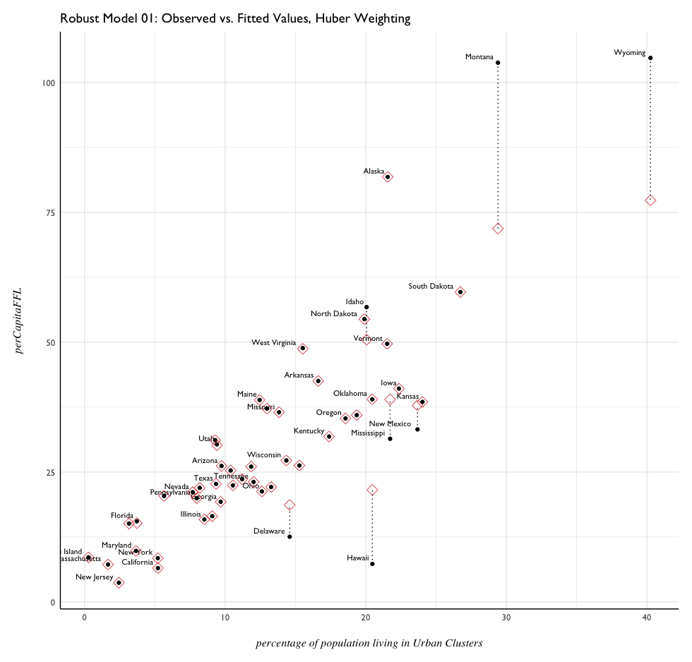

# Model 05 - Robust Regression

Before trying out a robust regression, a linear model using the variables:

- POPPCT_UC
- POPPCT_RURAL
- AREA_UC
- AREA_RURAL

```{R}
rr00 <-  lm(perCapitaFFL ~ POPPCT_UC + POPPCT_RURAL + AREA_RURAL + AREA_UC, data = ffl.16)

summary(rr00)

# Residuals:
#     Min      1Q  Median      3Q     Max 
# -24.667  -3.964   0.251   4.098  32.939 

Coefficients:
               Estimate Std. Error t value Pr(>|t|)    
(Intercept)   6.077e-01  3.934e+00   0.154  0.87793    
POPPCT_UC     1.472e+00  2.326e-01   6.327 1.02e-07 ***
POPPCT_RURAL  3.904e-01  1.189e-01   3.283  0.00199 ** 
AREA_RURAL    3.245e-11  6.707e-12   4.838 1.58e-05 ***
AREA_UC      -5.580e-09  1.898e-09  -2.939  0.00517 ** 
---
Signif. codes:  0 ‘***’ 0.001 ‘**’ 0.01 ‘*’ 0.05 ‘.’ 0.1 ‘ ’ 1

Residual standard error: 9.686 on 45 degrees of freedom
Multiple R-squared:  0.8153,	Adjusted R-squared:  0.7989 
F-statistic: 49.68 on 4 and 45 DF,  p-value: 6.018e-16
```


Looking at the QQ plot, it appears the residuals are normally distributed, beyond a few rather large (or small) outliers. 

- Montana
- Wyoming
- Hawaii

These are the states that appear to be the largest outliers - but

- Alaska 

seems to exert the strongest influence over the model. How would the robust regression, using Huber weights, handle these outliers? 

```{R}
summary(rr01 <- rlm(perCapitaFFL ~ POPPCT_UC + POPPCT_RURAL + 
                      AREA_RURAL + AREA_UC, data = ffl.16))
                      
Call: rlm(formula = perCapitaFFL ~ POPPCT_UC + POPPCT_RURAL + AREA_RURAL + 
    AREA_UC, data = ffl.16)
# Residuals:
#      Min       1Q   Median       3Q      Max 
# -21.5424  -3.8918  -0.3444   3.2812  39.2188 

Coefficients:
             Value   Std. Error t value
(Intercept)   4.1189  2.5128     1.6391
POPPCT_UC     1.1353  0.1486     7.6425
POPPCT_RURAL  0.4052  0.0760     5.3346
AREA_RURAL    0.0000  0.0000     7.1292
AREA_UC       0.0000  0.0000    -4.3045

Residual standard error: 5.415 on 45 degrees of freedom
```

It looks like t-values have become more extreme for each variable, as well as the coefficient estimates and standard errors. Taking a look at how `rlm` weighted the outliers: 

```{R}
# check weights
huber01 <- data.frame(state = ffl.16$NAME, 
                      resid = rr01$resid,
                      weight = rr01$w) %>%
  arrange(weight)

huber01[1:12, ]
           state      resid    weight
1        Montana  39.218754 0.1856933
2        Wyoming  34.708330 0.2098312
3         Hawaii -21.542390 0.3380360
4    Mississippi -14.835474 0.4908817
5          Idaho  13.556569 0.5372178
6       Delaware -13.395186 0.5436410
7     New Mexico -11.920365 0.6108850
8        Florida   7.616348 0.9561676
9           Utah   7.464884 0.9756199
10 West Virginia   7.419773 0.9814728
11    California  -4.888242 1.0000000
12         Texas   2.439917 1.0000000

```

As was noted from the diagnostic plots of the OLS model, Montana, Wyoming, and Hawaii all were weighted far less by the Robust Huber model. Overall 10 observations out of 50 were not given full weight, with 7 of these being given < 90% weight in the model. 

How did the weighting affect the fitted values, compared to observed? 

```{R}
# join with fitted and observed data,
# compute weighted residuals and fit values
rr.huber01 <- augment(rr01) %>%
  left_join(huber01) %>%
  arrange(weight) %>%
  mutate(weighted.resid = .resid * weight)
  
rr.huber01  
        .rownames perCapitaFFL POPPCT_UC POPPCT_RURAL   AREA_RURAL    AREA_UC   .fitted   .se.fit       .resid       .hat    .sigma    weight weighted.resid
1         Montana   103.810958     29.40        44.11 3.761922e+11  434862680 64.592204 1.7718185  39.21875373 0.02987218  8.303097 0.1856933     7.28265863
2         Wyoming   104.725127     40.25        35.24 2.509662e+11  334287801 70.016797 3.0569692  34.70832981 0.11595012  8.602622 0.2098312     7.28288981
3          Hawaii     7.303407     20.47         8.07 1.561632e+10  433177176 28.845797 2.2471154 -21.54238960 0.08928945  9.664039 0.3380360    -7.28210288
4     Mississippi    31.406916     21.73        50.65 1.186665e+11 1283061637 46.242390 1.5981733 -14.83547380 0.04861265  9.985850 0.4908817    -7.28246191
5           Idaho    56.749092     20.06        29.42 2.127521e+11  406348749 43.192523 1.1266775  13.55656852 0.03553968 10.032155 0.5372178     7.28282993
6        Delaware    12.542911     14.59        16.70 3.992911e+09  313212925 25.938097 1.4216942 -13.39518562 0.05038253 10.033969 0.5436410    -7.28217144
7      New Mexico    33.200946     23.68        22.57 3.120196e+11  873328300 45.121311 1.5589500 -11.92036452 0.08377477 10.072247 0.6108850    -7.28197163
8         Florida    15.507222      3.72         8.84 1.197136e+11 1473437543  7.890874 1.3452737   7.61634800 0.06338926 10.176800 0.9561676     7.28250487
9            Utah    30.329428      9.41         9.42 2.104493e+11  418182640 22.864544 1.4049278   7.46488428 0.07249055 10.178871 0.9756199     7.28288931
10  West Virginia    48.859466     15.52        51.28 6.060019e+10  561473646 41.439694 1.7495648   7.41977282 0.10956465 10.176920 0.9814728     7.28230509
11     California     6.492354      5.22         5.05 3.821784e+11 2372748165 11.380596 1.9425821  -4.88824226 0.13186980 10.215151 1.0000000    -4.88824226
12          Texas    22.717433      9.35        15.30 6.539360e+11 3952631358 20.277517 3.3475516   2.43991672 0.39130600 10.234871 1.0000000     2.43991672
```

Generally, it appears the model capped the residuals at about ±7.28 - and would assign weights to outliers accordingly to get these values.

How do these weighted fit and residual values look compared to unweighted? 



Other than the severe outliers, most of the weighted fit values correspond to the observed values.


visual observations:
- Variance increases slightly when the Urban Cluster population percentage is above 15. 
- Alaska remains an extreme outlier even after weights. Why is this?
- Looking back at OLS Resduals vs. Leverage plot, Alaska appears to be the most influential outlier - but was not assigned a different weight in the robust regression model. Was there an error in the modeling, or would `bisquare` weighting treat this differently? 

# Model 06: Bisquare Weighted Robust Regression

How does bisquare weighting differ from Huber weighting in robust regression? 

``` {R}
# model - bisquare weighted
summary(rr02 <- rlm(perCapitaFFL ~ POPPCT_UC + POPPCT_RURAL + AREA_RURAL + AREA_UC, 
                    data = ffl.16, method = "MM"))

# check weights
bisquare01 <- data.frame(.rownames = ffl.16$NAME, 
                         .resid = rr02$resid, 
                         weight = rr02$w) %>% arrange(weight)
```

Looking at the weights assigned to each observation, none are weighted fully in this case. Wyoming and Montana - two of the largest outlier cases - are both assigned 0.0000 weight in this model. 

```{R}
bisquare01
        .rownames      .resid    weight
1         Montana  44.0214201 0.0000000
2         Wyoming  44.1139402 0.0000000
3           Idaho  16.6578899 0.3606384
4          Hawaii -16.2983839 0.3812923
5     Mississippi -12.9788780 0.5737682
6        Delaware -10.7434299 0.6952251
7    North Dakota   9.3593968 0.7636892
8            Utah   8.5425052 0.8009345
9        Missouri   7.5464498 0.8427464
10   South Dakota   7.5011896 0.8445727
11  West Virginia   7.4937804 0.8448270
12     New Mexico  -7.4040104 0.8483413
```

```{R}
# join with fitted and observed data
rr.bisquare01 <- augment(rr02) %>%
  left_join(bisquare01) %>%
  arrange(weight) %>%
  mutate(weighted.resid = .resid * weight,
         weighted.fit = .fitted + weighted.resid)
  
rr.bisquare01
        .rownames perCapitaFFL POPPCT_UC POPPCT_RURAL   AREA_RURAL    AREA_UC   .fitted   .se.fit      .resid    weight weighted.resid weighted.fit
1         Montana   103.810958     29.40        44.11 3.761922e+11  434862680 59.789538 1.8408233  44.0214201 0.0000000      0.0000000    59.789538
2         Wyoming   104.725127     40.25        35.24 2.509662e+11  334287801 60.611187 3.1760250  44.1139402 0.0000000      0.0000000    60.611187
3           Idaho    56.749092     20.06        29.42 2.127521e+11  406348749 40.091202 1.1705568  16.6578899 0.3606384      6.0074755    46.098678
4          Hawaii     7.303407     20.47         8.07 1.561632e+10  433177176 23.601791 2.3346309 -16.2983839 0.3812923     -6.2144486    17.387342
5     Mississippi    31.406916     21.73        50.65 1.186665e+11 1283061637 44.385794 1.6604153 -12.9788780 0.5737682     -7.4468669    36.938927
6        Delaware    12.542911     14.59        16.70 3.992911e+09  313212925 23.286341 1.4770631 -10.7434299 0.6952251     -7.4691019    15.817239
7    North Dakota    54.444960     19.90        40.10 1.782353e+11  185518370 45.085564 1.3545953   9.3593968 0.7636892      7.1476702    52.233234
8            Utah    30.329428      9.41         9.42 2.104493e+11  418182640 21.786923 1.4596438   8.5425052 0.8009345      6.8419873    28.628910
9        Missouri    36.505006     13.83        29.56 1.727192e+11 1420686359 28.958556 0.9337873   7.5464498 0.8427464      6.3597434    35.318299
10   South Dakota    59.641144     26.73        43.35 1.957635e+11  295855333 52.139954 1.6328781   7.5011896 0.8445727      6.3352999    58.475254
11  West Virginia    48.859466     15.52        51.28 6.060019e+10  561473646 41.365686 1.8177028   7.4937804 0.8448270      6.3309479    47.696634
12     New Mexico    33.200946     23.68        22.57 3.120196e+11  873328300 40.604956 1.6196644  -7.4040104 0.8483413     -6.2811280    34.323828
```


 


