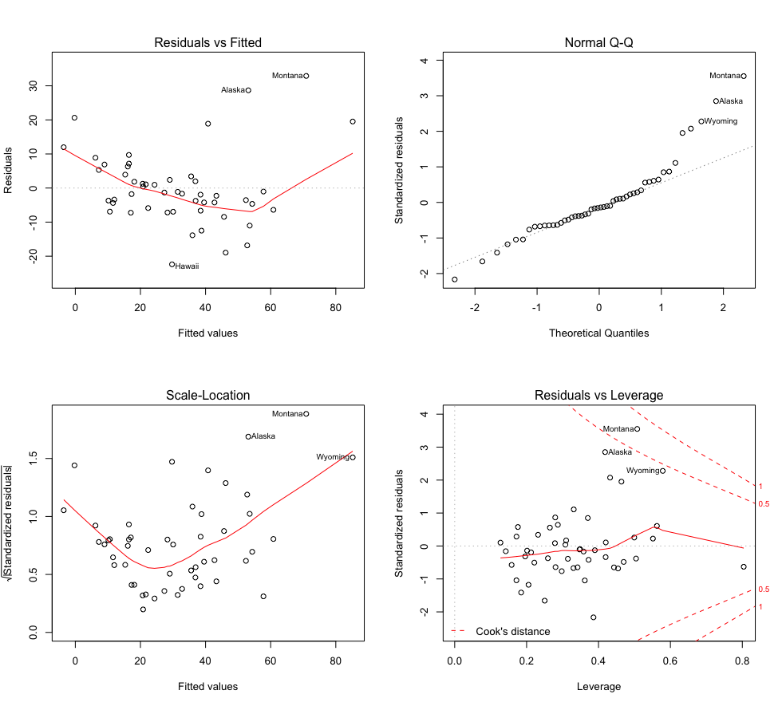
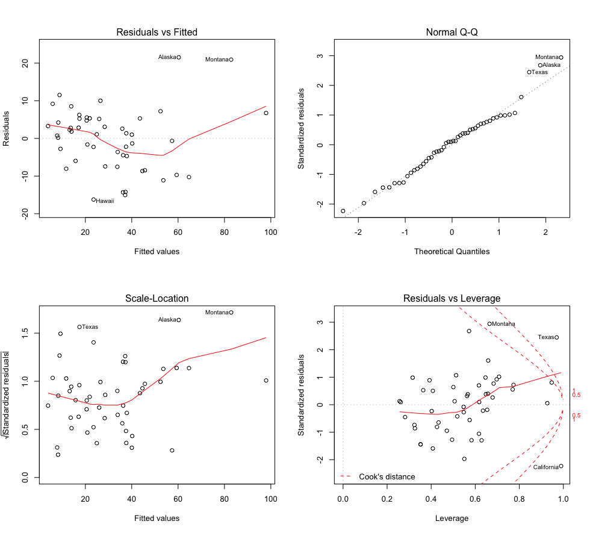
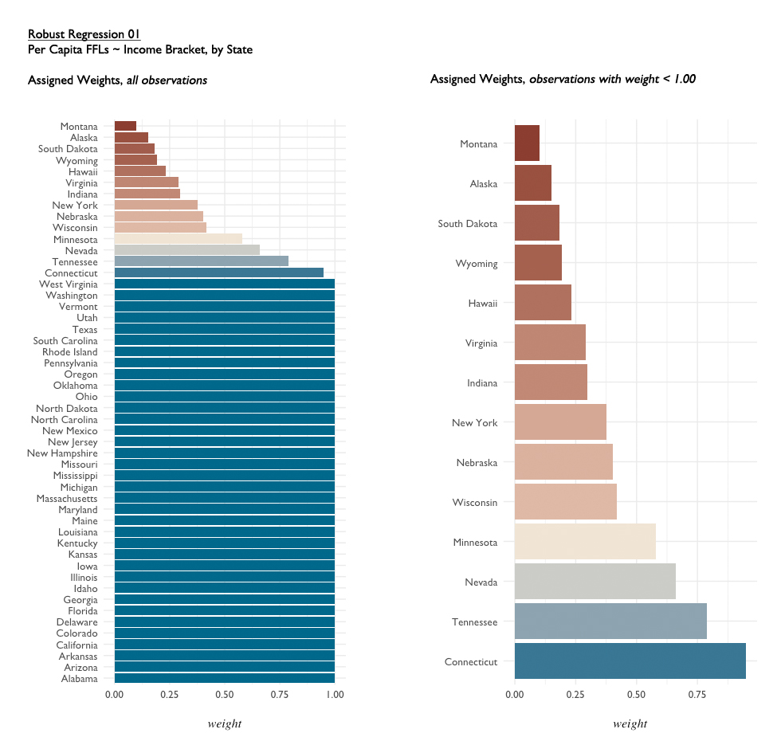

# Income Bracket Regressions

# Model 00: Baseline Linear Model - Percentages

**model: `income.00`** - all income bracket variables as percentages of population.

```{R}
library(MASS)
library(broom)
library(dplyr)

income.ffl <- ffl %>%
  left_join(finance, by = "NAME") 

income.ffl.pct <- income.ffl %>%
  dplyr::select(NAME, perCapitaFFL, contains("pct"))

rownames(income.ffl.pct) <- income.ffl.pct$NAME
income.ffl.pct$NAME <- NULL


income.00 <- lm(perCapitaFFL ~ ., data = income.ffl.pct)
summary(income.00)
Residuals:
#     Min      1Q  Median      3Q     Max 
# -22.395  -6.266  -1.718   3.806  32.896 

Coefficients:
                               Estimate Std. Error t value Pr(>|t|)  
(Intercept)                  -2.482e+03  2.516e+03  -0.987   0.3310  
ATF.Region                    9.321e-01  1.066e+00   0.874   0.3883  
Pop2016                       4.663e-06  4.556e-06   1.023   0.3135  
fin.GEO.id2                  -7.174e-02  1.431e-01  -0.501   0.6194  
fin.01.OccupiedHousingUnits  -1.391e-05  1.362e-05  -1.022   0.3144  
pct.03.LessThan5000           5.697e+00  2.658e+01   0.214   0.8316  
pct.04.5000to9999             3.440e+01  2.530e+01   1.359   0.1833  
pct.05.10000to14999           2.243e+01  2.706e+01   0.829   0.4132  
pct.06.15000to19999           1.915e+01  2.792e+01   0.686   0.4976  
pct.07.20000to24999           4.340e+01  2.475e+01   1.753   0.0889 .
pct.08.25000to34999           3.058e+01  2.636e+01   1.160   0.2544  
pct.09.35000to49999           2.159e+01  2.564e+01   0.842   0.4059  
pct.10.50000to74999           1.833e+01  2.611e+01   0.702   0.4876  
pct.11.75000to99999           1.196e+01  2.536e+01   0.472   0.6403  
pct.12.100000to149999         3.053e+01  2.608e+01   1.171   0.2502  
pct.13.150000.or.more         8.912e+00  2.644e+01   0.337   0.7382  
fin.14.MedianHouseholdIncome  6.286e-03  3.730e-03   1.685   0.1014  
---
Signif. codes:  0 ‘***’ 0.001 ‘**’ 0.01 ‘*’ 0.05 ‘.’ 0.1 ‘ ’ 1

Residual standard error: 13.2 on 33 degrees of freedom
Multiple R-squared:  0.7486,	Adjusted R-squared:  0.6267 
F-statistic:  6.14 on 16 and 33 DF,  p-value: 5.659e-06
```


# Model 000: Baseline Linear Model - Percentages and Counts

**model: `income.000`** - all income bracket variables, as percentages of population and raw counts

```{R}
income.ffl.all <- income.ffl
rownames(income.ffl.all) <- income.ffl.all$NAME
income.ffl.all$NAME <- NULL
income.ffl.all <- income.ffl.all %>%
  dplyr::select(1:2, 6:31)

income.000 <- lm(perCapitaFFL ~ ., data = income.ffl.all)
summary(income.000)
plot(income.000)

Residuals:
#     Min      1Q  Median      3Q     Max 
# -16.240  -5.646   1.051   5.229  21.535 

Coefficients:
                               Estimate Std. Error t value Pr(>|t|)   
(Intercept)                  -1.119e+04  4.600e+03  -2.432  0.02363 * 
ATF.Region                    7.154e-01  1.203e+00   0.594  0.55830   
Pop2016                       1.456e-05  9.787e-06   1.488  0.15101   
fin.GEO.id2                   3.750e-02  1.741e-01   0.215  0.83143   
fin.01.OccupiedHousingUnits   3.518e-03  1.627e-03   2.162  0.04180 * 
pct.03.LessThan5000           8.505e+01  4.823e+01   1.764  0.09169 . 
pct.04.5000to9999             1.203e+02  4.442e+01   2.709  0.01282 * 
pct.05.10000to14999           1.092e+02  4.879e+01   2.239  0.03560 * 
pct.06.15000to19999           9.346e+01  4.882e+01   1.914  0.06866 . 
pct.07.20000to24999           1.398e+02  4.649e+01   3.007  0.00649 **
pct.08.25000to34999           1.450e+02  5.070e+01   2.859  0.00912 **
pct.09.35000to49999           8.741e+01  4.501e+01   1.942  0.06505 . 
pct.10.50000to74999           1.030e+02  4.681e+01   2.201  0.03853 * 
pct.11.75000to99999           1.036e+02  4.632e+01   2.237  0.03571 * 
pct.12.100000to149999         1.180e+02  4.679e+01   2.522  0.01939 * 
pct.13.150000.or.more         9.382e+01  4.663e+01   2.012  0.05664 . 
fin.14.MedianHouseholdIncome  7.286e-03  3.825e-03   1.905  0.06994 . 
fin.LessThan5000             -3.134e-03  1.903e-03  -1.647  0.11379   
fin.5000to9999               -3.315e-03  1.406e-03  -2.357  0.02772 * 
fin.10000to14999             -3.825e-03  1.959e-03  -1.953  0.06364 . 
fin.15000to19999             -2.011e-03  1.881e-03  -1.069  0.29672   
fin.20000to24999             -4.409e-03  1.598e-03  -2.759  0.01145 * 
fin.25000to34999             -5.698e-03  2.093e-03  -2.722  0.01245 * 
fin.35000to49999             -2.060e-03  1.768e-03  -1.165  0.25640   
fin.50000to74999             -3.281e-03  1.660e-03  -1.977  0.06072 . 
fin.75000to99999             -4.050e-03  1.735e-03  -2.334  0.02912 * 
fin.100000to149999           -3.845e-03  1.785e-03  -2.155  0.04241 * 
fin.150000.or.more           -3.387e-03  1.582e-03  -2.141  0.04362 * 
---
Signif. codes:  0 ‘***’ 0.001 ‘**’ 0.01 ‘*’ 0.05 ‘.’ 0.1 ‘ ’ 1

Residual standard error: 12.29 on 22 degrees of freedom
Multiple R-squared:  0.8547,	Adjusted R-squared:  0.6764 
F-statistic: 4.793 on 27 and 22 DF,  p-value: 0.0001908
```

most significant variables:
- pct.07.20000to24999
- pct.08.25000to34999

mid-significant variables:
- fin.01.OccupiedHousingUnits
- pct.04.5000to9999
- pct.05.10000to14999
- pct.10.50000to74999
- pct.11.75000to99999
- pct.12.100000to149999

It might be worth consolidating income brackets. 



# Robust Regression 01: Income Bracket by Population Percentages

**Model: `income.01`** - 
```{R}
# model
income.01 <- rlm(perCapitaFFL ~ ., data = income.ffl.pct)

# check weights
huber01 <- data.frame(.rownames = income.ffl$NAME, 
                      .resid = income.01$resid,
                      weight = income.01$w) %>% arrange(weight)
                      
summary(income.01)
Residuals:
#      Min       1Q   Median       3Q      Max 
# -21.2285  -2.4884   0.1529   2.3826  49.5270 

Coefficients:
                             Value      Std. Error t value   
(Intercept)                  -1152.9067  1207.4966    -0.9548
ATF.Region                       0.5712     0.5118     1.1162
Pop2016                          0.0000     0.0000     2.0233
fin.GEO.id2                     -0.0709     0.0687    -1.0323
fin.01.OccupiedHousingUnits      0.0000     0.0000    -2.0732
pct.03.LessThan5000             -1.9413    12.7573    -0.1522
pct.04.5000to9999               14.3638    12.1462     1.1826
pct.05.10000to14999              9.3398    12.9888     0.7191
pct.06.15000to19999             15.0561    13.4001     1.1236
pct.07.20000to24999             20.2428    11.8823     1.7036
pct.08.25000to34999             13.9513    12.6529     1.1026
pct.09.35000to49999             12.3068    12.3090     0.9998
pct.10.50000to74999              6.9773    12.5334     0.5567
pct.11.75000to99999              1.5776    12.1719     0.1296
pct.12.100000to149999           18.5034    12.5192     1.4780
pct.13.150000.or.more            0.1415    12.6934     0.0111
fin.14.MedianHouseholdIncome     0.0037     0.0018     2.0686

Residual standard error: 3.688 on 33 degrees of freedom          
```



