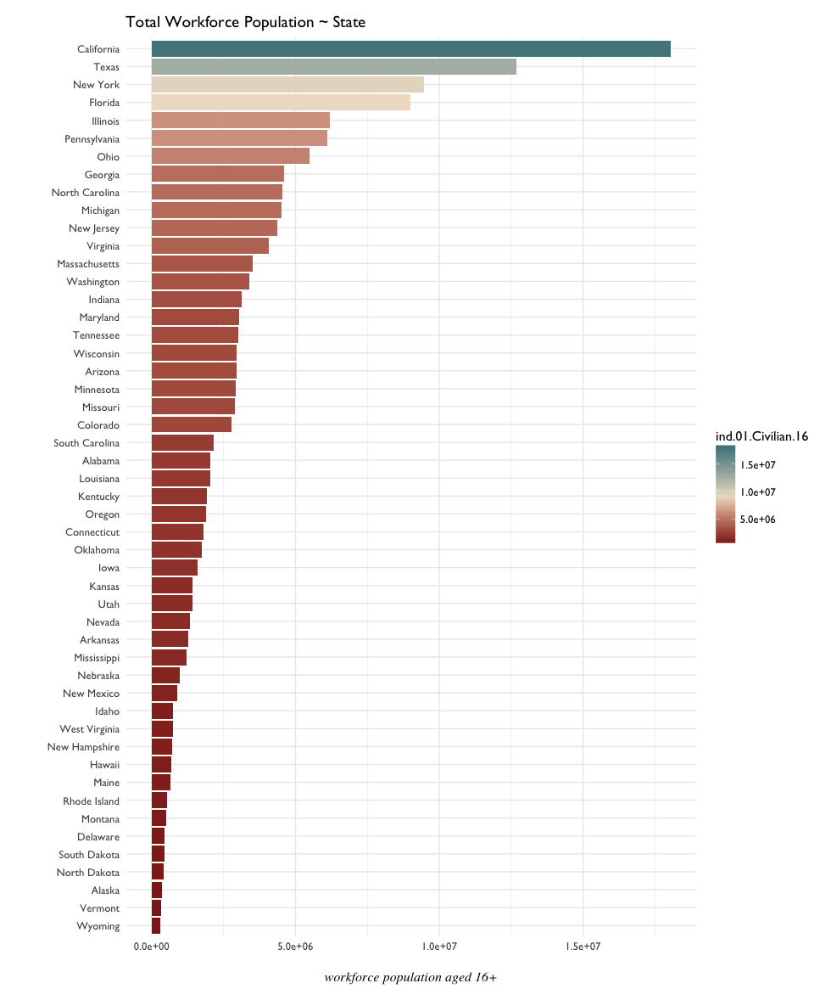
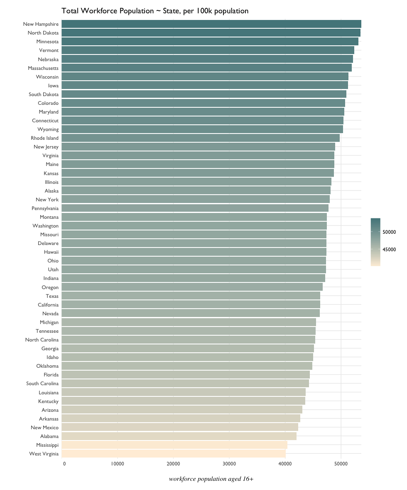
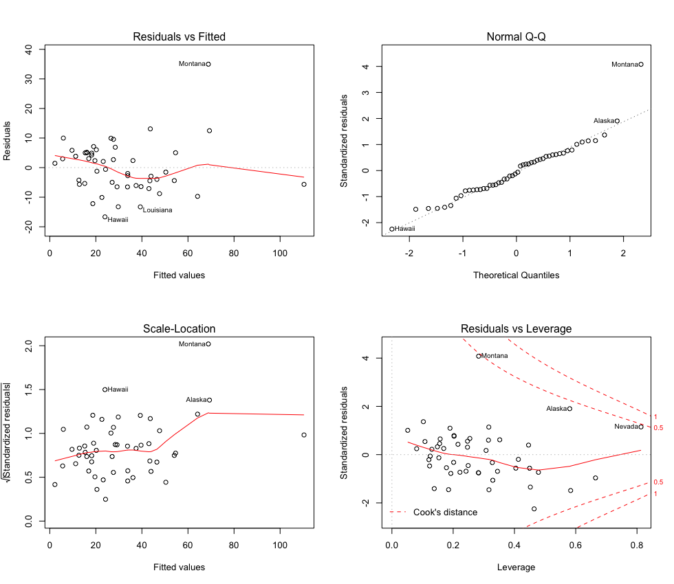
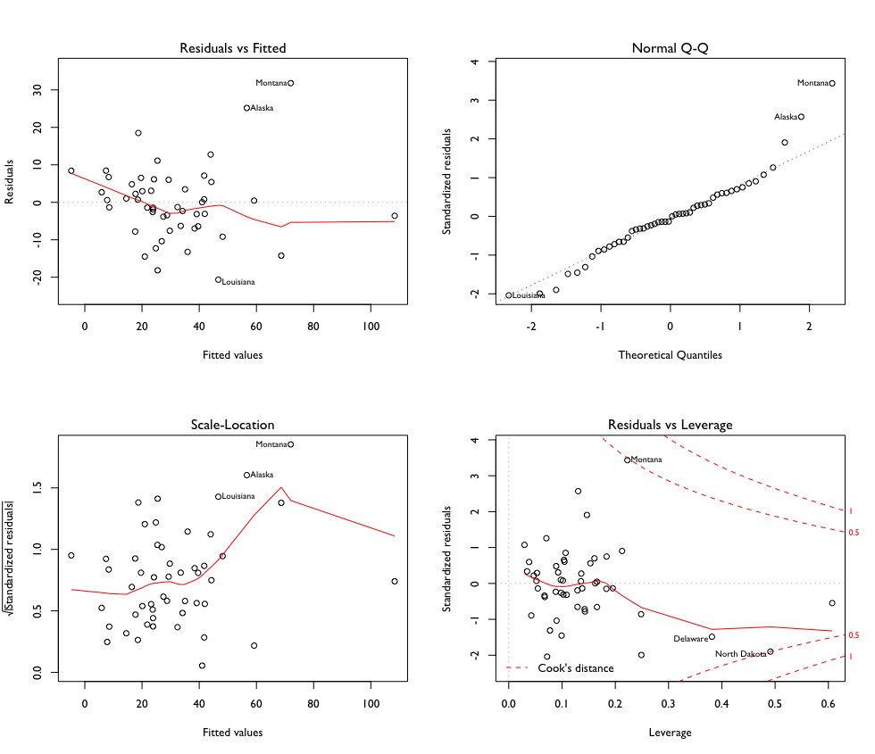

# Industry Regressions

The United States Census provides information by state, on the total population in the workforce by broad industry category. Can certain characteristics be observed from state to state? And can any trends in workforce associated with a particular state or region have an association with the number of Federal Firearms Licenses for that state? 

## Exploratory Plots

A look at the total workforce population by state:



This is a bit misleading, as it takes raw totals and doesn't normalize population across a single metric, i.e. California has the largest population, therefore it's expected to have the largest workforce population. Here are the figures, adjusted per 100k:



There's much less variance once adjusted per capita - a range of about 10,000 separates the min and max values, as opposed to a range of millions as seen in the raw counts. 

## Industry Categories

There are several broad industries the US Census groups the workforce into:

- Agriculture, Forestry, Mining, Hunting & Fishing
- 

## Baseline Model - all variables
```{R}
industry.model <- industry %>%
  dplyr::select(perCapitaFFL, 24:37)

mod.00 <- lm(perCapitaFFL ~ ., industry.model)
summary(mod.00)
# Residuals:
#     Min      1Q  Median      3Q     Max 
# -16.652  -5.664  -0.900   5.025  34.970 

Coefficients: (1 not defined because of singularities)
                   Estimate Std. Error t value Pr(>|t|)   
(Intercept)      15.2584251 31.7962546   0.480  0.63421   
workforcePC       0.0019829  0.0031701   0.625  0.53559   
agriculturePC     0.0095759  0.0035622   2.688  0.01081 * 
constructionPC    0.0092748  0.0078971   1.174  0.24792   
manufacturingPC  -0.0006728  0.0031761  -0.212  0.83343   
wholesalePC      -0.0271323  0.0088036  -3.082  0.00393 **
retailPC          0.0032370  0.0057329   0.565  0.57582   
transportationPC  0.0012623  0.0079344   0.159  0.87448   
informationPC     0.0147275  0.0109358   1.347  0.18649   
financePC        -0.0073975  0.0035482  -2.085  0.04424 * 
pro.scientificPC -0.0039805  0.0053441  -0.745  0.46120   
educationPC      -0.0009597  0.0040861  -0.235  0.81564   
artsPC           -0.0025770  0.0034333  -0.751  0.45778   
otherPC          -0.0236851  0.0142845  -1.658  0.10599   
publicAdminPC            NA         NA      NA       NA   
---
Signif. codes:  0 ‘***’ 0.001 ‘**’ 0.01 ‘*’ 0.05 ‘.’ 0.1 ‘ ’ 1

Residual standard error: 10.12 on 36 degrees of freedom
Multiple R-squared:  0.8387,	Adjusted R-squared:  0.7804 
F-statistic: 14.39 on 13 and 36 DF,  p-value: 1.508e-10
```
Given the exploratory scatterplots, there was an expectation that `agriculturalPC`, `pro.scientificPC`, and perhaps `financePC` would carry more weight in the model. 

`PublicAdminPC` went asymptotic; that could be expected given the presence of very large outliers in this particular category. 

A diagnostic plot of this first maximal model:



Montana, Alaska, and Nevada appear to be influential outliers. 

Hawaii and Louisiana also appear. 

## Reduction of the Baseline Model

```{R}
mod.01 <- lm(perCapitaFFL ~ agriculturePC + wholesalePC + financePC +
               constructionPC + manufacturingPC + pro.scientificPC, data = industry.model)
summary(mod.01)
# Residuals:
#     Min      1Q  Median      3Q     Max 
# -20.640  -5.692  -0.621   5.278  31.807 

Coefficients:
                  Estimate Std. Error t value Pr(>|t|)    
(Intercept)      20.101609  15.868508   1.267  0.21206    
agriculturePC     0.011709   0.002124   5.513 1.86e-06 ***
wholesalePC      -0.023762   0.008038  -2.956  0.00504 ** 
financePC        -0.003678   0.002804  -1.312  0.19657    
constructionPC    0.011963   0.004600   2.601  0.01270 *  
manufacturingPC   0.001644   0.001090   1.509  0.13862    
pro.scientificPC -0.001861   0.002001  -0.930  0.35769    
---
Signif. codes:  0 ‘***’ 0.001 ‘**’ 0.01 ‘*’ 0.05 ‘.’ 0.1 ‘ ’ 1

Residual standard error: 10.5 on 43 degrees of freedom
Multiple R-squared:  0.7926,	Adjusted R-squared:  0.7636 
F-statistic: 27.38 on 6 and 43 DF,  p-value: 3.494e-13
```
**_p-value_** and _**adjusted r-squared**_ both look pleasant. It appears that by removing some of the 'noisier' variables, interactions between the remanining variables has become more clear.

Diagnostics:


Influential Outliers:
- North Dakota
- Montana
- Delaware

Montana and North Dakota tend to appear as outliers in many models because of their relatively high Firearms License counts. Delaware might appear influential here because of its leading status in the finance industry. 

Other Outliers:
- Montana
- Alaska
- Louisiana

## Minimal Adequate Model Candidate

```{R}
# agriculture, science, construction
mod.06 <- lm(perCapitaFFL ~ agriculturePC + constructionPC + 
               pro.scientificPC, data = industry.model)
               
summary(mod.06)

# Residuals:
#     Min      1Q  Median      3Q     Max 
# -31.600  -5.230   0.520   4.651  36.447 

Coefficients:
                  Estimate Std. Error t value Pr(>|t|)    
(Intercept)      16.623286  13.332119   1.247   0.2188    
agriculturePC     0.010995   0.002117   5.193 4.59e-06 ***
constructionPC    0.007164   0.004726   1.516   0.1364    
pro.scientificPC -0.004583   0.001873  -2.447   0.0183 *  
---
Signif. codes:  0 ‘***’ 0.001 ‘**’ 0.01 ‘*’ 0.05 ‘.’ 0.1 ‘ ’ 1

Residual standard error: 11.68 on 46 degrees of freedom
Multiple R-squared:  0.7257,	Adjusted R-squared:  0.7078 
F-statistic: 40.56 on 3 and 46 DF,  p-value: 5.688e-13
```
## Robust Regression 01

Robust linear model using 

- agriculture
- wholesale
- finance
- construction
- manufacturing
- scientific

```{R}
industry.01 <- rlm(perCapitaFFL ~ agriculturePC + wholesalePC + financePC + 
                    constructionPC + manufacturingPC + pro.scientificPC, 
                    data = industry.model)

summary(industry.01)
```

Weights assigned by the model:

```{R}
huber.01 <- data.frame(.rownames = industryPerCapita$NAME, 
                       .resid = industry.01$resid,
                       weight = industry.01$w) %>% arrange(weight)

 huber.01[1:12, ]
       .rownames     .resid    weight
1        Montana  40.376970 0.2088998
2         Alaska  30.188168 0.2794054
3  New Hampshire  20.966970 0.4022963
4      Louisiana -16.223473 0.5198691
5     California -15.312064 0.5508207
6       Delaware -13.762724 0.6129595
7         Hawaii -13.716314 0.6148984
8          Idaho  13.636656 0.6185429
9       Missouri  11.679457 0.7221662
10       Vermont  11.168928 0.7552429
11  North Dakota  -9.890754 0.8525111
12    Washington  -9.435684 0.8938027
```

