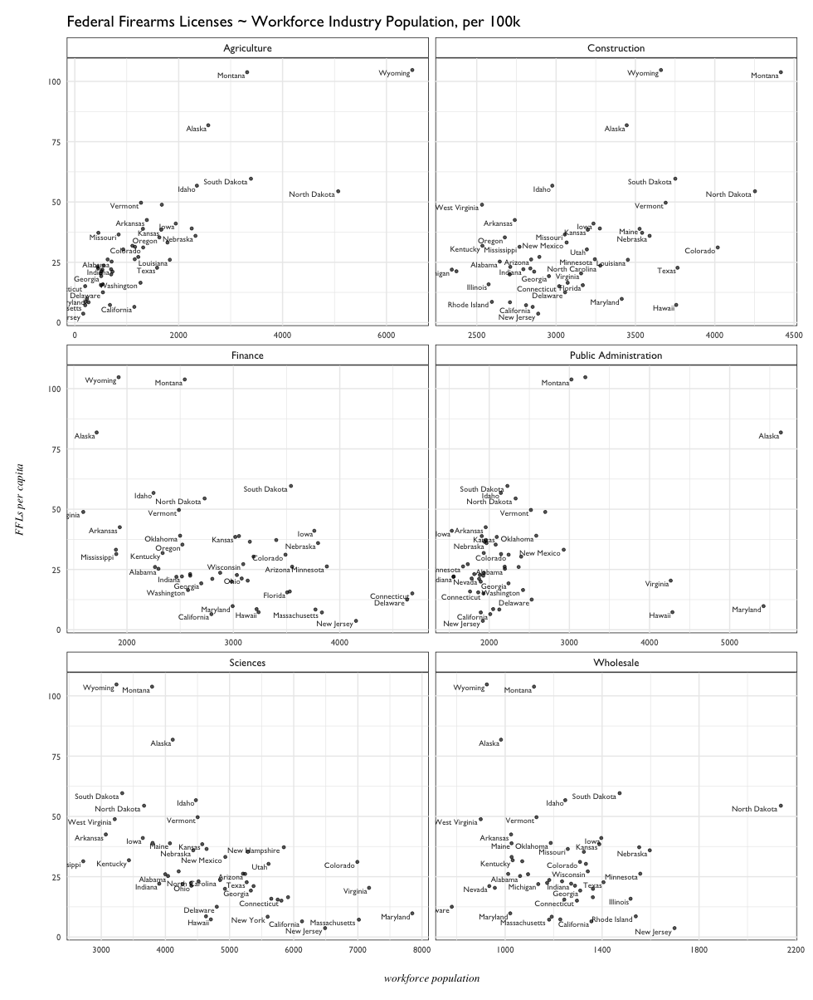
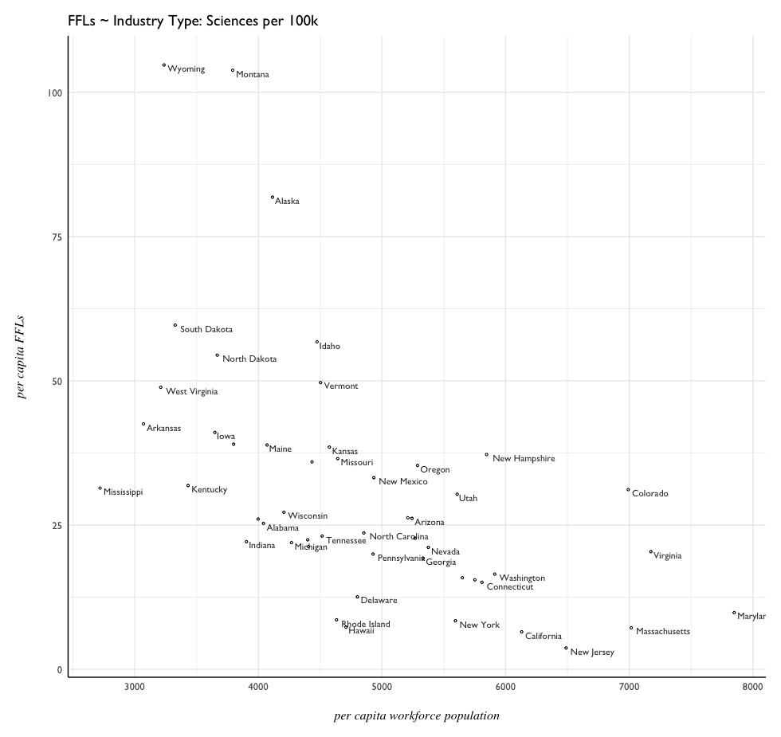

# The American Workforce by Industry

The [United States Census](https://www.census.gov/acs/www/data/data-tables-and-tools/subject-tables/) provides information on the total population in the workforce by broad industry category<sup>[1](#notes)</sup>. 

- Can certain characteristics be observed from state to state? 
- Can any trends observed have association with the number of Federal Firearms Licenses for that state or region?

## Total Workforce by Industry

Who's got the largest workforce in the United States? 


This is a bit misleading, as it takes raw totals and doesn't normalize population across a single metric, **i.e.** California has the _largest population_, therefore it's expected to have the _largest workforce population_.

There's much less variance once adjusted per capita - a range of about 10,000 separates the min and max values, as opposed to a range of millions as seen in the raw counts. Of course, this also can be a result of the polling sample conducted by the US Census.

Adjusted per capita, **New Hampshire** has the most population engaged in the workforce, while **West Virginia** has the least.

## Industry Categories

There are several broad industries the US Census groups the workforce into:

- Agriculture, Forestry, Mining, Hunting & Fishing
- Construction
- Manufacturing
- Wholesale trade
- Retail trade
- Transportation and Warehousing, and Utilities
- Information
- Finance and Insurance, and Real Estate, Rental, and Leasing
- Professional, Scientific, Management, and Administrative and Waste Management services
- Educational services, Health Care, and Social Assistance
- Arts, Entertainment, Recreation, Accomodation and Food Service
- Other services, excluding public administration
- Public Administration

The original dataset provided raw counts; per capita numbers for each industry and state were created. Given that there are 13 categories, a facetted scatterplot of each gave only a cursory sense. 

Looking at a few specific industries, some potential trends appear to emerge.

```{R}
# select per capita observations &
# create a long dataframe
indPC <- industryPerCapita %>%
  select(NAME, Pop2015, contains("PC"), perCapitaFFL) %>%
  gather(key = Industry, value = PerCapIndustry, 3:16)

# filter for industries of interest
# scatterplot against per capita FFLs
indPC %>% group_by(Industry) %>%
  filter(Industry == "Agriculture" | 
           Industry == "Construction" | 
           Industry == "Finance" |
           Industry == "Sciences" | 
           Industry == "Public Administration" |
           Industry == "Wholesale") %>%
  ggplot(aes(PerCapIndustry, perCapitaFFL, label = NAME)) +
  geom_point(size = 1, alpha = 0.65) +
  geom_text(size = 2.5, position = "jitter", 
            alpha = 0.85, hjust = 1.075, vjust = 1,
            check_overlap = T, family = "Gill Sans") +
  facet_wrap(~ Industry, scales = "free_x", nrow = 5) + 
  pd.theme +
  theme(strip.background = element_rect(fill = NA, color = "black"),
        panel.background = element_rect(fill = NA, color = "black"),
        axis.text = element_text(size = 8),
        axis.title = element_text(size = 10)) +
  labs(title = "Federal Firearms Licenses ~ Workforce Industry Population, per 100k",
       y = "FFLs per capita", x = "workforce population")
```



- `Agriculture` (_Agriculture, Forestry, Hunting & Fishing, and Mining_) appears to show strong positive linear trend. 
- `Construction` may have a weak positive linear relationship.
- `Finance` and `Sciences` appear to have a weak linear relationship with FFLs
- `Wholesale` appears vague.
- `Public Administration` has a few very large outliers in FFL count and per capita workforce.

It might be worth noting that **Alaska**, **Montana**, and **Wyoming** consistently appear as outliers because of their high per capita FFL counts. A closer look at few specific industries before model building: 
`Agriculture`: the more workers, the more firearms licenses? 


`Sciences`: a vaguely negative linear trend?



`Finance`: another vaguely negative linear trend? 


# Exploratory Model Building

Although a linear model will likely not have predictive power given the diversity and number of variables, fitting a few with different parameters might shed some light on how these variables describe the data and interact. 

The process is outlined as follows, with observations made at each step:

- Baseline Maximal Model
- Reduction of the Baseline Model
- Candidate for a Minimal Adequate Model

## Baseline Maximal Model

To get some sense of the variables and their effects and interactions, an all-inclusive maximal model is fit.

```{R}
industry.model <- industry %>%
  dplyr::select(perCapitaFFL, 24:37)

mod.00 <- lm(perCapitaFFL ~ ., industry.model)
summary(mod.00)
# Residuals:
#     Min      1Q  Median      3Q     Max 
# -16.652  -5.664  -0.900   5.025  34.970 

Coefficients: (1 not defined because of singularities)
                   Estimate Std. Error t value Pr(>|t|)   
(Intercept)      15.2584251 31.7962546   0.480  0.63421   
workforcePC       0.0019829  0.0031701   0.625  0.53559   
agriculturePC     0.0095759  0.0035622   2.688  0.01081 * 
constructionPC    0.0092748  0.0078971   1.174  0.24792   
manufacturingPC  -0.0006728  0.0031761  -0.212  0.83343   
wholesalePC      -0.0271323  0.0088036  -3.082  0.00393 **
retailPC          0.0032370  0.0057329   0.565  0.57582   
transportationPC  0.0012623  0.0079344   0.159  0.87448   
informationPC     0.0147275  0.0109358   1.347  0.18649   
financePC        -0.0073975  0.0035482  -2.085  0.04424 * 
pro.scientificPC -0.0039805  0.0053441  -0.745  0.46120   
educationPC      -0.0009597  0.0040861  -0.235  0.81564   
artsPC           -0.0025770  0.0034333  -0.751  0.45778   
otherPC          -0.0236851  0.0142845  -1.658  0.10599   
publicAdminPC            NA         NA      NA       NA   
---
Signif. codes:  0 ‘***’ 0.001 ‘**’ 0.01 ‘*’ 0.05 ‘.’ 0.1 ‘ ’ 1

Residual standard error: 10.12 on 36 degrees of freedom
Multiple R-squared:  0.8387,	Adjusted R-squared:  0.7804 
F-statistic: 14.39 on 13 and 36 DF,  p-value: 1.508e-10
```
Given the exploratory scatterplots, there was an expectation that `agriculturalPC`, `pro.scientificPC`, and perhaps `financePC` would carry more weight in the model. 

`PublicAdminPC` went asymptotic; that could be expected given the presence of very large outliers in this particular category. 

A diagnostic plot of this first maximal model:


- Montana 
- Alaska 
- Nevada 

appear to be influential outliers. 

- Hawaii
- Louisiana 

also appear. 

## Reduction of the Baseline Model

```{R}
mod.01 <- lm(perCapitaFFL ~ agriculturePC + wholesalePC + financePC +
               constructionPC + manufacturingPC + pro.scientificPC, data = industry.model)
summary(mod.01)
# Residuals:
#     Min      1Q  Median      3Q     Max 
# -20.640  -5.692  -0.621   5.278  31.807 

Coefficients:
                  Estimate Std. Error t value Pr(>|t|)    
(Intercept)      20.101609  15.868508   1.267  0.21206    
agriculturePC     0.011709   0.002124   5.513 1.86e-06 ***
wholesalePC      -0.023762   0.008038  -2.956  0.00504 ** 
financePC        -0.003678   0.002804  -1.312  0.19657    
constructionPC    0.011963   0.004600   2.601  0.01270 *  
manufacturingPC   0.001644   0.001090   1.509  0.13862    
pro.scientificPC -0.001861   0.002001  -0.930  0.35769    
---
Signif. codes:  0 ‘***’ 0.001 ‘**’ 0.01 ‘*’ 0.05 ‘.’ 0.1 ‘ ’ 1

Residual standard error: 10.5 on 43 degrees of freedom
Multiple R-squared:  0.7926,	Adjusted R-squared:  0.7636 
F-statistic: 27.38 on 6 and 43 DF,  p-value: 3.494e-13
```
**_p-value_** and _**adjusted r-squared**_ both look pleasant. It appears that by removing some of the 'noisier' variables, interactions between the remanining variables has become more clear.

Diagnostics:


Influential Outliers:
- North Dakota
- Montana
- Delaware

Montana and North Dakota tend to appear as outliers in many models because of their relatively high Firearms License counts. Delaware might appear influential here because of its leading status in the finance industry. 

Other Outliers:
- Montana
- Alaska
- Louisiana

## Minimal Adequate Model Candidate

```{R}
# agriculture, science, construction
mod.06 <- lm(perCapitaFFL ~ agriculturePC + constructionPC + 
               pro.scientificPC, data = industry.model)
               
summary(mod.06)

# Residuals:
#     Min      1Q  Median      3Q     Max 
# -31.600  -5.230   0.520   4.651  36.447 

Coefficients:
                  Estimate Std. Error t value Pr(>|t|)    
(Intercept)      16.623286  13.332119   1.247   0.2188    
agriculturePC     0.010995   0.002117   5.193 4.59e-06 ***
constructionPC    0.007164   0.004726   1.516   0.1364    
pro.scientificPC -0.004583   0.001873  -2.447   0.0183 *  
---
Signif. codes:  0 ‘***’ 0.001 ‘**’ 0.01 ‘*’ 0.05 ‘.’ 0.1 ‘ ’ 1

Residual standard error: 11.68 on 46 degrees of freedom
Multiple R-squared:  0.7257,	Adjusted R-squared:  0.7078 
F-statistic: 40.56 on 3 and 46 DF,  p-value: 5.688e-13
```

As expected from the exploratory scatterplots, `agriculturePC` carries weight as a strong predictor. What happens if we remove this variable? How do the other variables interact? 

```{R}
# remove agriculture - its a strong predictor
mod.02 <- lm(perCapitaFFL ~ wholesalePC + financePC + constructionPC + 
               manufacturingPC + pro.scientificPC, data = industry.model)
summary(mod.02)
# Residuals:
#     Min      1Q  Median      3Q     Max 
# -39.178  -7.129  -0.707   7.176  35.668 

Coefficients:
                   Estimate Std. Error t value Pr(>|t|)    
(Intercept)      27.1591208 20.4280659   1.330  0.19054    
wholesalePC      -0.0099197  0.0098619  -1.006  0.31998    
financePC        -0.0079997  0.0034765  -2.301  0.02618 *  
constructionPC    0.0251843  0.0050696   4.968 1.07e-05 ***
manufacturingPC  -0.0001537  0.0013427  -0.114  0.90939    
pro.scientificPC -0.0078592  0.0021692  -3.623  0.00075 ***
---
Signif. codes:  0 ‘***’ 0.001 ‘**’ 0.01 ‘*’ 0.05 ‘.’ 0.1 ‘ ’ 1

Residual standard error: 13.56 on 44 degrees of freedom
Multiple R-squared:  0.6459,	Adjusted R-squared:  0.6057 
F-statistic: 16.05 on 5 and 44 DF,  p-value: 5.451e-09
```

`pro.scientificPC` and `construction` come to the fore as strongest predictors now. The adjusted R-squared does suffer a significant decrease because of this though. 


# Robust Regression 01

Robust linear model using per capita population data from the following industries:

- agriculture
- wholesale
- finance
- construction
- manufacturing
- scientific

```{R}
industry.01 <- rlm(perCapitaFFL ~ agriculturePC + wholesalePC + financePC + 
                    constructionPC + manufacturingPC + pro.scientificPC, 
                    data = industry.model)

summary(industry.01)
```
The diagnostic plot shows strong influence of **North Dakota**, **Montana**, and **Delaware**. In the Q-Q plot, **Montana**, **Alaska**, and **New Hampshire** (in addition to states on the low end) appear to be skewing the distribution of residuals away from normal.


How did the robust regression handle the more severe outliers? A look at the weights assigned by the model:

```{R}
huber.01 <- data.frame(.rownames = industryPerCapita$NAME, 
                       .resid = industry.01$resid,
                       weight = industry.01$w) %>% arrange(weight)

 huber.01[1:12, ]
       .rownames     .resid    weight
1        Montana  40.376970 0.2088998
2         Alaska  30.188168 0.2794054
3  New Hampshire  20.966970 0.4022963
4      Louisiana -16.223473 0.5198691
5     California -15.312064 0.5508207
6       Delaware -13.762724 0.6129595
7         Hawaii -13.716314 0.6148984
8          Idaho  13.636656 0.6185429
9       Missouri  11.679457 0.7221662
10       Vermont  11.168928 0.7552429
11  North Dakota  -9.890754 0.8525111
12    Washington  -9.435684 0.8938027
```

Overall, 13 states were given weight less than 1 in the robust model. 


#### How does each industry's observed vs. fitted values appear?

First to create a "long" dataframe in order to create a facetted plot by industry:

```{R}
# create long dataframe
industry.huber02 <- industry.huber01 %>%
  gather("industry", "ind.perCapita", 2:8)

# append perCapitaFFL data
ffl$.rownames <- ffl$NAME

industry.huber02 <- ffl %>%
  dplyr::select(.rownames, perCapitaFFL) %>%
  left_join(industry.huber02) %>%
  filter(industry != "perCapitaFFL")

# rename and clean up industry categories
industry.huber02$industry <- gsub("PC", "", industry.huber02$industry)
industry.huber02$industry <- capwords(industry.huber02$industry)

# factor industry categories
industry.huber02$industry <- factor(industry.huber02$industry)
```

And then to plot observed vs. fitted values, by industry:

```{R}
# create facetted plot
industry.huber02 %>%
  group_by(industry) %>%
  ggplot(aes(ind.perCapita, perCapitaFFL, label = .rownames)) +
  geom_point(size = 0.75, alpha = 0.75) +
  geom_point(aes(ind.perCapita, weighted.fit),
             color = "firebrick3", alpha = 0.8,
             shape = 23, size = 2.5,
             data = industry.huber02) +
  geom_text(size = 2.5, alpha = 0.7,
            position = "jitter",
            check_overlap = T,
            hjust = 1, 
            vjust = 1) +
  geom_errorbar(aes(x = ind.perCapita, 
                    ymin = weighted.fit, 
                    ymax = perCapitaFFL), 
                linetype = "dotted") +
  geom_smooth(method = "loess", se = F, size = 0.2, 
              color = "deepskyblue4", 
              linetype = "longdash") +
  facet_wrap(~ industry, scales = "free_x", nrow = 3) +
  pd.theme +
  theme(strip.background = element_rect(fill = NA, color = "black"),
        panel.background = element_rect(fill = NA, color = "black")) +
  labs(x = "per capita population by industry",
       y = "per capita Federal Firearms Licenses")
```


**Montana** and **Alaska** consistently have their fitted values adjusted by the model, while **Wyoming** remains constant.

 `Agriculture` appears closest showing a linear relationship.
 
 

In the diagnostic plots of the robust regression model (and bar plots of model weights), **New Hampshire** appeared to throw off the normality of errors. Taking a subset of the above facetted plots might show why, more clearly. This might also reveal how other outliers were accounted for more clearly.

```{R}
# subset for residuals > 5 or residuals < -9
industry.outliers <- industry.huber02 %>%
  group_by(industry) %>%
  filter(.resid > 5 | .resid < -9) 
```


# Notes

<sup>1</sup> [American Community Survey](https://www.census.gov/acs/www/data/data-tables-and-tools/subject-tables/), **Table S2407**: _Industry by Class of Worker for the Civilian Employed Population 16 Years and Over_	
