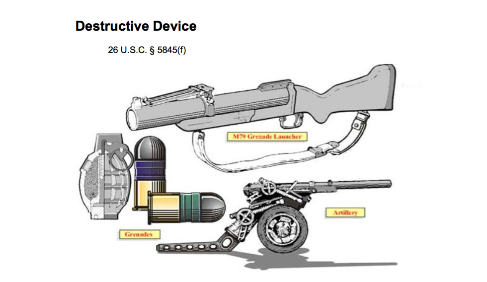
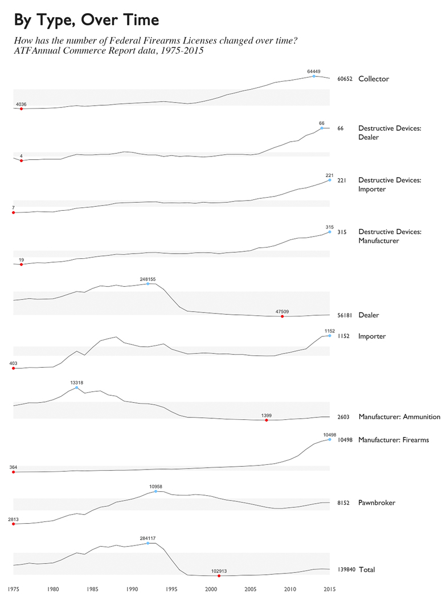
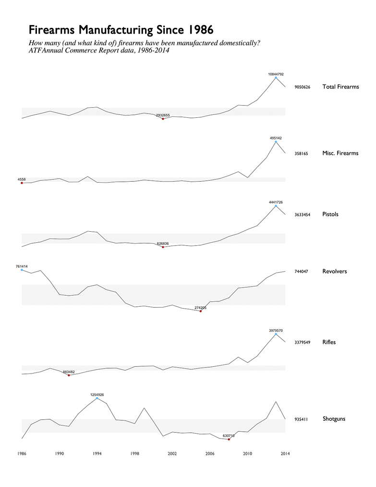
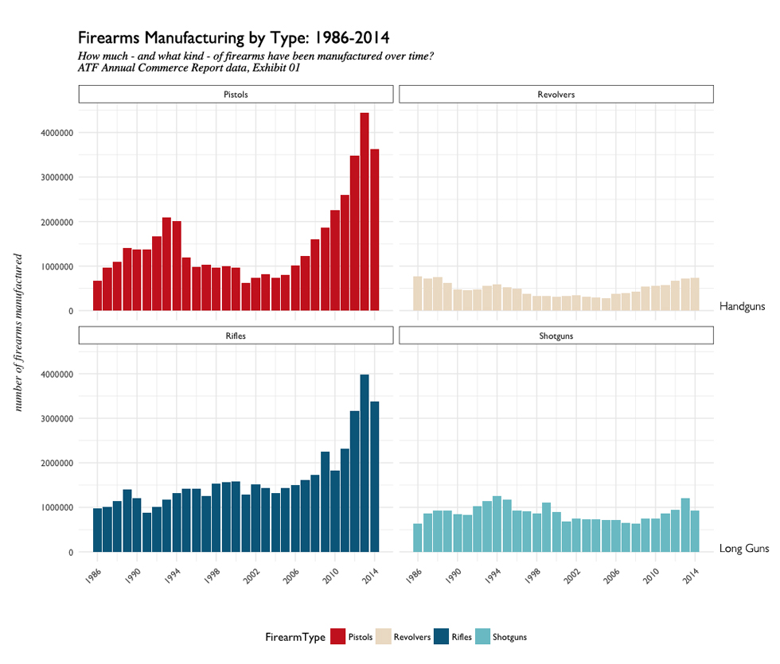

- [Exploratory Data Analysis](EDA-FFLs.md)

# What is a Federal Firearms License?

In the United States, a Federal Firearms License (FFL) is a requirement for those who engage in the business of firearms - generally **dealers**, **manufacturers**, and **importers**. 

It's not actually a license to carry a firearm; it's strictly for the conducting business involving firearms. It's not necessary to have one if selling at gun shows, or when purchasing guns for personal reasons. 

The ATF considers 9 __types__ of FFLs: 

- Dealer
- Pawnbroker
- Collector
- Manufacturer of Ammunition
- Manufacturer of Firearms
- Dealer in Destructive Devices
- Manufacturer of Destructive Devices
- Importer of Destructive Devices

The ATF [publishes data on this FFL holders](https://www.atf.gov/firearms/listing-federal-firearms-licensees-ffls-2016) monthly, from 2013 to present. Additionally, an [annual commerce report](https://www.atf.gov/resource-center/data-statistics) is released, which contains numbers on weapons registrations, imports and taxes, and historical FFL data. With historical FFL data, we can broadly see how license counts have changed over time - from 1975-2015. 

#### Destructive Devices

While most firearms (pistols, rifles, shotguns) can generally be identified, _"Destructive Devices"_ is a class I felt unfamiliar with. 

'Destructive Devices' constitute their own class, and are [defined by the National Firearms Act](https://www.atf.gov/firearms/firearms-guides-importation-verification-firearms-national-firearms-act-definitions-1), [26 U.S.C. § 5845(F) (page 82)](https://www.atf.gov/firearms/docs/guide/atf-guidebook-importation-verification-firearms-ammunition-and-implements-war/download). Three examples, as shown in an illustration from the ATF Guidebook:

The ATF bullet points defining Destructive Device are: 

- A missile having an explosive or incendiary charge of more than 1/4 oz. (**1/4 oz explosive/incendiary**)
- Any type of weapon by whatever name known which will, or which may readily be converted to expel a projectile, by the action of an explosive or other propellant, the barrel or barrels of which have a bore greater than one-half inch in diameter. (**1/2" bore**)
- A combination of parts designed and intended for use in converting a device into a destructive device and from which a destructive device can be readily assembled.

# A Brief History in Numbers

By the 9 Types of FFLs as defined by the ATF, how have the counts changed from 1975 to 2015[1](#works-cited)?

- Looking specifically at Destructive Devices - the number has increased steadily and heavily since 1975.
- Manufacturers of Ammunition have gone down dramatically
- around 2010, Manufacturers of Firearms began to increase steadily.
- peak of all FFL types appears to have happened in the early 1990s.

Looking at categories showing broad increases over time: these include all classes (Dealer, Importer, Manufacturer) of Destructive Devices, and Manufacturers of Firearms. Can anything be seen looking specifically at Manufacturers? 

Generally across all firearm types, it appears production has increased overall, or increased to near peak levels of the past. How do some of the Firearm Types manufactured look, more specifically? Are there more of a certain type than another? 

It appears that in the class of Handguns, Pistol manufacturing has risen over time - while Revolver production has remained (relatively) steady. For Long Guns, Rifles also increased dramatically - from under 1 million produced in 1986 to 4 million in 2013. Shotguns, by comparison, remain (relatively) stable in production numbers.

# Notes

1Tufte-style sparkline plot originally translated to R by [Lukasz Piwek](http://motioninsocial.com/tufte/)