# Regression Trees

Carrying out regression trees on different datasets:

- education
- income
- industry
- legislation
- population

## Income Features

This data comes from the United States Census, and stratifies US households into _11 annual income brackets_ ranging from **Less than $5000** to **$150,000 or more**. Below are each of the brackets, from which per 100,000 totals were derived. 

- **Less than $5,000**
- $5,000 to $9,999
- $10,000 to $14,999
- $15,000 to $19,999
- $20,000 to $24,999
- $25,000 to $34,999
- $35,000 to $49,999
- **$50,000 to $74,999**
- $75,000 to $99,999
- $100,000 to $149,000
- **$150,000 or more**

What's the population distribution across these income categories? 

```{R}
# distibution of population by annual income
income.perCapita %>%
  mutate(NAME = rownames(income.perCapita)) %>%
  gather("category", "pop.per.100k", 1:11) %>%
  ggplot(aes(pop.per.100k)) +
  geom_histogram(binwidth = 100, color = "black", fill = "white") +
  facet_wrap(~ category, ncol = 3) +
  pd.scatter +
  theme(strip.background = element_rect(fill = NA, color = "black"),
        panel.background = element_rect(fill = NA, color = "black")) +
  labs(x = "population per 100k",
       title = "Distribution of Population by Anuual Income Category")
```
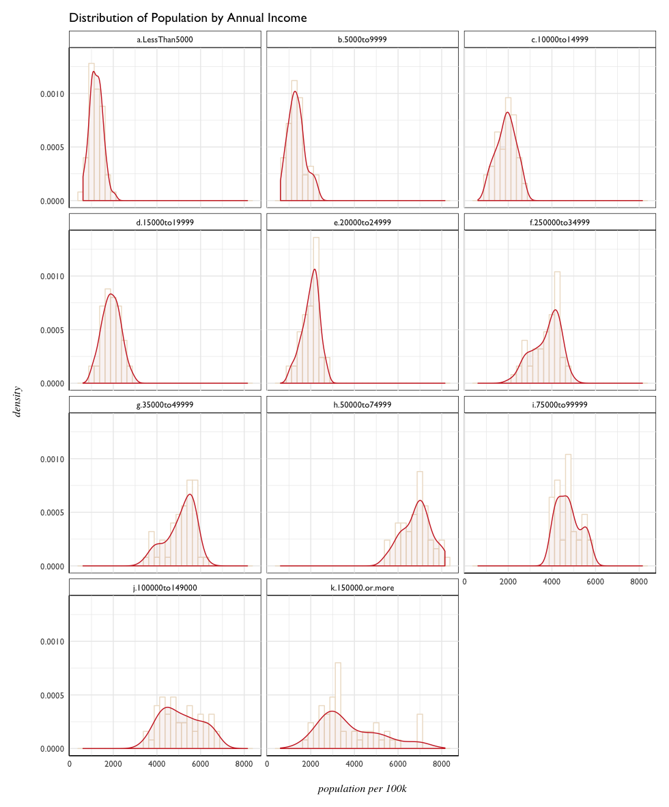

Appears that across the United States, most of the households in the population have an annual income between $50,000 to $74,999. Relatively fewer households earn less than $25,000 annually. Interestingly enough, households making $150,000 or more spread widely across the distribution. 

Fitting a regression tree to all income variables: 

```{R}
# `rpart` tree
income.tree.a <- rpart(perCapitaFFL ~ ., data = income.perCapita)
rpart.plot(income.tree.a, type = 1, extra = 1,
           digits = 4, cex = 0.85, 
           split.family = "GillSans", split.cex = 1.1,
           nn.family = "GillSans", nn.cex = 0.85, 
           fallen.leaves = T)
```

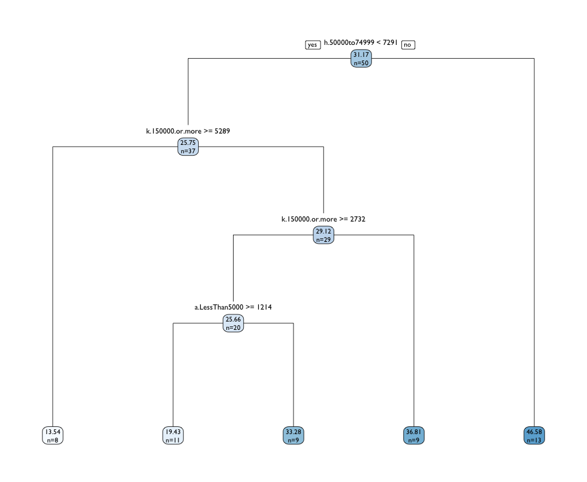

The main split occurs in the income category $50,000 to $74,999. If there are over 7291 households per 100k in a given state earning $50,000 to $74,999 annually, the mean FFL count goes up to about 47 - from 31. 13 states show this. Is 7,291 a common number? 

 ```{R}
# examine top split
summary(income.perCapita$h.50000to74999)
Min. 1st Qu.  Median    Mean 3rd Qu.    Max. 
5424    6392    6915    6853    7299    8150

quantile(income.perCapita$h.50000to74999)
#       0%      25%      50%      75%     100% 
# 5423.926 6392.141 6914.593 7298.875 8149.873 
```

It appears the split at 7291 occurs above the 3rd quantile in the distribution. How are each of the splits distributed? 

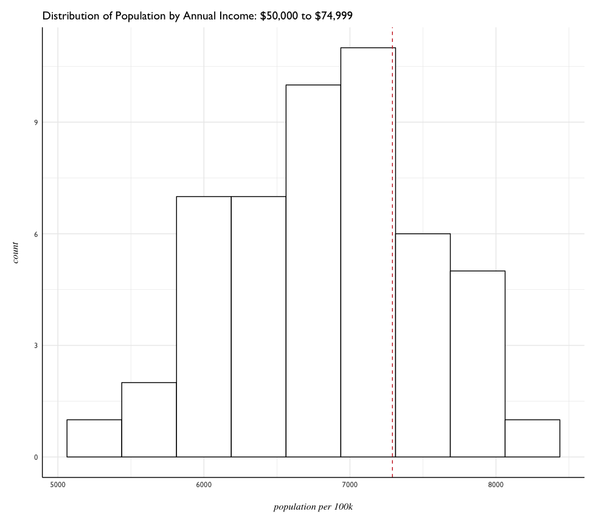

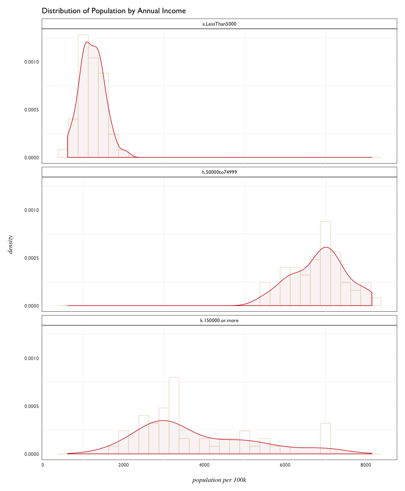


## Industry Features


Again this data comes from the United States Census, specifically the American Community Survey 1 year estimates for 2015 (table S2407).

The official name of the dataset is **INDUSTRY BY CLASS OF WORKER FOR THE CIVILIAN EMPLOYED POPULATION 16 YEARS AND OVER**, groups the American workforce into 13 broad categories:

- Agriculture, forestry, fishing and hunting, and mining
- Construction
- Manufacturing
- Wholesale trade
- Retail trade
- Transportation and warehousing, and utilities
- Information
- Finance and insurance, and real estate and rental and leasing
- Professional, scientific, and management, and administrative and waste management services
- Educational services, and health care and social assistance
- Arts, entertainment, and recreation, and accommodation and food services
- Other services, except public administration
- Public administration

Initial scatterplots of per capita Federal Firearms Licenses against population by state for each of these categories showed some potential relationships:

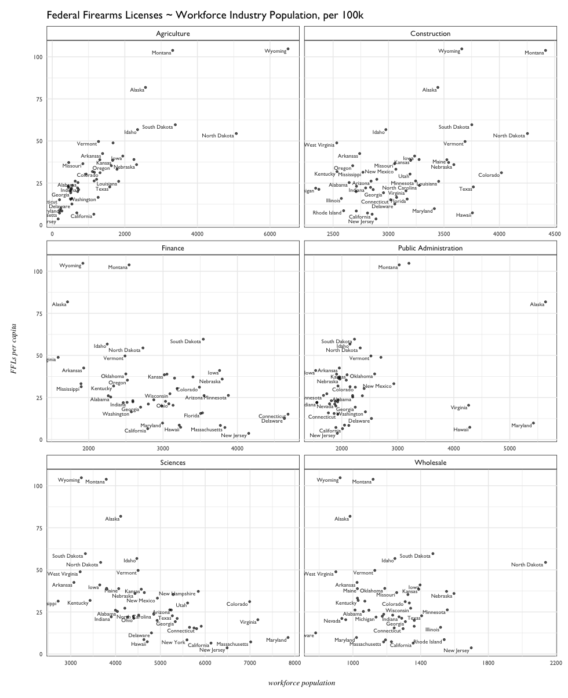

Potential, approximate, positive linear relationships:
- **_Agriculture, forestry, fishing and hunting, and mining_**
- **_Construction_**

Potential, approximate, negative linear relationships:
- **_Finance and insurance, and real estate and rental and leasing_**
-  **_Professional, scientific, and management, and administrative and waste management services_**

Interesting clusters and outliers:
- **_Public Administration_**
- **_Wholesale trade_**

An initial robust regression model was fit to this data, using the 6 variables above. 

```{R}
industry.01 <- rlm(perCapitaFFL ~ agriculturePC + wholesalePC + financePC +
                       constructionPC + manufacturingPC + pro.scientificPC, data = industry.model)

summary(industry.01)
```

Weights assigned to outlier states by the model are as follows: 

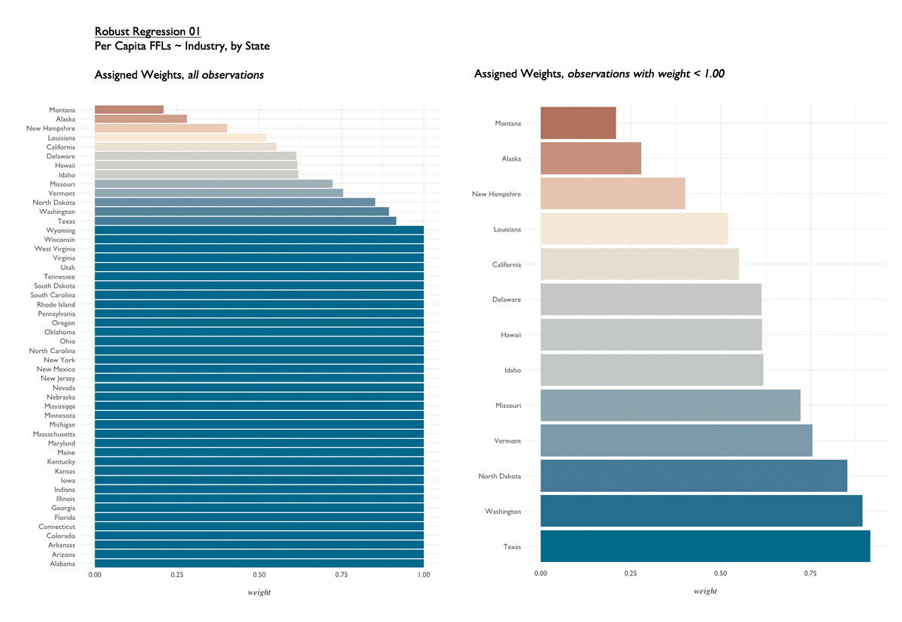

And a look at fitted vs observed values:

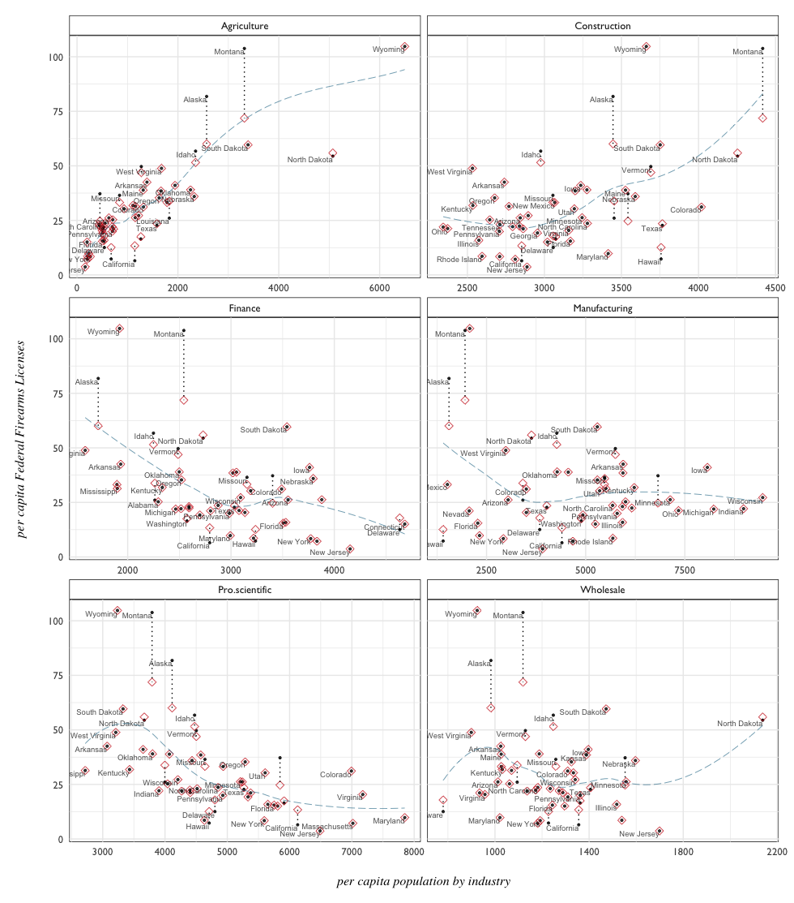

How much did the outliers affect the model? I decided to take a subset of observations that had the largest/smallest residuals, and plot only those.

```{R}
# subset for residuals > 5 or residuals < -9
industry.outliers <- industry.huber02 %>%
  group_by(industry) %>%
  filter(.resid > 5 | .resid < -9)

# create facetted plot
industry.outliers %>%
  group_by(industry) %>%
  ggplot(aes(ind.perCapita, perCapitaFFL, label = .rownames)) +
  geom_point(size = 0.75, alpha = 0.75) +
  geom_point(aes(ind.perCapita, weighted.fit),
             color = "firebrick3", alpha = 0.8,
             shape = 23, size = 2.5,
             data = industry.outliers) +
  geom_text(size = 2.5, alpha = 0.7,
            position = "jitter",
            check_overlap = T,
            hjust = 1, 
            vjust = 1) +
  geom_errorbar(aes(x = ind.perCapita, 
                    ymin = weighted.fit, 
                    ymax = perCapitaFFL), 
                linetype = "dotted") +
  geom_smooth(method = "loess", se = F, size = 0.2, 
              color = "deepskyblue4", 
              linetype = "longdash") +
  facet_wrap(~ industry, scales = "free_x", nrow = 3) +
  pd.theme +
  theme(strip.background = element_rect(fill = NA, color = "black"),
        panel.background = element_rect(fill = NA, color = "black")) +
  labs(x = "per capita population by industry",
       y = "per capita Federal Firearms Licenses")
```

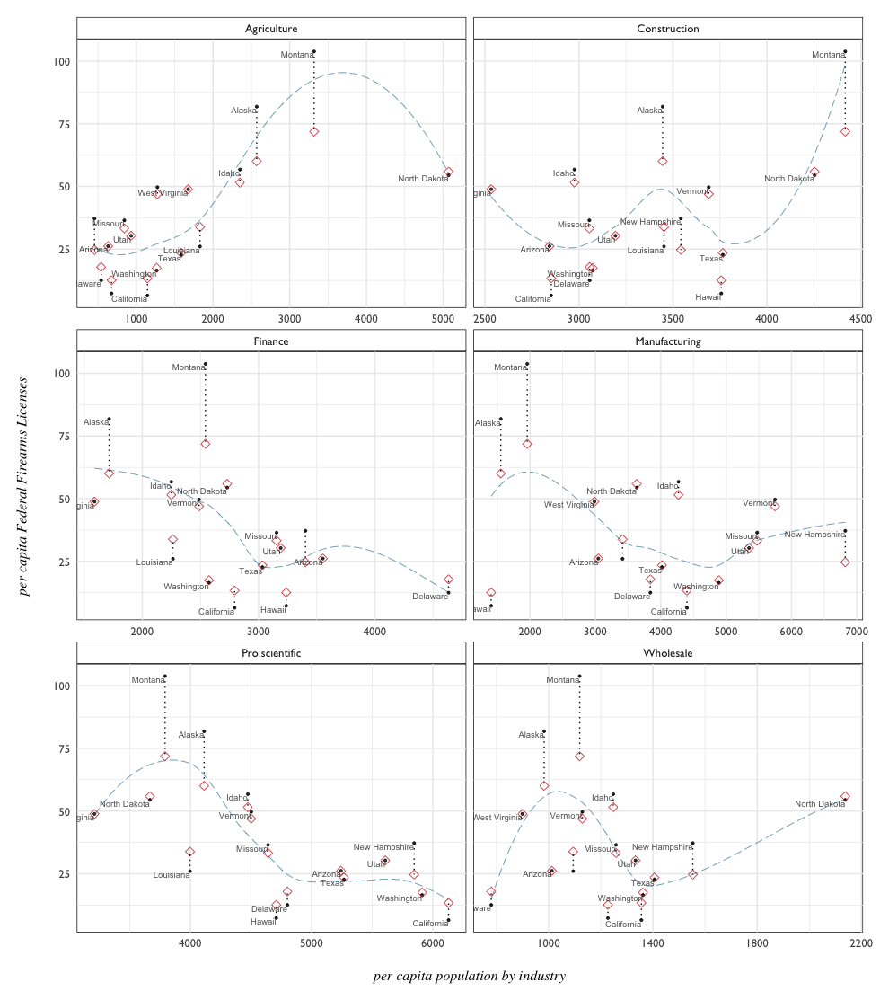

While probably not prudent to draw firm conclusions from this, it's clear that the model wanted to reduce the FFLs per capita in **Montana** and **Alaska** - two states with rather high FFL counts. 

Interestingly, the robust regression didn't penalize **Wyoming** at all - despite it having the highest per capita FFL count. Could it be that Wyoming, having the highest per capita workforce in _Agriculture, Hunting & Fishing, and Mining_ - is mathematically "justified" in the number of Federal Firearms Licenses it boasts?

How would a regression tree treat all of these variables?

```{R}
# `rpart` model
industry.tree.a <- rpart(perCapitaFFL ~ ., data = industry.perCapita)

# `rpart` model results
print(industry.tree.a)
n= 50 

node), split, n, deviance, yval
      * denotes terminal node

1) root 50 22865.9600 31.16886  
  2) agriculturePC< 2286.951 43  5773.8460 24.68142  
    4) agriculturePC< 1269.452 31  2414.1110 19.81906  
      8) manufacturingPC< 5297.78 14   578.4599 13.53260 *
      9) manufacturingPC>=5297.78 17   826.7403 24.99614 *
    5) agriculturePC>=1269.452 12   733.4458 37.24251 *
  3) agriculturePC>=2286.951 7  4165.4300 71.02028 *
```

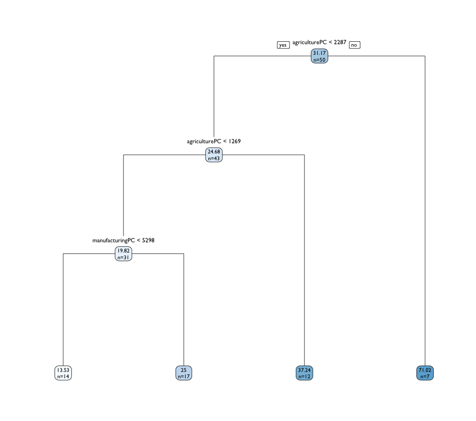

Not surprisingly, the main split is made in the **Agriculture** (Hunting & Fishing, and Mining) variable. Interestingly, the third split involves **Manufacturing**. We saw earlier that Agriculture very _generally_ had a postive relationship with FFLs - and now the regression tree model seems to suggest lower mean FFL counts with a lower Agriculture workforce population.

```{R}
summary(industry.perCapita$agriculturePC)
#    Min. 1st Qu.  Median    Mean 3rd Qu.    Max. 
#   162.3   517.4  1020.0  1299.0  1655.0  6497.0
```

A visual look at the tree-split variables and their partition points:

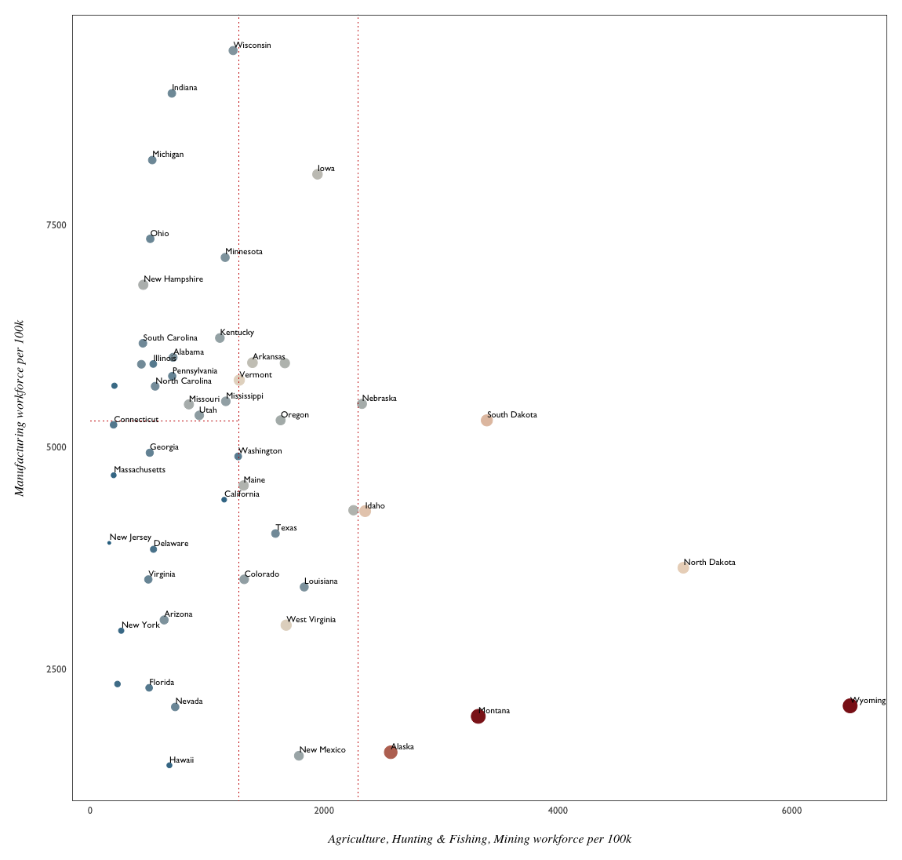

Very general observations:

- low manufacturing population + low agricultural population = low FFLs per capita
- as the agricultural sector grows, so do the FFLs
- Above a certain population threshold in the agricultural sector (~2300 workers per 100k), FFLs will increase regardless of the per capita population in the manufacturing sector. Only 7 states cross this threshold, however. In Wyoming, which has the most FFLs and Agricultural workers, the Agricultural sector accounts for only 12.9% of the total workforce. 

## Legislative Features

State Governments - their sizes and political tendencies.

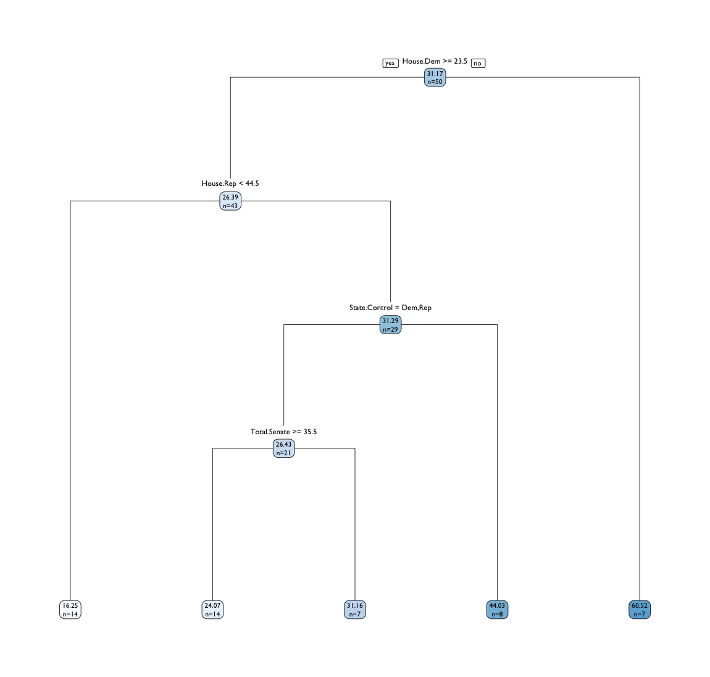

Immediately we see that when a State House has less than 24 Democrats, there's an increase in the mean FFLs - and once again, in a small portion of 7 outlier states.

But supposing a State House has more than 24 Democrats, the next split criteria calls for less than 45 Republicans in order to reach the lowest mean FFL count per capita. 

If there are more than 24 Democrats but also more than 45 Republicans, the tree branches to a decision at the State Control variable: the deciding factor being whether a state is firmly controlled by **_either_** Democrats or Republicans - essentially **_not_** divided or split. 

If a state does happen to be divided/split across the state government branches - the total number of senators for that state decides. This measure is roughly equivalent to a state's population - which generally determines the number of legislators. 

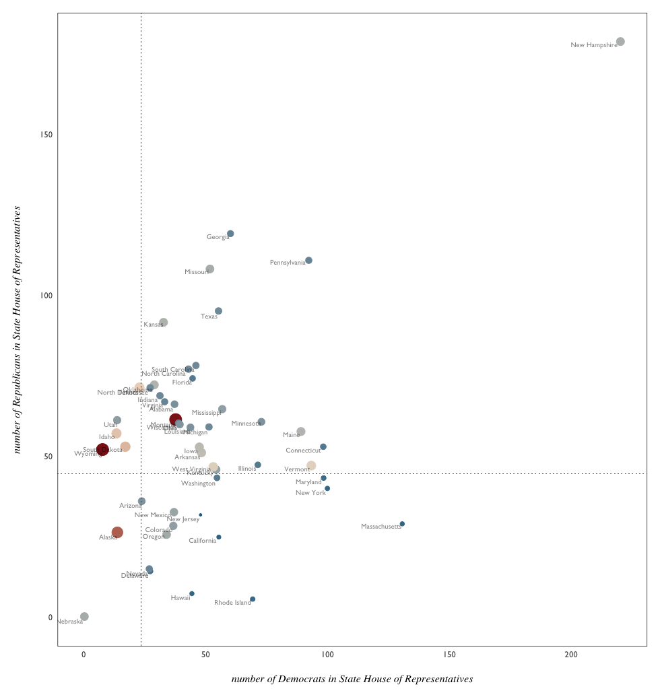

Spatially, how does this look?

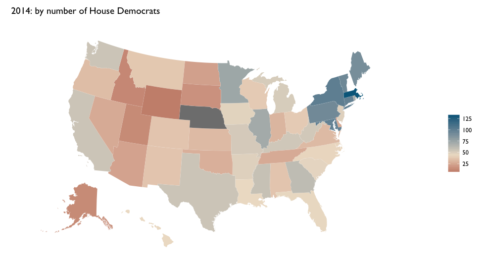

* _New Hampshire was removed from this map for being such a large outlier, having 220 Democrats and 179 Republicans in it's State House - a total of 400 representatives. To give a sense, Massachusetts has the second largest State House - with 160 represenatives._
* _**_Nebraska_** has no House of Representatives - unicameral._
* Median was chosen for color gradient scale midpoint.

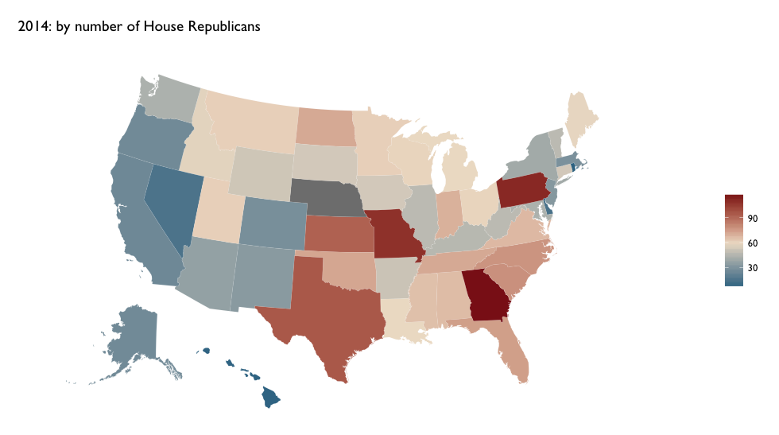


