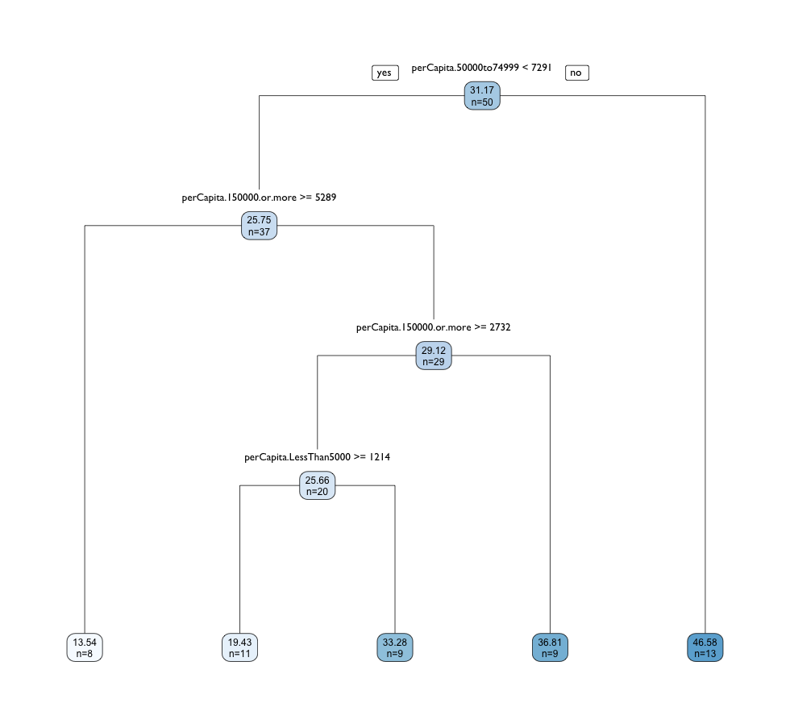
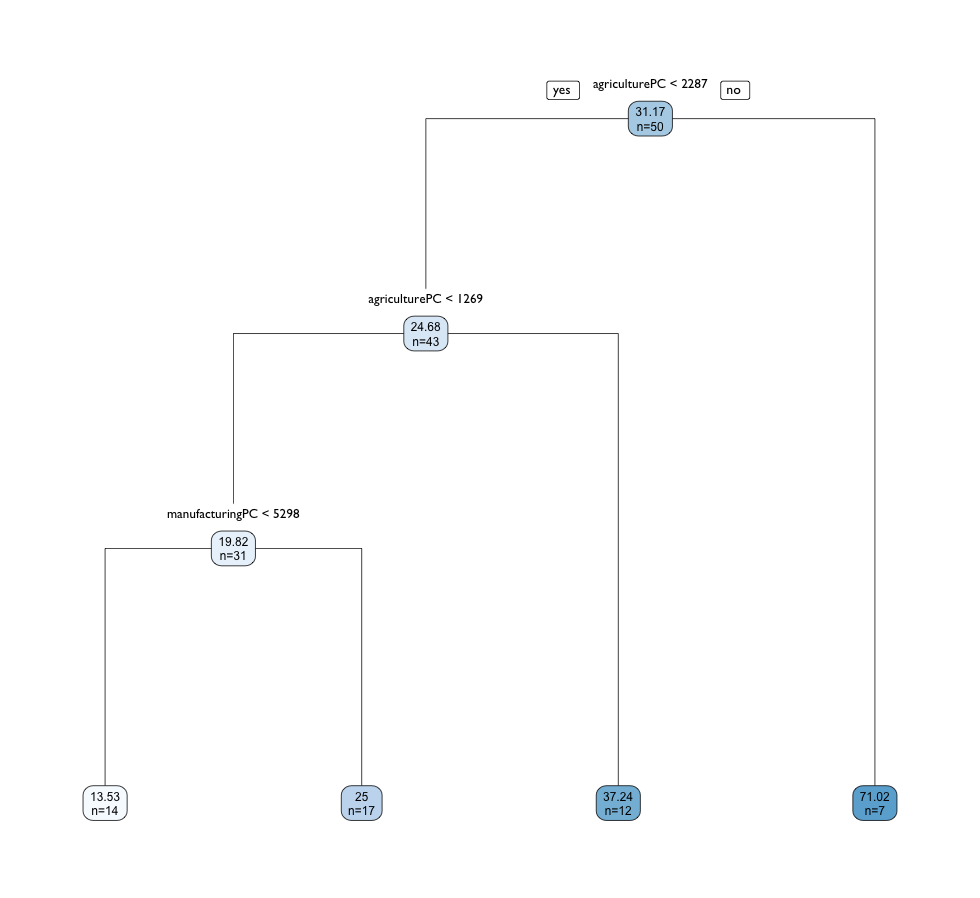
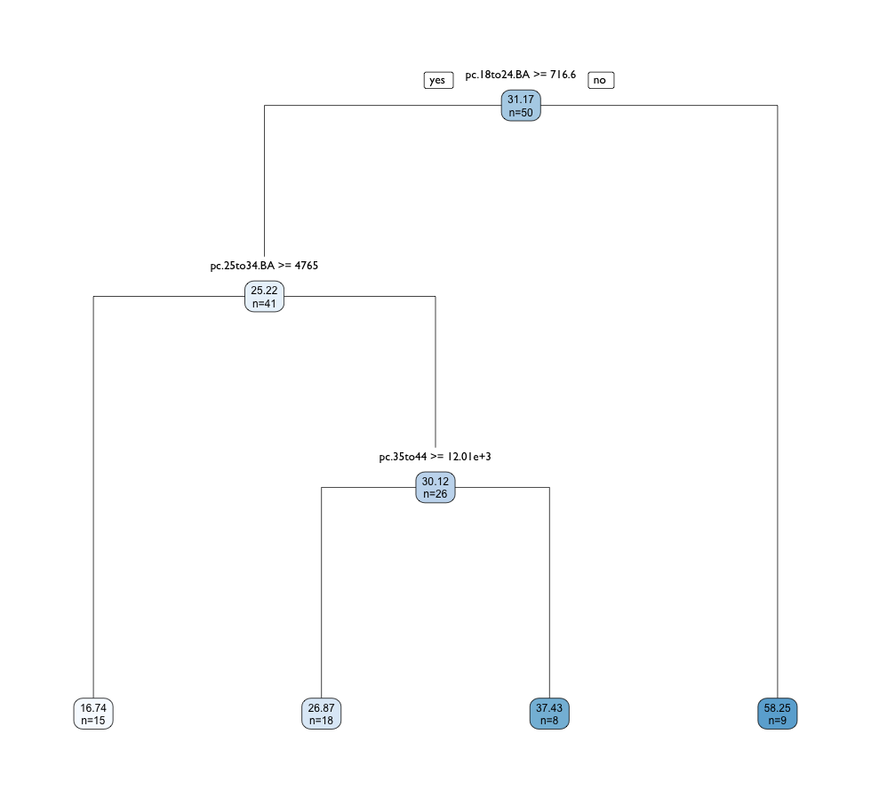
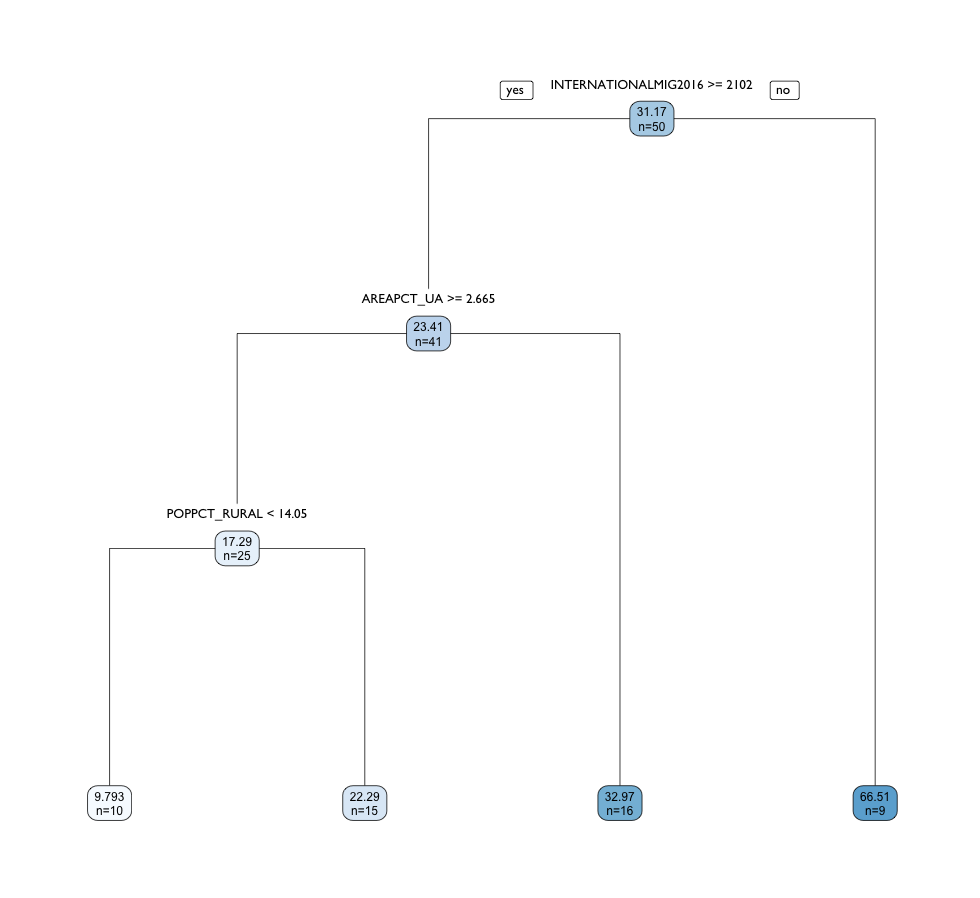
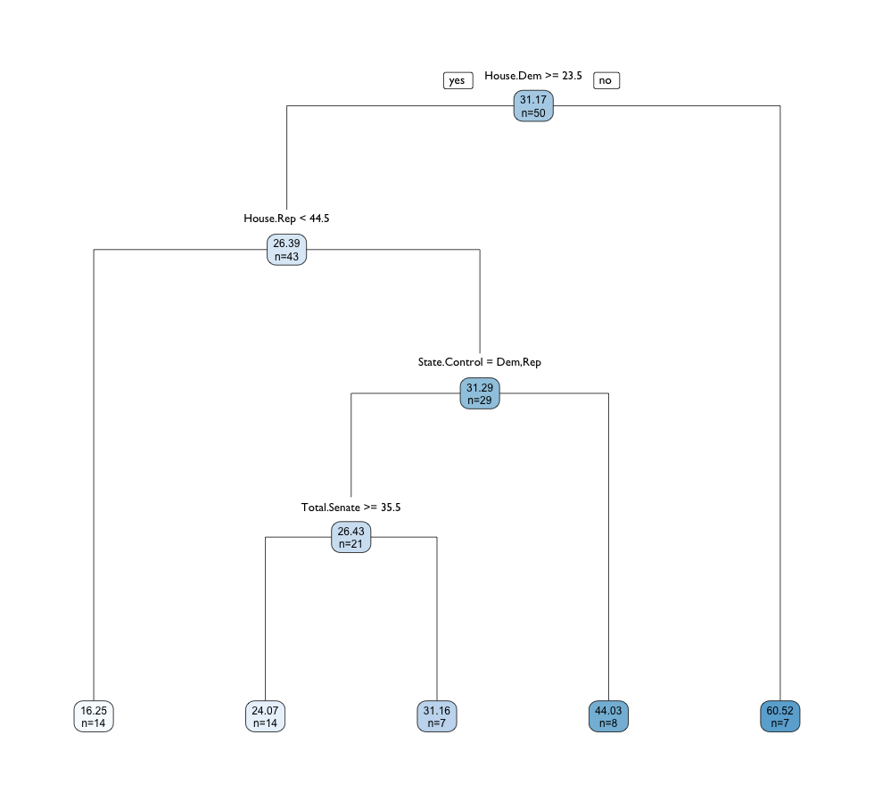
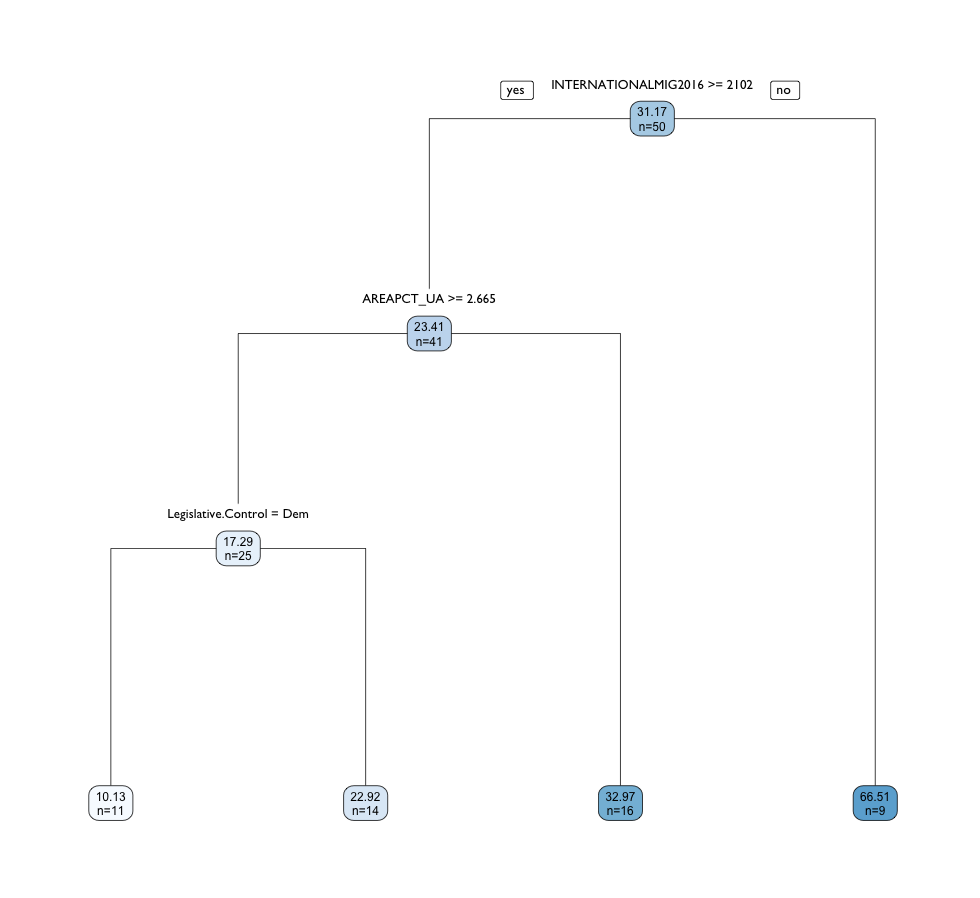

# Regression Trees

Carrying out regression trees on different datasets:

- income
- industry
- education
- population
- legislation

## dataframes

- income.perCapita
- industry.model
- edu.perCapita
- rural.urban
- leg.model

## Income Features

This data comes from the United States Census, and classifies US households into 11 annual income brackets ranging from **Less than $5000** to **$150,000 or more**. 

What's the distribution across these categories? 

Structure of the data:
```{R}
str(income.perCapita)
'data.frame':	50 obs. of  12 variables:
 $ perCapita.LessThan5000  : num  1712 610 1445 1576 959 ...
 $ perCapita.5000to9999    : num  1902 746 1264 1922 860 ...
 $ perCapita.10000to14999  : num  2625 1085 1734 2729 1587 ...
 $ perCapita.15000to19999  : num  2435 1221 1879 2499 1422 ...
 $ perCapita.20000to24999  : num  2396 1085 2023 2652 1554 ...
 $ perCapita.25000to34999  : num  4298 2577 3866 4843 2844 ...
 $ perCapita.35000to49999  : num  5249 4002 5238 5766 3870 ...
 $ perCapita.50000to74999  : num  6771 6003 6792 6804 5424 ...
 $ perCapita.75000to99999  : num  4070 5087 4335 3998 4035 ...
 $ perCapita.100000to149999: num  3994 6376 4371 3575 5060 ...
 $ perCapita.150000.or.more: num  2587 5155 3143 2114 5424 ...
 $ perCapitaFFL            : num  25.29 81.82 26.16 42.53 6.49 ...
```

Regression tree: 

```{R}
income.tree01 <- rpart(perCapitaFFL ~ ., data = income.perCapita)
rpart.plot(income.tree01, type = 1, extra = 1,
           digits = 4, cex = 0.75, 
           split.family = "GillSans", split.cex = 1.1,
           nn.family = "GillSans", nn.cex = 0.85, 
           fallen.leaves = T)
```



```{R}
print(income.tree01)
n= 50 

node), split, n, deviance, yval
      * denotes terminal node

 1) root 50 22865.9600 31.16886  
   2) perCapita.50000to74999< 7291.024 37  9457.7300 25.75285  
     4) perCapita.150000.or.more>=5289.41 8   837.0288 13.53529 *
     5) perCapita.150000.or.more< 5289.41 29  7097.1300 29.12321  
      10) perCapita.150000.or.more>=2731.794 20  5338.9330 25.66308  
        20) perCapita.LessThan5000>=1214.428 11   322.5765 19.42972 *
        21) perCapita.LessThan5000< 1214.428 9  4066.5720 33.28164 *
      11) perCapita.150000.or.more< 2731.794 9   986.6362 36.81239 *
   3) perCapita.50000to74999>=7291.024 13  9233.9030 46.58365 *
```

## Industry Features

Structure of the data:

```{R}
str(industry.model)
'data.frame':	50 obs. of  15 variables:
 $ perCapitaFFL    : num  25.29 81.82 26.16 42.53 6.49 ...
 $ workforcePC     : num  42031 48090 43087 42684 46278 ...
 $ agriculturePC   : num  708 2569 632 1387 1145 ...
 $ constructionPC  : num  2645 3445 2843 2740 2852 ...
 $ manufacturingPC : num  6005 1554 3045 5945 4400 ...
 $ wholesalePC     : num  1062 983 1012 1024 1356 ...
 $ retailPC        : num  4970 5287 5399 5870 4993 ...
 $ transportationPC: num  2230 3662 2164 2365 2307 ...
 $ informationPC   : num  694 937 806 696 1343 ...
 $ financePC       : num  2296 1715 3552 1932 2794 ...
 $ pro.scientificPC: num  4041 4114 5242 3071 6130 ...
 $ educationPC     : num  9472 11262 9338 10410 9619 ...
 $ artsPC          : num  3528 4652 4832 3280 4878 ...
 $ otherPC         : num  2184 2272 2030 2008 2449 ...
 $ publicAdminPC   : num  2195 5638 2192 1956 2012 ...
```

Regression Tree:

```{R}
# grow regression tree
industry.tree01 <- rpart(perCapitaFFL ~ ., data = industry.model)

# plot tree
rpart.plot(industry.tree01, type = 1, extra = 1,
           digits = 4, cex = 0.75, 
           split.family = "GillSans", split.cex = 1.1,
           nn.family = "GillSans", nn.cex = 0.85, 
           fallen.leaves = T)
```



```{R}
print(industry.tree01)
n= 50 

node), split, n, deviance, yval
      * denotes terminal node

1) root 50 22865.9600 31.16886  
  2) agriculturePC< 2286.951 43  5773.8460 24.68142  
    4) agriculturePC< 1269.452 31  2414.1110 19.81906  
      8) manufacturingPC< 5297.78 14   578.4599 13.53260 *
      9) manufacturingPC>=5297.78 17   826.7403 24.99614 *
    5) agriculturePC>=1269.452 12   733.4458 37.24251 *
  3) agriculturePC>=2286.951 7  4165.4300 71.02028 *
```

## Education Features

Structure of the data:

```{R}
str(edu.perCapita)
'data.frame':	50 obs. of  16 variables:
 $ perCapitaFFL: num  6.49 22.72 15.51 8.41 15.86 ...
 $ pc.18to24   : num  10112 10162 8763 9830 9641 ...
 $ pc.18to24.HS: num  2991 3268 2603 2574 2783 ...
 $ pc.18to24.BA: num  978 805 769 1548 1209 ...
 $ pc.25to34   : num  14958 14502 12809 14562 13811 ...
 $ pc.25to34.HS: num  13023 12569 11489 13078 12626 ...
 $ pc.25to34.BA: num  5091 4269 3724 6420 5523 ...
 $ pc.35to44   : num  13311 13582 12168 12654 13027 ...
 $ pc.35to44.HS: num  10824 11199 10787 11085 11590 ...
 $ pc.35to44.BA: num  4619 4170 3734 5020 4869 ...
 $ pc.45to64   : num  25318 23872 26635 26863 26387 ...
 $ pc.45to64.HS: num  20567 19619 23596 23338 23627 ...
 $ pc.45to64.BA: num  7864 6691 7537 8711 8370 ...
 $ pc.65plus   : num  13309 11745 19488 15002 14240 ...
 $ pc.65plus.HS: num  10573 9116 16430 11877 11900 ...
 $ pc.65plus.BA: num  4008 2936 5219 4047 3463 ...
```

Regression tree:

```{R}
# subset variables
edu.perCapita <- edu.pc2 %>%
  select(-c(NAME, Pop2015, Pop2016))

# grow tree
edu.tree01 <- rpart(perCapitaFFL ~ ., data = edu.perCapita)

# plot tree
rpart.plot(edu.tree01, type = 1, extra = 1,
           digits = 4, cex = 0.75, 
           split.family = "GillSans", split.cex = 1.1,
           nn.family = "GillSans", nn.cex = 0.85, 
           fallen.leaves = T)
```



```{R}
print(edu.tree01)
n= 50 

node), split, n, deviance, yval
      * denotes terminal node

 1) root 50 22865.9600 31.16886  
   2) pc.18to24.BA>=716.5771 41  6963.1860 25.22488  
     4) pc.25to34.BA>=4765.145 15  2386.3920 16.74053 *
     5) pc.25to34.BA< 4765.145 26  2874.0880 30.11971  
      10) pc.35to44>=12008.21 18   737.3559 26.86992 *
      11) pc.35to44< 12008.21 8  1518.9070 37.43173 *
   3) pc.18to24.BA< 716.5771 9  7855.2010 58.24696 *
```

## Rural-Urban Features

Structure of the data:

```{R}
str(rural.urban)
'data.frame':	50 obs. of  33 variables:
 $ perCapitaFFL        : num  6.49 22.72 15.51 8.41 15.86 ...
 $ POPESTIMATE2016     : int  39250017 27862596 20612439 19745289 12801539 12784227 11614373 10310371 10146788 9928300 ...
 $ NPOPCHG_2016        : int  256077 432957 367525 -1894 -37508 -7677 9283 110973 111602 10585 ...
 $ BIRTHS2016          : int  502848 404533 222793 236507 155238 140897 138012 130862 120778 113437 ...
 $ DEATHS2016          : int  273850 192814 201485 160713 108040 133053 115938 81525 89721 94353 ...
 $ NATURALINC2016      : int  228998 211719 21308 75794 47198 7844 22074 49337 31057 19084 ...
 $ INTERNATIONALMIG2016: int  142553 91839 118831 118478 30934 34678 19591 23831 20494 22511 ...
 $ DOMESTICMIG2016     : int  -109023 125703 207155 -191367 -114144 -45565 -27558 36781 59584 -27839 ...
 $ NETMIG2016          : int  33530 217542 325986 -72889 -83210 -10887 -7967 60612 80078 -5328 ...
 $ RESIDUAL2016        : int  -6451 3696 20231 -4799 -1496 -4634 -4824 1024 467 -3171 ...
 $ atf.Region          : int  9 5 1 6 3 8 4 1 1 4 ...
 $ POP_ST              : int  37253956 25145561 18801310 19378102 12830632 12702379 11536504 9687653 9535483 9883640 ...
 $ AREA_ST             : num  4.03e+11 6.77e+11 1.39e+11 1.22e+11 1.44e+11 ...
 $ POP_URBAN           : int  35373606 21298039 17139844 17028105 11353553 9991287 8989694 7272151 6301756 7369957 ...
 $ POPPCT_URBAN        : num  95 84.7 91.2 87.9 88.5 ...
 $ AREA_URBAN          : num  2.13e+10 2.27e+10 1.92e+10 1.06e+10 1.02e+10 ...
 $ AREAPCT_URBAN       : num  5.28 3.35 13.81 8.68 7.11 ...
 $ POPDEN_URBAN        : num  4304 2435 2315 4161 2878 ...
 $ POP_UA              : int  33427689 18947957 16439936 16018144 10260671 8977537 7534686 6334271 5232799 6560163 ...
 $ POPPCT_UA           : num  89.7 75.3 87.4 82.7 80 ...
 $ AREA_UA             : num  1.89e+10 1.87e+10 1.77e+10 9.06e+09 8.61e+09 ...
 $ AREAPCT_UA          : num  4.69 2.76 12.74 7.42 5.99 ...
 $ POPDEN_UA           : num  4577 2625 2406 4580 3086 ...
 $ POP_UC              : int  1945917 2350082 699908 1009961 1092882 1013750 1455008 937880 1068957 809794 ...
 $ POPPCT_UC           : num  5.22 9.35 3.72 5.21 8.52 ...
 $ AREA_UC             : num  2.37e+09 3.95e+09 1.47e+09 1.54e+09 1.61e+09 ...
 $ AREAPCT_UC          : num  0.59 0.58 1.06 1.26 1.12 1.48 2.05 1.47 2.11 1.03 ...
 $ POPDEN_UC           : num  2124 1540 1230 1700 1760 ...
 $ POP_RURAL           : int  1880350 3847522 1661466 2349997 1477079 2711092 2546810 2415502 3233727 2513683 ...
 $ POPPCT_RURAL        : num  5.05 15.3 8.84 12.13 11.51 ...
 $ AREA_RURAL          : num  3.82e+11 6.54e+11 1.20e+11 1.11e+11 1.34e+11 ...
 $ AREAPCT_RURAL       : num  94.7 96.7 86.2 91.3 92.9 ...
 $ POPDEN_RURAL        : num  12.7 15.2 35.9 54.6 28.6 67.7 69.9 45.8 73.5 47.5 ...
```

Regression tree:

```{R}
rural.urban <- rural.urban %>%
  select(perCapitaFFL, 7:38)

rural.urban.tree01 <- rpart(perCapitaFFL ~ ., data = rural.urban)
rpart.plot(rural.urban.tree01, type = 1, extra = 1,
           digits = 4, cex = 0.75, 
           split.family = "GillSans", split.cex = 1.1,
           nn.family = "GillSans", nn.cex = 0.85,
           fallen.leaves = T)
```



```{R}
print(rural.urban.tree01)
n= 50 

node), split, n, deviance, yval
      * denotes terminal node

1) root 50 22865.9600 31.168860  
  2) INTERNATIONALMIG2016>=2102.5 41  4423.6960 23.410790  
    4) AREAPCT_UA>=2.665 25  1495.8680 17.292370  
      8) POPPCT_RURAL< 14.05 10   161.9899  9.792603 *
      9) POPPCT_RURAL>=14.05 15   396.4374 22.292210 *
    5) AREAPCT_UA< 2.665 16   529.6414 32.970830 *
  3) INTERNATIONALMIG2016< 2102.5 9  4732.8640 66.511170 *
```

## State Government

Structure of the data:

```{R}
str(leg.model)
'data.frame':	50 obs. of  12 variables:
 $ Total.Seats        : int  140 60 90 135 120 100 187 62 160 236 ...
 $ Total.Senate       : int  35 20 30 35 40 35 36 21 40 56 ...
 $ Senate.Dem         : int  11 7 12 13 28 18 21 13 14 18 ...
 $ Senate.Rep         : int  23 13 17 22 11 17 14 8 26 38 ...
 $ Senate.other       : Factor w/ 6 levels "0","1","1v","2",..: 2 1 3 1 3 1 3 1 1 1 ...
 $ Total.House        : int  105 40 60 100 80 65 151 41 120 180 ...
 $ House.Dem          : int  37 14 24 48 55 37 98 27 45 60 ...
 $ House.Rep          : int  66 26 36 51 25 28 53 14 74 119 ...
 $ Legislative.Control: Factor w/ 4 levels "Dem","N/A","Rep",..: 3 3 3 3 1 1 1 1 3 3 ...
 $ Governing.Party    : Factor w/ 2 levels "Dem","Rep": 2 2 2 1 1 1 1 1 2 2 ...
 $ State.Control      : Factor w/ 4 levels "Dem","Divided",..: 4 4 4 2 1 1 1 1 4 4 ...
 $ perCapitaFFL       : num  25.29 81.82 26.16 42.53 6.49 ...
```

Regression Tree:

```{R}
legislative.tree <- rpart(perCapitaFFL ~ ., data = leg.model)
rpart.plot(legislative.tree, type = 1, extra = 1,
           digits = 4, cex = 0.75, 
           split.family = "GillSans", split.cex = 1.1,
           nn.family = "GillSans", nn.cex = 0.85,
           fallen.leaves = T)
```



```{R}
print(legislative.tree)
n= 50 

node), split, n, deviance, yval
      * denotes terminal node

 1) root 50 22865.9600 31.16886  
   2) House.Dem>=23.5 43 11877.8600 26.39029  
     4) House.Rep< 44.5 14  1585.3220 16.24681 *
     5) House.Rep>=44.5 29  8156.6800 31.28714  
      10) State.Control=Dem,Rep 21  1941.7840 26.43441  
        20) Total.Senate>=35.5 14   766.4074 24.07139 *
        21) Total.Senate< 35.5 7   940.8538 31.16046 *
      11) State.Control=Divided 8  4422.2300 44.02556 *
   3) House.Dem< 23.5 7  3974.5850 60.52292 *
```

# All Features

Preparation: 

```{R}
all.features <- leg.model %>%
  left_join(edu.perCapita) %>%
  left_join(incomePerCapita) %>%
  left_join(industry.model) %>%
  left_join(rural.urban)
```

Structure of the data:

```{R}
str(all.features)
'data.frame':	50 obs. of  84 variables:
 $ Total.Seats             : int  140 60 90 135 120 100 187 62 160 236 ...
 $ Total.Senate            : int  35 20 30 35 40 35 36 21 40 56 ...
 $ Senate.Dem              : int  11 7 12 13 28 18 21 13 14 18 ...
 $ Senate.Rep              : int  23 13 17 22 11 17 14 8 26 38 ...
 $ Senate.other            : Factor w/ 6 levels "0","1","1v","2",..: 2 1 3 1 3 1 3 1 1 1 ...
 $ Total.House             : int  105 40 60 100 80 65 151 41 120 180 ...
 $ House.Dem               : int  37 14 24 48 55 37 98 27 45 60 ...
 $ House.Rep               : int  66 26 36 51 25 28 53 14 74 119 ...
 $ Legislative.Control     : Factor w/ 4 levels "Dem","N/A","Rep",..: 3 3 3 3 1 1 1 1 3 3 ...
 $ Governing.Party         : Factor w/ 2 levels "Dem","Rep": 2 2 2 1 1 1 1 1 2 2 ...
 $ State.Control           : Factor w/ 4 levels "Dem","Divided",..: 4 4 4 2 1 1 1 1 4 4 ...
 $ perCapitaFFL            : num  25.29 81.82 26.16 42.53 6.49 ...
 $ pc.18to24               : num  9648 11186 9821 9552 10112 ...
 $ pc.18to24.HS            : num  3082 4259 2982 3027 2991 ...
 $ pc.18to24.BA            : num  722 650 723 688 978 ...
 $ pc.25to34               : num  12865 16101 13418 12942 14958 ...
 $ pc.25to34.HS            : num  11181 14955 11668 11472 13023 ...
 $ pc.25to34.BA            : num  3320 4564 3536 3124 5091 ...
 $ pc.35to44               : num  12612 12424 12398 12341 13311 ...
 $ pc.35to44.HS            : num  10890 11682 10405 10844 10824 ...
 $ pc.35to44.BA            : num  3412 3636 3561 3096 4619 ...
 $ pc.45to64               : num  26448 25495 24304 25415 25318 ...
 $ pc.45to64.HS            : num  22716 23862 21028 21854 20567 ...
 $ pc.45to64.BA            : num  6284 7799 6774 5340 7864 ...
 $ pc.65plus               : num  15696 9625 16428 16056 13309 ...
 $ pc.65plus.HS            : num  12597 8455 14192 12843 10573 ...
 $ pc.65plus.BA            : num  3320 2900 4574 2994 4008 ...
 $ perCapita.LessThan5000  : num  1712 610 1445 1576 959 ...
 $ perCapita.5000to9999    : num  1902 746 1264 1922 860 ...
 $ perCapita.10000to14999  : num  2625 1085 1734 2729 1587 ...
 $ perCapita.15000to19999  : num  2435 1221 1879 2499 1422 ...
 $ perCapita.20000to24999  : num  2396 1085 2023 2652 1554 ...
 $ perCapita.25000to34999  : num  4298 2577 3866 4843 2844 ...
 $ perCapita.35000to49999  : num  5249 4002 5238 5766 3870 ...
 $ perCapita.50000to74999  : num  6771 6003 6792 6804 5424 ...
 $ perCapita.75000to99999  : num  4070 5087 4335 3998 4035 ...
 $ perCapita.100000to149999: num  3994 6376 4371 3575 5060 ...
 $ perCapita.150000.or.more: num  2587 5155 3143 2114 5424 ...
 $ workforcePC             : num  42031 48090 43087 42684 46278 ...
 $ agriculturePC           : num  708 2569 632 1387 1145 ...
 $ constructionPC          : num  2645 3445 2843 2740 2852 ...
 $ manufacturingPC         : num  6005 1554 3045 5945 4400 ...
 $ wholesalePC             : num  1062 983 1012 1024 1356 ...
 $ retailPC                : num  4970 5287 5399 5870 4993 ...
 $ transportationPC        : num  2230 3662 2164 2365 2307 ...
 $ informationPC           : num  694 937 806 696 1343 ...
 $ financePC               : num  2296 1715 3552 1932 2794 ...
 $ pro.scientificPC        : num  4041 4114 5242 3071 6130 ...
 $ educationPC             : num  9472 11262 9338 10410 9619 ...
 $ artsPC                  : num  3528 4652 4832 3280 4878 ...
 $ otherPC                 : num  2184 2272 2030 2008 2449 ...
 $ publicAdminPC           : num  2195 5638 2192 1956 2012 ...
 $ POPESTIMATE2016         : int  4863300 741894 6931071 2988248 39250017 5540545 3576452 952065 20612439 10310371 ...
 $ NPOPCHG_2016            : int  9425 4185 113506 10395 256077 91726 -8278 7989 367525 110973 ...
 $ BIRTHS2016              : int  58556 11255 87204 37936 502848 67453 35848 10922 222793 130862 ...
 $ DEATHS2016              : int  52405 4511 56564 30581 273850 37121 30638 8945 201485 81525 ...
 $ NATURALINC2016          : int  6151 6744 30640 7355 228998 30332 5210 1977 21308 49337 ...
 $ INTERNATIONALMIG2016    : int  4738 2030 14861 3335 142553 10557 17058 2556 118831 23831 ...
 $ DOMESTICMIG2016         : int  -864 -4587 61544 195 -109023 50216 -29880 3027 207155 36781 ...
 $ NETMIG2016              : int  3874 -2557 76405 3530 33530 60773 -12822 5583 325986 60612 ...
 $ RESIDUAL2016            : int  -600 -2 6461 -490 -6451 621 -666 429 20231 1024 ...
 $ atf.Region              : int  1 9 9 5 9 5 6 8 1 1 ...
 $ POP_ST                  : int  4779736 710231 6392017 2915918 37253956 5029196 3574097 897934 18801310 9687653 ...
 $ AREA_ST                 : num  1.31e+11 1.48e+12 2.94e+11 1.35e+11 4.03e+11 ...
 $ POP_URBAN               : int  2821804 468893 5740659 1637589 35373606 4332761 3144942 747949 17139844 7272151 ...
 $ POPPCT_URBAN            : num  59 66 89.8 56.2 95 ...
 $ AREA_URBAN              : num  5.72e+09 6.74e+08 5.66e+09 2.84e+09 2.13e+10 ...
 $ AREAPCT_URBAN           : num  4.36 0.05 1.92 2.11 5.28 ...
 $ POPDEN_URBAN            : num  1278 1803 2625 1493 4304 ...
 $ POP_UA                  : int  2325304 315756 5117783 1152837 33427689 3865471 3031980 616982 16439936 6334271 ...
 $ POPPCT_UA               : num  48.6 44.5 80.1 39.5 89.7 ...
 $ AREA_UA                 : num  4.42e+09 3.63e+08 4.70e+09 1.88e+09 1.89e+10 ...
 $ AREAPCT_UA              : num  3.37 0.02 1.6 1.4 4.69 ...
 $ POPDEN_UA               : num  1364 2254 2822 1587 4577 ...
 $ POP_UC                  : int  496500 153137 622876 484752 1945917 467290 112962 130967 699908 937880 ...
 $ POPPCT_UC               : num  10.39 21.56 9.74 16.62 5.22 ...
 $ AREA_UC                 : num  1.30e+09 3.11e+08 9.67e+08 9.60e+08 2.37e+09 ...
 $ AREAPCT_UC              : num  0.99 0.02 0.33 0.71 0.59 0.26 1.83 6.21 1.06 1.47 ...
 $ POPDEN_UC               : num  989 1276 1669 1308 2124 ...
 $ POP_RURAL               : int  1957932 241338 651358 1278329 1880350 696435 429155 149985 1661466 2415502 ...
 $ POPPCT_RURAL            : num  40.96 33.98 10.19 43.84 5.05 ...
 $ AREA_RURAL              : num  1.25e+11 1.48e+12 2.89e+11 1.32e+11 3.82e+11 ...
 $ AREAPCT_RURAL           : num  95.6 100 98.1 97.9 94.7 ...
 $ POPDEN_RURAL            : num  40.4 0.4 5.8 25.1 12.7 ...
```

Regression Tree: 

```{R}
# Regression Tree: All Features
all.tree <- rpart(perCapitaFFL ~ ., data = all.features)
rpart.plot(all.tree, type = 1, extra = 1,
           digits = 4, cex = 0.75, 
           split.family = "GillSans", split.cex = 1.1,
           nn.family = "GillSans", nn.cex = 0.85,
           fallen.leaves = T)
```   


